# Pause — Comprehensive Technical Design Document
### PRD · HLD · LLD · Use Cases · Sequence Diagrams · Flow Diagrams

---

> **Document Scope:** This is the single source of truth for the Pause Android application across all three phases. It covers product requirements, system architecture, component design, data models, and all interaction diagrams.

---

## Table of Contents

1. [Product Overview](#1-product-overview)
2. [High-Level Design (HLD)](#2-high-level-design-hld)
   - 2.1 System Context Diagram
   - 2.2 Component Architecture Diagram
   - 2.3 Data Flow Diagram
   - 2.4 Phase Dependency Map
3. [Low-Level Design (LLD)](#3-low-level-design-lld)
   - 3.1 Database Schema
   - 3.2 Class Diagram
   - 3.3 Accessibility Service Design
   - 3.4 Overlay Manager Design
   - 3.5 Session Manager Design
   - 3.6 Repository Layer
4. [Use Case Diagrams](#4-use-case-diagrams)
   - 4.1 Phase 1 Use Cases
   - 4.2 Phase 2 Use Cases
   - 4.3 Phase 3 Use Cases
5. [Sequence Diagrams](#5-sequence-diagrams)
   - 5.1 Onboarding & Permission Grant
   - 5.2 App Interception (Phase 1)
   - 5.3 App Interception with Reflection (Phase 2)
   - 5.4 Focus Mode Session
   - 5.5 Commitment Mode + Override Attempt
   - 5.6 Accountability Partner Setup
   - 5.7 Daily Summary Dispatch
6. [Flow Diagrams](#6-flow-diagrams)
   - 6.1 First Launch Flow
   - 6.2 App Interception Decision Flow
   - 6.3 Streak Calculation Flow
   - 6.4 Commitment Break Flow
   - 6.5 Accountability Notification Flow
   - 6.6 Daily Allowance Enforcement Flow
7. [State Diagrams](#7-state-diagrams)
   - 7.1 App Monitoring States
   - 7.2 Session Lifecycle States
   - 7.3 Streak States
8. [Phased PRD](#8-phased-prd)
   - 8.1 Phase 1 — Awareness & Friction
   - 8.2 Phase 2 — Control & Reflection
   - 8.3 Phase 3 — Commitment & Accountability
9. [Permissions & Feasibility](#9-permissions--feasibility)
10. [Risk Register](#10-risk-register)
11. [Success Metrics](#11-success-metrics)
12. [Development Timeline](#12-development-timeline)

---

## 1. Product Overview

### 1.1 What is Pause?

**Pause** is a minimal Android application that reduces impulsive phone usage through graduated behavioral intervention. Rather than blocking apps outright, Pause inserts intentional friction — delays, reflection prompts, and commitment mechanisms — at the moment a user reaches for a distracting app.

### 1.2 Core Philosophy

| Principle | Description |
|---|---|
| **Friction over blocking** | A well-placed pause outperforms a hard block. Users who feel controlled uninstall. Users who feel supported improve. |
| **Awareness before restriction** | Users cannot change what they do not notice. Phase 1 builds awareness before Phase 2 adds limits. |
| **Commitment over willpower** | Long-term change requires commitment devices — not repeated acts of willpower. Phase 3 is built on this principle. |

### 1.3 Phase Summary

| Phase | Theme | Key Mechanic | Est. Build |
|---|---|---|---|
| Phase 1 | Awareness & Friction | Delay screen, launch counter | 5 days |
| Phase 2 | Control & Reflection | Reflection prompt, limits, streaks | 5–6 days |
| Phase 3 | Commitment & Accountability | Commitment mode, accountability partner | 6–7 days |

### 1.4 Target Users

- Social media over-users seeking to reduce scrolling
- Students protecting study time
- Professionals avoiding distraction during deep work
- Digital minimalists building intentional phone habits

### 1.5 Non-Goals (All Phases)

- iOS version
- Cloud sync or user accounts
- AI/ML-powered insights
- In-app messaging system
- Social feed or community features
- Cross-device support
- Internet connectivity (no network permission required)

---

## 2. High-Level Design (HLD)

### 2.1 System Context Diagram

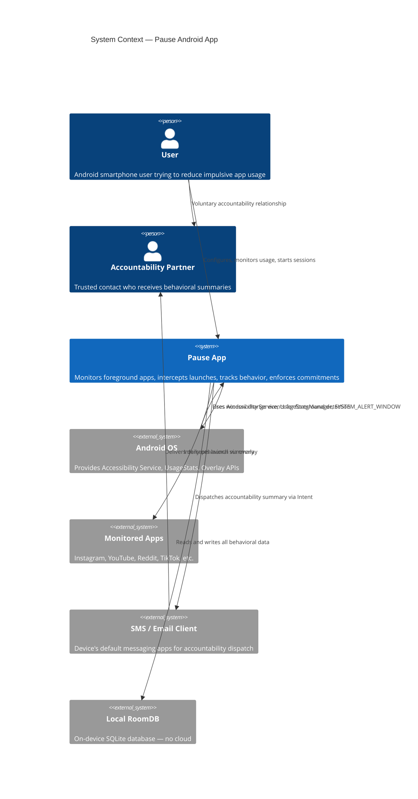
```mermaid
C4Context
    title System Context — Pause Android App

    Person(user, "User", "Android smartphone user trying to reduce impulsive app usage")
    Person(partner, "Accountability Partner", "Trusted contact who receives behavioral summaries")

    System(pause, "Pause App", "Monitors foreground apps, intercepts launches, tracks behavior, enforces commitments")

    System_Ext(android_os, "Android OS", "Provides Accessibility Service, UsageStats, Overlay APIs")
    System_Ext(monitored_apps, "Monitored Apps", "Instagram, YouTube, Reddit, TikTok, etc.")
    System_Ext(sms_email, "SMS / Email Client", "Device's default messaging apps for accountability dispatch")
    System_Ext(room_db, "Local RoomDB", "On-device SQLite database — no cloud")

    Rel(user, pause, "Configures, monitors usage, starts sessions")
    Rel(pause, android_os, "Uses Accessibility Service, UsageStatsManager, SYSTEM_ALERT_WINDOW")
    Rel(android_os, pause, "Fires window change events for foreground detection")
    Rel(pause, monitored_apps, "Intercepts launch via overlay")
    Rel(pause, room_db, "Reads and writes all behavioral data")
    Rel(pause, sms_email, "Dispatches accountability summary via Intent")
    Rel(sms_email, partner, "Delivers daily behavioral summary")
    Rel(user, partner, "Voluntary accountability relationship")
```

---

### 2.2 Component Architecture Diagram

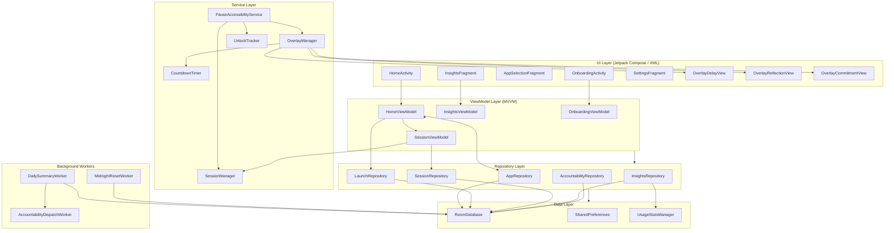
```mermaid
graph TB
    subgraph UI["UI Layer (Jetpack Compose / XML)"]
        A[HomeActivity]
        B[OnboardingActivity]
        C[AppSelectionFragment]
        D[InsightsFragment]
        E[SettingsFragment]
        F[OverlayDelayView]
        G[OverlayReflectionView]
        H[OverlayCommitmentView]
    end

    subgraph VM["ViewModel Layer (MVVM)"]
        I[HomeViewModel]
        J[SessionViewModel]
        K[InsightsViewModel]
        L[OnboardingViewModel]
    end

    subgraph SERVICE["Service Layer"]
        M[PauseAccessibilityService]
        N[OverlayManager]
        O[SessionManager]
        P[CountdownTimer]
        Q[UnlockTracker]
    end

    subgraph REPO["Repository Layer"]
        R[AppRepository]
        S[LaunchRepository]
        T[SessionRepository]
        U[InsightsRepository]
        V[AccountabilityRepository]
    end

    subgraph DATA["Data Layer"]
        W[RoomDatabase]
        X[SharedPreferences]
        Y[UsageStatsManager]
    end

    subgraph WORKER["Background Workers"]
        Z[DailySummaryWorker]
        AA[MidnightResetWorker]
        AB[AccountabilityDispatchWorker]
    end

    A --> I
    B --> L
    D --> K
    I --> J
    I --> R
    I --> S

    M --> N
    M --> O
    M --> Q
    N --> F
    N --> G
    N --> H
    N --> P

    J --> O
    J --> T

    R --> W
    S --> W
    T --> W
    U --> W
    U --> Y
    V --> W

    Z --> AB
    Z --> W
    AA --> W

    I --> VM
    VM --> REPO
    REPO --> DATA
```

---

### 2.3 Data Flow Diagram

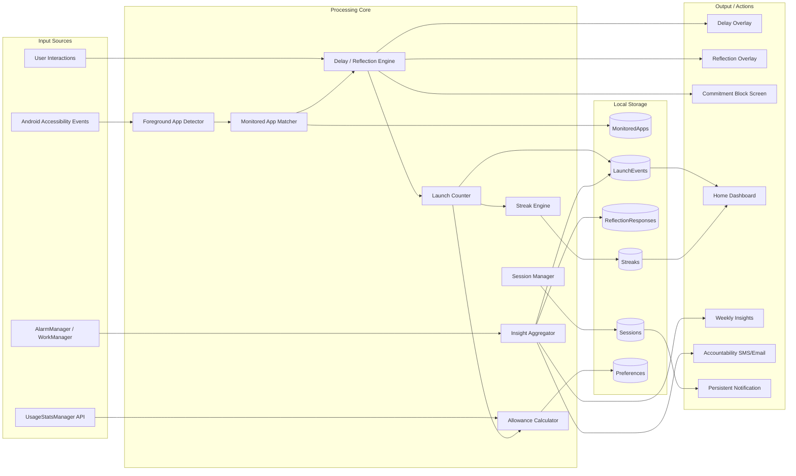
```mermaid
flowchart LR
    subgraph INPUT["Input Sources"]
        A1[Android Accessibility Events]
        A2[UsageStatsManager API]
        A3[User Interactions]
        A4[AlarmManager / WorkManager]
    end

    subgraph PROCESSING["Processing Core"]
        B1[Foreground App Detector]
        B2[Monitored App Matcher]
        B3[Delay / Reflection Engine]
        B4[Launch Counter]
        B5[Allowance Calculator]
        B6[Session Manager]
        B7[Streak Engine]
        B8[Insight Aggregator]
    end

    subgraph STORAGE["Local Storage"]
        C1[(MonitoredApps)]
        C2[(LaunchEvents)]
        C3[(ReflectionResponses)]
        C4[(Sessions)]
        C5[(Streaks)]
        C6[(Preferences)]
    end

    subgraph OUTPUT["Output / Actions"]
        D1[Delay Overlay]
        D2[Reflection Overlay]
        D3[Commitment Block Screen]
        D4[Home Dashboard]
        D5[Weekly Insights]
        D6[Accountability SMS/Email]
        D7[Persistent Notification]
    end

    A1 --> B1
    A2 --> B5
    A3 --> B3
    A4 --> B8

    B1 --> B2
    B2 --> C1
    B2 --> B3
    B3 --> B4
    B3 --> D1
    B3 --> D2
    B3 --> D3

    B4 --> C2
    B4 --> B5
    B4 --> B7

    B5 --> C6
    B6 --> C4
    B7 --> C5

    B8 --> C2
    B8 --> C3

    C2 --> D4
    C4 --> D7
    C5 --> D4
    B8 --> D5
    B8 --> D6
```

---

### 2.4 Phase Dependency Map

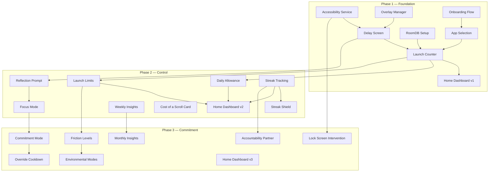
```mermaid
graph TD
    subgraph P1["Phase 1 — Foundation"]
        F1[Accessibility Service]
        F2[Overlay Manager]
        F3[App Selection]
        F4[Delay Screen]
        F5[Launch Counter]
        F6[Home Dashboard v1]
        F7[Onboarding Flow]
        F8[RoomDB Setup]
    end

    subgraph P2["Phase 2 — Control"]
        G1[Reflection Prompt]
        G2[Daily Allowance]
        G3[Launch Limits]
        G4[Focus Mode]
        G5[Streak Tracking]
        G6[Streak Shield]
        G7[Weekly Insights]
        G8[Cost of a Scroll Card]
        G9[Home Dashboard v2]
    end

    subgraph P3["Phase 3 — Commitment"]
        H1[Commitment Mode]
        H2[Override Cooldown]
        H3[Friction Levels]
        H4[Environmental Modes]
        H5[Lock Screen Intervention]
        H6[Accountability Partner]
        H7[Monthly Insights]
        H8[Home Dashboard v3]
    end

    F1 --> F4
    F2 --> F4
    F3 --> F5
    F4 --> F5
    F5 --> F6
    F7 --> F3
    F8 --> F5

    F4 --> G1
    F5 --> G2
    F5 --> G3
    G1 --> G4
    G5 --> G6
    G2 --> G9
    G3 --> G9
    G5 --> G9

    G4 --> H1
    H1 --> H2
    G3 --> H3
    H3 --> H4
    F1 --> H5
    G5 --> H6
    G7 --> H7
```

---

## 3. Low-Level Design (LLD)

### 3.1 Database Schema

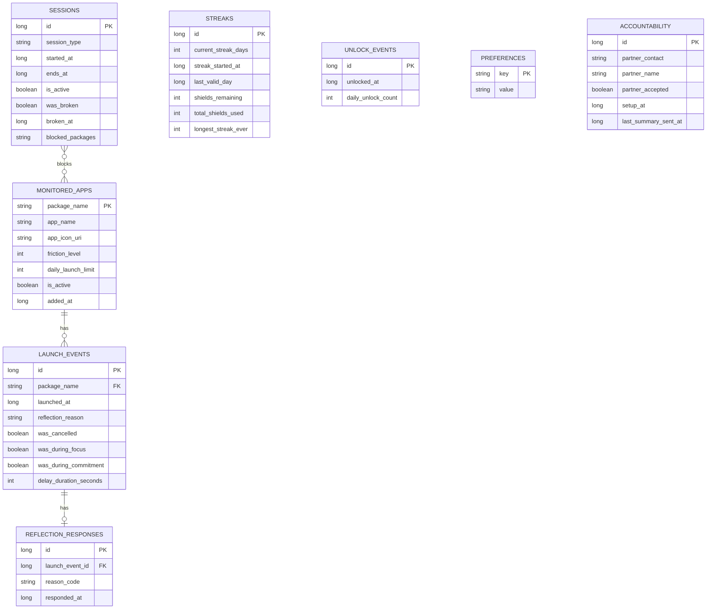
```mermaid
erDiagram
    MONITORED_APPS {
        string package_name PK
        string app_name
        string app_icon_uri
        int friction_level
        int daily_launch_limit
        boolean is_active
        long added_at
    }

    LAUNCH_EVENTS {
        long id PK
        string package_name FK
        long launched_at
        string reflection_reason
        boolean was_cancelled
        boolean was_during_focus
        boolean was_during_commitment
        int delay_duration_seconds
    }

    SESSIONS {
        long id PK
        string session_type
        long started_at
        long ends_at
        boolean is_active
        boolean was_broken
        long broken_at
        string blocked_packages
    }

    STREAKS {
        long id PK
        int current_streak_days
        long streak_started_at
        long last_valid_day
        int shields_remaining
        int total_shields_used
        int longest_streak_ever
    }

    REFLECTION_RESPONSES {
        long id PK
        long launch_event_id FK
        string reason_code
        long responded_at
    }

    UNLOCK_EVENTS {
        long id PK
        long unlocked_at
        int daily_unlock_count
    }

    PREFERENCES {
        string key PK
        string value
    }

    ACCOUNTABILITY {
        long id PK
        string partner_contact
        string partner_name
        boolean partner_accepted
        long setup_at
        long last_summary_sent_at
    }

    MONITORED_APPS ||--o{ LAUNCH_EVENTS : "has"
    LAUNCH_EVENTS ||--o| REFLECTION_RESPONSES : "has"
    SESSIONS }o--o{ MONITORED_APPS : "blocks"
```

---

### 3.2 Class Diagram

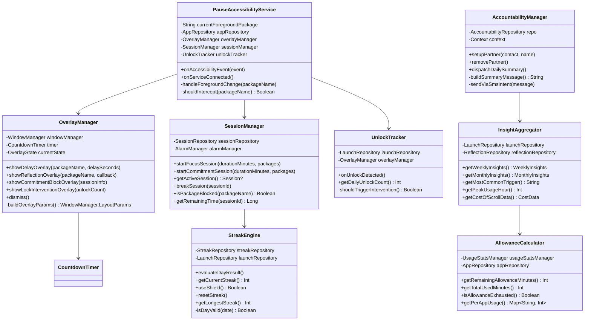
```mermaid
classDiagram
    class PauseAccessibilityService {
        -String currentForegroundPackage
        -AppRepository appRepository
        -OverlayManager overlayManager
        -SessionManager sessionManager
        -UnlockTracker unlockTracker
        +onAccessibilityEvent(event)
        +onServiceConnected()
        -handleForegroundChange(packageName)
        -shouldIntercept(packageName) Boolean
    }

    class OverlayManager {
        -WindowManager windowManager
        -CountdownTimer timer
        -OverlayState currentState
        +showDelayOverlay(packageName, delaySeconds)
        +showReflectionOverlay(packageName, callback)
        +showCommitmentBlockOverlay(sessionInfo)
        +showLockInterventionOverlay(unlockCount)
        +dismiss()
        -buildOverlayParams() WindowManager.LayoutParams
    }

    class SessionManager {
        -SessionRepository sessionRepository
        -AlarmManager alarmManager
        +startFocusSession(durationMinutes, packages)
        +startCommitmentSession(durationMinutes, packages)
        +getActiveSession() Session?
        +breakSession(sessionId)
        +isPackageBlocked(packageName) Boolean
        +getRemainingTime(sessionId) Long
    }

    class StreakEngine {
        -StreakRepository streakRepository
        -LaunchRepository launchRepository
        +evaluateDayResult()
        +getCurrentStreak() Int
        +useShield() Boolean
        +resetStreak()
        +getLongestStreak() Int
        -isDayValid(date) Boolean
    }

    class AllowanceCalculator {
        -UsageStatsManager usageStatsManager
        -AppRepository appRepository
        +getRemainingAllowanceMinutes() Int
        +getTotalUsedMinutes() Int
        +isAllowanceExhausted() Boolean
        +getPerAppUsage() Map~String, Int~
    }

    class InsightAggregator {
        -LaunchRepository launchRepository
        -ReflectionRepository reflectionRepository
        +getWeeklyInsights() WeeklyInsights
        +getMonthlyInsights() MonthlyInsights
        +getMostCommonTrigger() String
        +getPeakUsageHour() Int
        +getCostOfScrollData() CostData
    }

    class AccountabilityManager {
        -AccountabilityRepository repo
        -Context context
        +setupPartner(contact, name)
        +removePartner()
        +dispatchDailySummary()
        -buildSummaryMessage() String
        -sendViaSmsIntent(message)
    }

    class UnlockTracker {
        -LaunchRepository launchRepository
        -OverlayManager overlayManager
        +onUnlockDetected()
        +getDailyUnlockCount() Int
        -shouldTriggerIntervention() Boolean
    }

    PauseAccessibilityService --> OverlayManager
    PauseAccessibilityService --> SessionManager
    PauseAccessibilityService --> UnlockTracker
    OverlayManager --> CountdownTimer
    SessionManager --> StreakEngine
    InsightAggregator --> AllowanceCalculator
    AccountabilityManager --> InsightAggregator
```

---

### 3.3 Accessibility Service Design

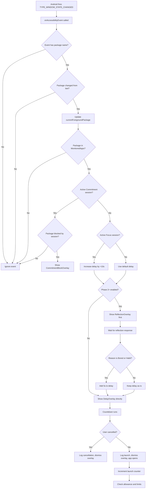
```mermaid
flowchart TD
    A[Android fires TYPE_WINDOW_STATE_CHANGED] --> B[onAccessibilityEvent called]
    B --> C{Event has package name?}
    C -- No --> Z[Ignore event]
    C -- Yes --> D{Package changed from last?}
    D -- No --> Z
    D -- Yes --> E[Update currentForegroundPackage]
    E --> F{Package in MonitoredApps?}
    F -- No --> Z
    F -- Yes --> G{Active Commitment session?}
    G -- Yes --> H{Package blocked by session?}
    H -- Yes --> I[Show CommitmentBlockOverlay]
    H -- No --> Z
    G -- No --> J{Active Focus session?}
    J -- Yes --> K[Increase delay by +10s]
    J -- No --> L[Use default delay]
    K --> M{Phase 2+ enabled?}
    L --> M
    M -- Yes --> N[Show ReflectionOverlay first]
    M -- No --> O[Show DelayOverlay directly]
    N --> P[Wait for reflection response]
    P --> Q{Reason is Bored or Habit?}
    Q -- Yes --> R[Add 5s to delay]
    Q -- No --> S[Keep delay as-is]
    R --> O
    S --> O
    O --> T[Countdown runs]
    T --> U{User cancelled?}
    U -- Yes --> V[Log cancellation, dismiss overlay]
    U -- No --> W[Log launch, dismiss overlay, app opens]
    W --> X[Increment launch counter]
    X --> Y[Check allowance and limits]
```

---

### 3.4 Overlay Manager Design

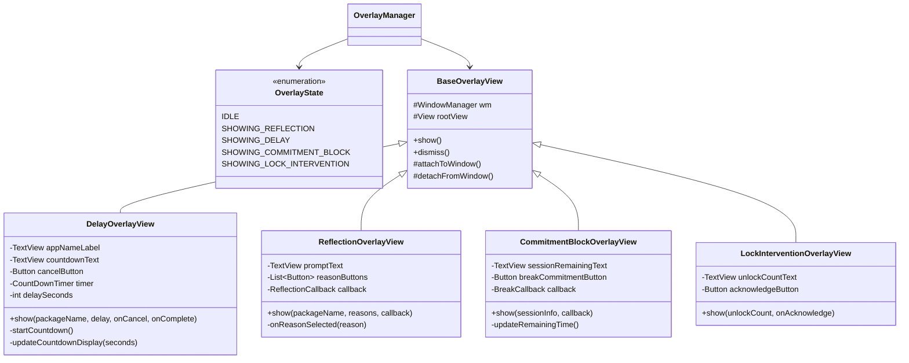
```mermaid
classDiagram
    class OverlayState {
        <<enumeration>>
        IDLE
        SHOWING_REFLECTION
        SHOWING_DELAY
        SHOWING_COMMITMENT_BLOCK
        SHOWING_LOCK_INTERVENTION
    }

    class BaseOverlayView {
        #WindowManager wm
        #View rootView
        +show()
        +dismiss()
        #attachToWindow()
        #detachFromWindow()
    }

    class DelayOverlayView {
        -TextView appNameLabel
        -TextView countdownText
        -Button cancelButton
        -CountDownTimer timer
        -int delaySeconds
        +show(packageName, delay, onCancel, onComplete)
        -startCountdown()
        -updateCountdownDisplay(seconds)
    }

    class ReflectionOverlayView {
        -TextView promptText
        -List~Button~ reasonButtons
        -ReflectionCallback callback
        +show(packageName, reasons, callback)
        -onReasonSelected(reason)
    }

    class CommitmentBlockOverlayView {
        -TextView sessionRemainingText
        -Button breakCommitmentButton
        -BreakCallback callback
        +show(sessionInfo, callback)
        -updateRemainingTime()
    }

    class LockInterventionOverlayView {
        -TextView unlockCountText
        -Button acknowledgeButton
        +show(unlockCount, onAcknowledge)
    }

    BaseOverlayView <|-- DelayOverlayView
    BaseOverlayView <|-- ReflectionOverlayView
    BaseOverlayView <|-- CommitmentBlockOverlayView
    BaseOverlayView <|-- LockInterventionOverlayView
    OverlayManager --> OverlayState
    OverlayManager --> BaseOverlayView
```

---

### 3.5 Session Manager Design

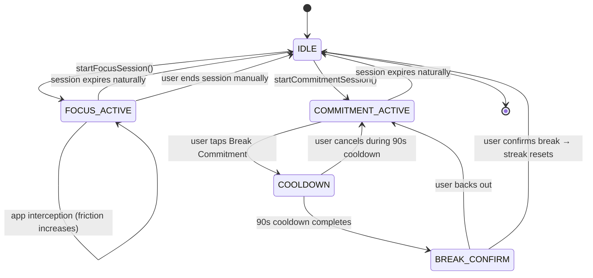
```mermaid
stateDiagram-v2
    [*] --> IDLE

    IDLE --> FOCUS_ACTIVE : startFocusSession()
    IDLE --> COMMITMENT_ACTIVE : startCommitmentSession()

    FOCUS_ACTIVE --> IDLE : session expires naturally
    FOCUS_ACTIVE --> IDLE : user ends session manually
    FOCUS_ACTIVE --> FOCUS_ACTIVE : app interception (friction increases)

    COMMITMENT_ACTIVE --> COOLDOWN : user taps Break Commitment
    COOLDOWN --> COMMITMENT_ACTIVE : user cancels during 90s cooldown
    COOLDOWN --> BREAK_CONFIRM : 90s cooldown completes
    BREAK_CONFIRM --> COMMITMENT_ACTIVE : user backs out
    BREAK_CONFIRM --> IDLE : user confirms break → streak resets
    COMMITMENT_ACTIVE --> IDLE : session expires naturally

    IDLE --> [*]
```

---

### 3.6 Repository Layer

```mermaid
classDiagram
    class AppRepository {
        -AppDao appDao
        +getMonitoredApps() Flow~List~MonitoredApp~~
        +addApp(app)
        +removeApp(packageName)
        +updateFrictionLevel(packageName, level)
        +isMonitored(packageName) Boolean
    }

    class LaunchRepository {
        -LaunchDao launchDao
        +recordLaunch(event)
        +getTodayLaunches(packageName) Int
        +getTodayLaunchesAll() Map~String,Int~
        +getWeeklyLaunches() List~LaunchEvent~
        +cancelLastLaunch(packageName)
        +resetDailyCounts()
    }

    class SessionRepository {
        -SessionDao sessionDao
        +saveSession(session)
        +getActiveSession() Session?
        +markSessionBroken(id)
        +getSessionHistory() List~Session~
    }

    class StreakRepository {
        -StreakDao streakDao
        +getStreak() Streak
        +updateStreak(streak)
        +useShield()
        +resetStreak()
    }

    class InsightsRepository {
        -LaunchDao launchDao
        -ReflectionDao reflectionDao
        -UsageStatsManager usm
        +getWeeklyInsights() WeeklyInsights
        +getMonthlyInsights() MonthlyInsights
        +getDailyUnlockCount() Int
    }

    class AccountabilityRepository {
        -AccountabilityDao dao
        +getPartner() Accountability?
        +savePartner(accountability)
        +removePartner()
        +markSummarySent(timestamp)
    }

    AppRepository --> AppDao
    LaunchRepository --> LaunchDao
    SessionRepository --> SessionDao
    StreakRepository --> StreakDao
    InsightsRepository --> LaunchDao
    InsightsRepository --> ReflectionDao
    AccountabilityRepository --> AccountabilityDao
```

---

## 4. Use Case Diagrams

### 4.1 Phase 1 Use Cases

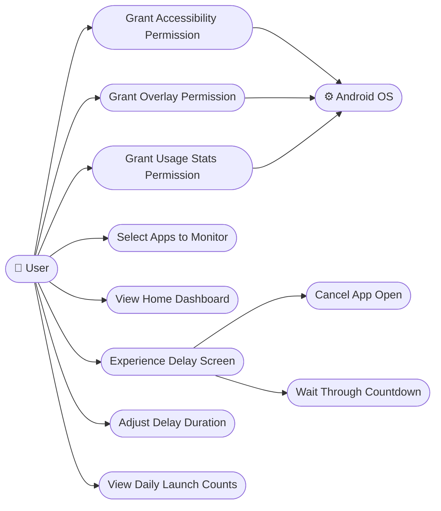
```mermaid
graph LR
    User(["👤 User"])

    UC1([Grant Accessibility Permission])
    UC2([Grant Overlay Permission])
    UC3([Grant Usage Stats Permission])
    UC4([Select Apps to Monitor])
    UC5([View Home Dashboard])
    UC6([Experience Delay Screen])
    UC7([Cancel App Open])
    UC8([Wait Through Countdown])
    UC9([Adjust Delay Duration])
    UC10([View Daily Launch Counts])

    User --> UC1
    User --> UC2
    User --> UC3
    User --> UC4
    User --> UC5
    User --> UC6
    UC6 --> UC7
    UC6 --> UC8
    User --> UC9
    User --> UC10

    OS(["⚙️ Android OS"])
    UC1 --> OS
    UC2 --> OS
    UC3 --> OS
```

---

### 4.2 Phase 2 Use Cases

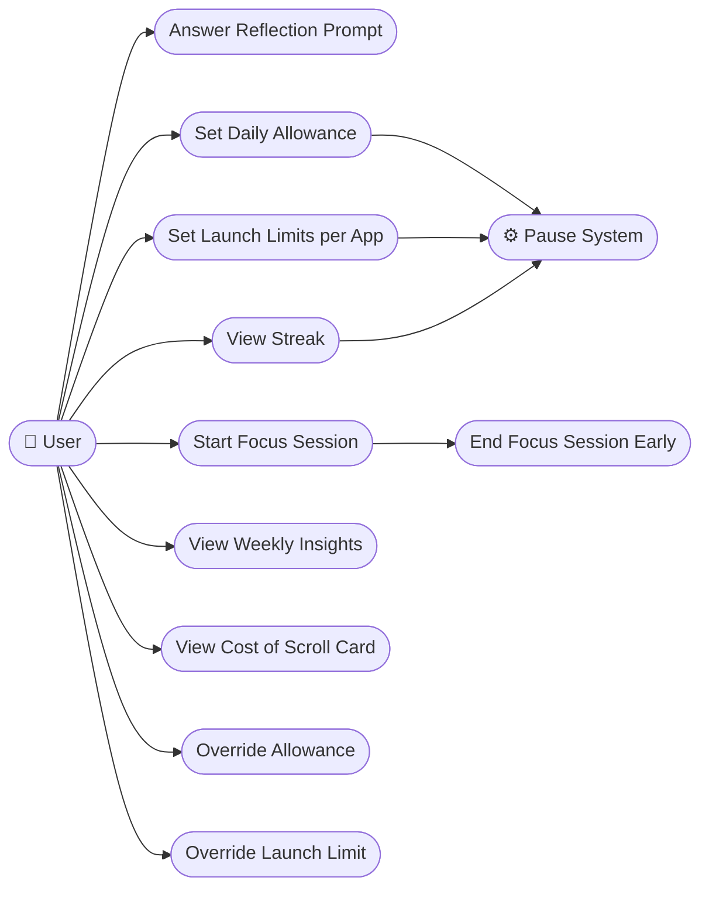
```mermaid
graph LR
    User(["👤 User"])

    UC11([Answer Reflection Prompt])
    UC12([Set Daily Allowance])
    UC13([Set Launch Limits per App])
    UC14([Start Focus Session])
    UC15([End Focus Session Early])
    UC16([View Streak])
    UC17([View Weekly Insights])
    UC18([View Cost of Scroll Card])
    UC19([Override Allowance])
    UC20([Override Launch Limit])

    User --> UC11
    User --> UC12
    User --> UC13
    User --> UC14
    UC14 --> UC15
    User --> UC16
    User --> UC17
    User --> UC18
    User --> UC19
    User --> UC20

    System(["⚙️ Pause System"])
    UC12 --> System
    UC13 --> System
    UC16 --> System
```

---

### 4.3 Phase 3 Use Cases

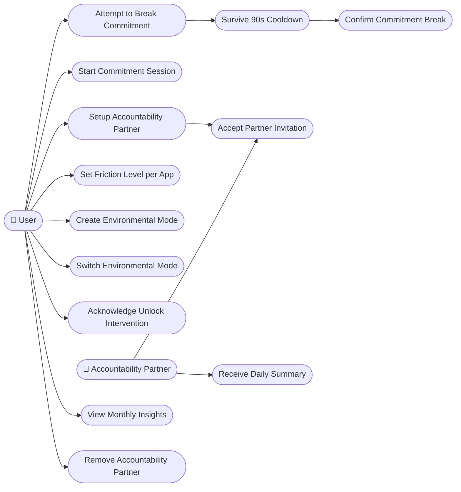
```mermaid
graph LR
    User(["👤 User"])
    Partner(["👥 Accountability Partner"])

    UC21([Start Commitment Session])
    UC22([Attempt to Break Commitment])
    UC23([Survive 90s Cooldown])
    UC24([Confirm Commitment Break])
    UC25([Set Friction Level per App])
    UC26([Create Environmental Mode])
    UC27([Switch Environmental Mode])
    UC28([Acknowledge Unlock Intervention])
    UC29([Setup Accountability Partner])
    UC30([Accept Partner Invitation])
    UC31([Receive Daily Summary])
    UC32([View Monthly Insights])
    UC33([Remove Accountability Partner])

    User --> UC21
    User --> UC22
    UC22 --> UC23
    UC23 --> UC24
    User --> UC25
    User --> UC26
    User --> UC27
    User --> UC28
    User --> UC29
    UC29 --> UC30
    Partner --> UC30
    Partner --> UC31
    User --> UC32
    User --> UC33
```

---

## 5. Sequence Diagrams

### 5.1 Onboarding & Permission Grant

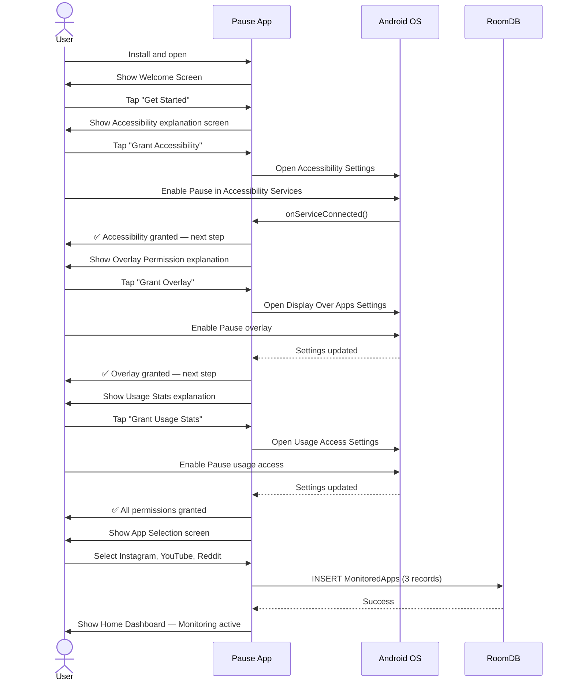
```mermaid
sequenceDiagram
    actor User
    participant App as Pause App
    participant OS as Android OS
    participant DB as RoomDB

    User->>App: Install and open
    App->>User: Show Welcome Screen
    User->>App: Tap "Get Started"
    App->>User: Show Accessibility explanation screen
    User->>App: Tap "Grant Accessibility"
    App->>OS: Open Accessibility Settings
    User->>OS: Enable Pause in Accessibility Services
    OS->>App: onServiceConnected()
    App->>User: ✅ Accessibility granted — next step
    App->>User: Show Overlay Permission explanation
    User->>App: Tap "Grant Overlay"
    App->>OS: Open Display Over Apps Settings
    User->>OS: Enable Pause overlay
    OS-->>App: Settings updated
    App->>User: ✅ Overlay granted — next step
    App->>User: Show Usage Stats explanation
    User->>App: Tap "Grant Usage Stats"
    App->>OS: Open Usage Access Settings
    User->>OS: Enable Pause usage access
    OS-->>App: Settings updated
    App->>User: ✅ All permissions granted
    App->>User: Show App Selection screen
    User->>App: Select Instagram, YouTube, Reddit
    App->>DB: INSERT MonitoredApps (3 records)
    DB-->>App: Success
    App->>User: Show Home Dashboard — Monitoring active
```

---

### 5.2 App Interception — Phase 1 (Delay Only)

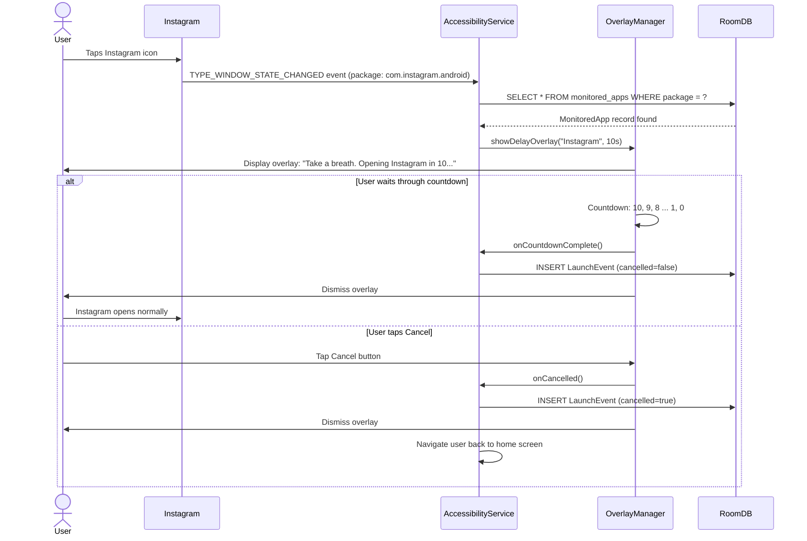
```mermaid
sequenceDiagram
    actor User
    participant Target as Instagram
    participant AS as AccessibilityService
    participant OM as OverlayManager
    participant DB as RoomDB

    User->>Target: Taps Instagram icon
    Target->>AS: TYPE_WINDOW_STATE_CHANGED event (package: com.instagram.android)
    AS->>DB: SELECT * FROM monitored_apps WHERE package = ?
    DB-->>AS: MonitoredApp record found
    AS->>OM: showDelayOverlay("Instagram", 10s)
    OM->>User: Display overlay: "Take a breath. Opening Instagram in 10..."
    
    alt User waits through countdown
        OM->>OM: Countdown: 10, 9, 8 ... 1, 0
        OM->>AS: onCountdownComplete()
        AS->>DB: INSERT LaunchEvent (cancelled=false)
        OM->>User: Dismiss overlay
        User->>Target: Instagram opens normally
    else User taps Cancel
        User->>OM: Tap Cancel button
        OM->>AS: onCancelled()
        AS->>DB: INSERT LaunchEvent (cancelled=true)
        OM->>User: Dismiss overlay
        AS->>AS: Navigate user back to home screen
    end
```

---

### 5.3 App Interception with Reflection — Phase 2

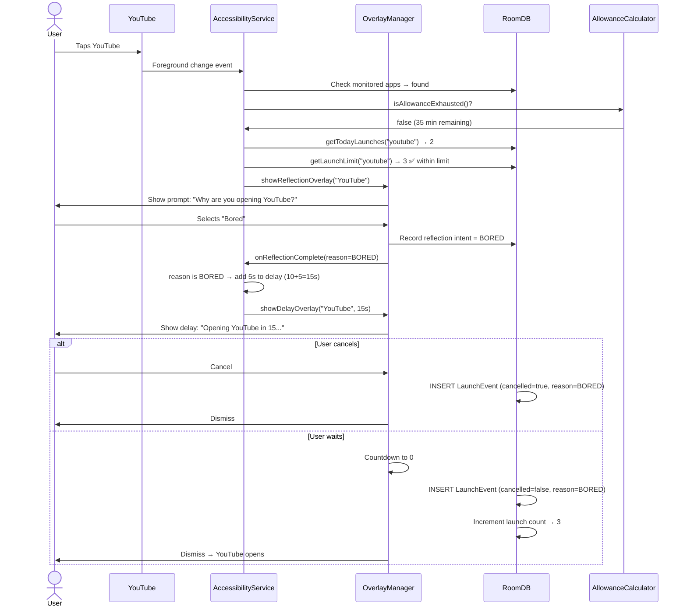
```mermaid
sequenceDiagram
    actor User
    participant Target as YouTube
    participant AS as AccessibilityService
    participant OM as OverlayManager
    participant DB as RoomDB
    participant AC as AllowanceCalculator

    User->>Target: Taps YouTube
    Target->>AS: Foreground change event
    AS->>DB: Check monitored apps → found
    AS->>AC: isAllowanceExhausted()?
    AC->>AS: false (35 min remaining)
    AS->>DB: getTodayLaunches("youtube") → 2
    AS->>DB: getLaunchLimit("youtube") → 3 ✅ within limit
    AS->>OM: showReflectionOverlay("YouTube")
    OM->>User: Show prompt: "Why are you opening YouTube?"
    User->>OM: Selects "Bored"
    OM->>DB: Record reflection intent = BORED
    OM->>AS: onReflectionComplete(reason=BORED)
    AS->>AS: reason is BORED → add 5s to delay (10+5=15s)
    AS->>OM: showDelayOverlay("YouTube", 15s)
    OM->>User: Show delay: "Opening YouTube in 15..."
    
    alt User cancels
        User->>OM: Cancel
        DB->>DB: INSERT LaunchEvent (cancelled=true, reason=BORED)
        OM->>User: Dismiss
    else User waits
        OM->>OM: Countdown to 0
        DB->>DB: INSERT LaunchEvent (cancelled=false, reason=BORED)
        DB->>DB: Increment launch count → 3
        OM->>User: Dismiss → YouTube opens
    end
```

---

### 5.4 Focus Mode Session

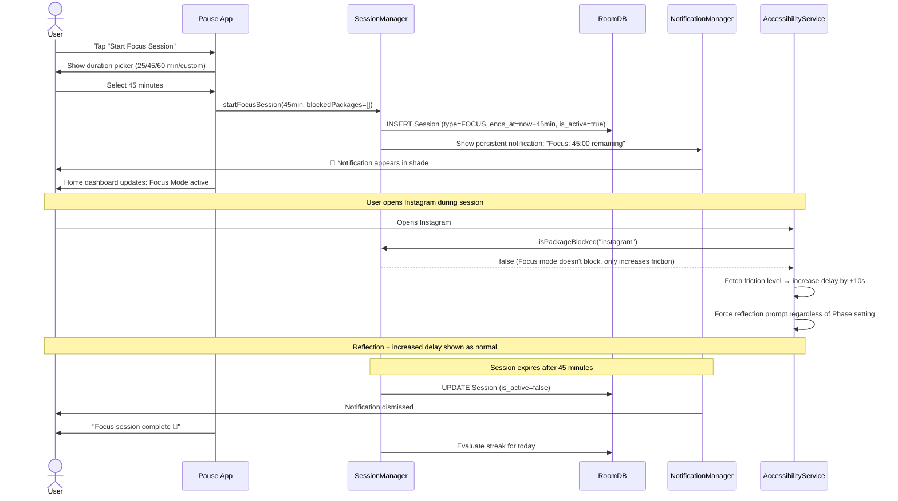
```mermaid
sequenceDiagram
    actor User
    participant App as Pause App
    participant SM as SessionManager
    participant DB as RoomDB
    participant NM as NotificationManager
    participant AS as AccessibilityService

    User->>App: Tap "Start Focus Session"
    App->>User: Show duration picker (25/45/60 min/custom)
    User->>App: Select 45 minutes
    App->>SM: startFocusSession(45min, blockedPackages=[])
    SM->>DB: INSERT Session (type=FOCUS, ends_at=now+45min, is_active=true)
    SM->>NM: Show persistent notification: "Focus: 45:00 remaining"
    NM->>User: 🔕 Notification appears in shade
    App->>User: Home dashboard updates: Focus Mode active

    Note over User,AS: User opens Instagram during session

    User->>AS: Opens Instagram
    AS->>SM: isPackageBlocked("instagram")
    SM-->>AS: false (Focus mode doesn't block, only increases friction)
    AS->>AS: Fetch friction level → increase delay by +10s
    AS->>AS: Force reflection prompt regardless of Phase setting
    Note over User,AS: Reflection + increased delay shown as normal

    Note over SM,NM: Session expires after 45 minutes

    SM->>DB: UPDATE Session (is_active=false)
    NM->>User: Notification dismissed
    App->>User: "Focus session complete 🎉"
    SM->>DB: Evaluate streak for today
```

---

### 5.5 Commitment Mode + Override Attempt

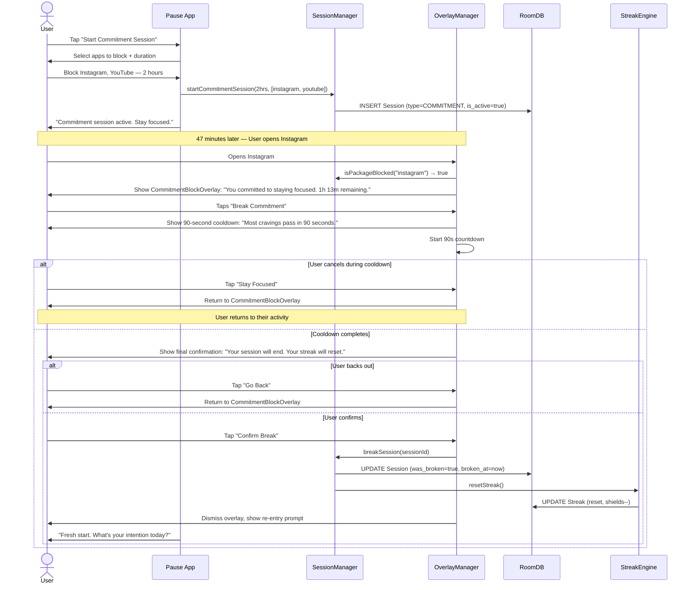
```mermaid
sequenceDiagram
    actor User
    participant App as Pause App
    participant SM as SessionManager
    participant OM as OverlayManager
    participant DB as RoomDB
    participant SE as StreakEngine

    User->>App: Tap "Start Commitment Session"
    App->>User: Select apps to block + duration
    User->>App: Block Instagram, YouTube — 2 hours
    App->>SM: startCommitmentSession(2hrs, [instagram, youtube])
    SM->>DB: INSERT Session (type=COMMITMENT, is_active=true)
    App->>User: "Commitment session active. Stay focused."

    Note over User,OM: 47 minutes later — User opens Instagram

    User->>OM: Opens Instagram
    OM->>SM: isPackageBlocked("instagram") → true
    OM->>User: Show CommitmentBlockOverlay: "You committed to staying focused. 1h 13m remaining."
    
    User->>OM: Taps "Break Commitment"
    OM->>User: Show 90-second cooldown: "Most cravings pass in 90 seconds."
    OM->>OM: Start 90s countdown

    alt User cancels during cooldown
        User->>OM: Tap "Stay Focused"
        OM->>User: Return to CommitmentBlockOverlay
        Note over User,OM: User returns to their activity
    else Cooldown completes
        OM->>User: Show final confirmation: "Your session will end. Your streak will reset."
        alt User backs out
            User->>OM: Tap "Go Back"
            OM->>User: Return to CommitmentBlockOverlay
        else User confirms
            User->>OM: Tap "Confirm Break"
            OM->>SM: breakSession(sessionId)
            SM->>DB: UPDATE Session (was_broken=true, broken_at=now)
            SM->>SE: resetStreak()
            SE->>DB: UPDATE Streak (reset, shields--)
            OM->>User: Dismiss overlay, show re-entry prompt
            App->>User: "Fresh start. What's your intention today?"
        end
    end
```

---

### 5.6 Accountability Partner Setup

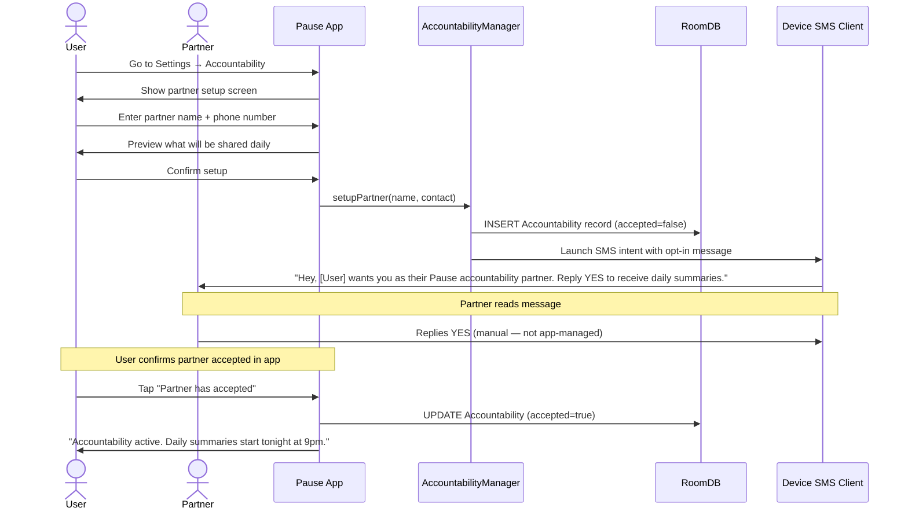
```mermaid
sequenceDiagram
    actor User
    actor Partner
    participant App as Pause App
    participant AM as AccountabilityManager
    participant DB as RoomDB
    participant SMS as Device SMS Client

    User->>App: Go to Settings → Accountability
    App->>User: Show partner setup screen
    User->>App: Enter partner name + phone number
    App->>User: Preview what will be shared daily
    User->>App: Confirm setup
    App->>AM: setupPartner(name, contact)
    AM->>DB: INSERT Accountability record (accepted=false)
    AM->>SMS: Launch SMS intent with opt-in message
    SMS->>Partner: "Hey, [User] wants you as their Pause accountability partner. Reply YES to receive daily summaries."
    Note over Partner,SMS: Partner reads message
    Partner->>SMS: Replies YES (manual — not app-managed)
    Note over User,App: User confirms partner accepted in app
    User->>App: Tap "Partner has accepted"
    App->>DB: UPDATE Accountability (accepted=true)
    App->>User: "Accountability active. Daily summaries start tonight at 9pm."
```

---

### 5.7 Daily Summary Dispatch

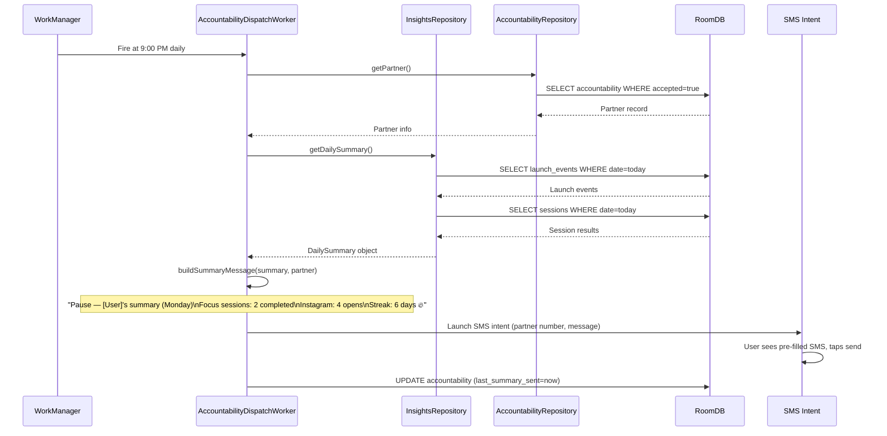
```mermaid
sequenceDiagram
    participant WM as WorkManager
    participant ADW as AccountabilityDispatchWorker
    participant IR as InsightsRepository
    participant AR as AccountabilityRepository
    participant DB as RoomDB
    participant SMS as SMS Intent

    WM->>ADW: Fire at 9:00 PM daily
    ADW->>AR: getPartner()
    AR->>DB: SELECT accountability WHERE accepted=true
    DB-->>AR: Partner record
    AR-->>ADW: Partner info

    ADW->>IR: getDailySummary()
    IR->>DB: SELECT launch_events WHERE date=today
    DB-->>IR: Launch events
    IR->>DB: SELECT sessions WHERE date=today
    DB-->>IR: Session results
    IR-->>ADW: DailySummary object

    ADW->>ADW: buildSummaryMessage(summary, partner)
    Note over ADW: "Pause — [User]'s summary (Monday)\nFocus sessions: 2 completed\nInstagram: 4 opens\nStreak: 6 days 🔥"

    ADW->>SMS: Launch SMS intent (partner number, message)
    SMS->>SMS: User sees pre-filled SMS, taps send
    ADW->>DB: UPDATE accountability (last_summary_sent=now)
```

---

## 6. Flow Diagrams

### 6.1 First Launch Flow

```mermaid
flowchart TD
    A([App Installed]) --> B[Show Welcome Screen]
    B --> C[Show How It Works - 3 steps]
    C --> D[Request Accessibility Permission]
    D --> E{Granted?}
    E -- Yes --> F[Request Overlay Permission]
    E -- No --> G[Show limited mode warning]
    G --> F
    F --> H{Granted?}
    H -- Yes --> I[Request Usage Stats Permission]
    H -- No --> J[Show analytics unavailable warning]
    J --> I
    I --> K{Granted?}
    K -- Yes --> L[Full functionality]
    K -- No --> M[Basic functionality only]
    L --> N[App Selection Screen]
    M --> N
    N --> O[User selects monitored apps]
    O --> P{At least 1 selected?}
    P -- No --> Q[Show prompt: select at least one app]
    Q --> O
    P -- Yes --> R[Save to RoomDB]
    R --> S[Show Home Dashboard]
    S --> T([Monitoring Active])
```

---

### 6.2 App Interception Decision Flow

```mermaid
flowchart TD
    A([Foreground app changes]) --> B{Package in MonitoredApps?}
    B -- No --> Z([Ignore])
    B -- Yes --> C{Active Commitment session?}
    C -- Yes --> D{Package blocked by session?}
    D -- Yes --> E[Show CommitmentBlockOverlay]
    E --> F{User taps Break?}
    F -- No --> Z
    F -- Yes --> G[Start 90s cooldown]
    G --> H{Survives cooldown?}
    H -- No --> Z
    H -- Yes --> I[Show confirm break screen]
    I --> J{Confirms?}
    J -- No --> Z
    J -- Yes --> K[Break session, reset streak]
    K --> L[Show re-entry prompt]
    D -- No --> Z
    C -- No --> M{Allowance exhausted?}
    M -- Yes --> N[Show allowance screen with Open Anyway]
    N --> O{User taps Open Anyway?}
    O -- No --> Z
    O -- Yes --> P{Launch limit reached?}
    M -- No --> P
    P -- Yes --> Q[Show limit screen with Open Anyway]
    Q --> R{Open Anyway?}
    R -- No --> Z
    R -- Yes --> S{Phase 2+ enabled?}
    P -- No --> S
    S -- Yes --> T[Show ReflectionOverlay]
    T --> U[User selects reason]
    U --> V{Reason = Bored or Habit?}
    V -- Yes --> W[Add 5s to delay]
    V -- No --> X[Keep default delay]
    W --> Y[Show DelayOverlay]
    X --> Y
    S -- No --> Y
    Y --> AA{User cancelled?}
    AA -- Yes --> AB[Log cancellation]
    AB --> Z
    AA -- No --> AC[Log launch, app opens]
    AC --> AD[Increment counter]
    AD --> AE[Evaluate streak]
```

---

### 6.3 Streak Calculation Flow

```mermaid
flowchart TD
    A([MidnightResetWorker fires]) --> B[Fetch yesterday's launch data]
    B --> C{Launch limits configured?}
    C -- Yes --> D{All limits respected yesterday?}
    C -- No --> E{Allowance configured?}
    D -- No --> F{Shields remaining > 0?}
    D -- Yes --> E
    F -- No --> G[Reset streak to 0]
    G --> H[Show re-entry prompt on next open]
    F -- Yes --> I[Use 1 shield]
    I --> J[Streak continues with shield marker]
    E -- Yes --> K{Allowance respected yesterday?}
    E -- No --> L[Day counts as valid]
    K -- No --> F
    K -- Yes --> L
    J --> M[Increment streak day count]
    L --> M
    M --> N[Update longest streak if beaten]
    N --> O[Reset daily counters]
    O --> P([Next day begins])
    G --> O
```

---

### 6.4 Commitment Break Flow

```mermaid
flowchart TD
    A([User taps Break Commitment]) --> B[Show 90-second cooldown screen]
    B --> C[Display: Most cravings pass in 90 seconds]
    C --> D{User taps Stay Focused?}
    D -- Yes --> E([Return to block screen])
    D -- No --> F{Countdown reaches 0?}
    F -- No --> D
    F -- Yes --> G[Show final confirmation screen]
    G --> H[Display: Streak will reset. Session will end.]
    H --> I{User taps Go Back?}
    I -- Yes --> E
    I -- No --> J{User taps Confirm Break?}
    J -- No --> I
    J -- Yes --> K[Mark session as broken in DB]
    K --> L{Streak shields remaining?}
    L -- Yes --> M[Offer to use shield]
    M --> N{User uses shield?}
    N -- Yes --> O[Streak preserved with shield marker]
    N -- No --> P[Reset streak]
    L -- No --> P
    O --> Q[Show re-entry prompt]
    P --> Q
    Q --> R([User sets fresh intention])
```

---

### 6.5 Accountability Notification Flow

```mermaid
flowchart TD
    A([9PM WorkManager trigger]) --> B{Partner configured?}
    B -- No --> Z([Skip])
    B -- Yes --> C{Partner accepted?}
    C -- No --> Z
    C -- Yes --> D[Fetch today's launch summary]
    D --> E[Fetch today's session results]
    E --> F[Fetch current streak]
    F --> G[Build summary message]
    G --> H{Any data to report?}
    H -- No --> I[Send minimal message: No app opens today]
    H -- Yes --> J[Format summary with app opens, sessions, streak]
    I --> K[Launch SMS intent with partner number]
    J --> K
    K --> L[User sees pre-filled SMS]
    L --> M{User sends?}
    M -- Yes --> N[Mark summary as sent in DB]
    M -- No --> O[Log as skipped, retry next day]
    N --> Z
    O --> Z
```

---

### 6.6 Daily Allowance Enforcement Flow

```mermaid
flowchart TD
    A([App interception triggered]) --> B[Query UsageStatsManager for today]
    B --> C[Sum time across all monitored apps]
    C --> D{Daily allowance configured?}
    D -- No --> E([Proceed to delay flow])
    D -- Yes --> F{Time used >= allowance?}
    F -- No --> G[Calculate remaining time]
    G --> H{Remaining < 10 minutes?}
    H -- Yes --> I[Show low allowance warning in overlay]
    H -- No --> E
    I --> E
    F -- Yes --> J[Show allowance exhausted screen]
    J --> K[Display: You've used your daily 60 minutes]
    K --> L{User taps Open Anyway?}
    L -- No --> M([User cancels])
    L -- Yes --> N[Log override event]
    N --> O[Proceed to delay flow with extra 5s penalty]
```

---

## 7. State Diagrams

### 7.1 App Monitoring States

```mermaid
stateDiagram-v2
    [*] --> NOT_MONITORED : App installed

    NOT_MONITORED --> MONITORED_DEFAULT : User adds to list
    MONITORED_DEFAULT --> MONITORED_LOW : Set friction = Low
    MONITORED_DEFAULT --> MONITORED_MEDIUM : Set friction = Medium
    MONITORED_DEFAULT --> MONITORED_HIGH : Set friction = High
    MONITORED_LOW --> MONITORED_MEDIUM : Adjust friction
    MONITORED_MEDIUM --> MONITORED_HIGH : Adjust friction
    MONITORED_HIGH --> MONITORED_MEDIUM : Adjust friction
    MONITORED_MEDIUM --> MONITORED_LOW : Adjust friction

    MONITORED_DEFAULT --> COMMITMENT_BLOCKED : Active commitment session
    MONITORED_LOW --> COMMITMENT_BLOCKED : Active commitment session
    MONITORED_MEDIUM --> COMMITMENT_BLOCKED : Active commitment session
    MONITORED_HIGH --> COMMITMENT_BLOCKED : Active commitment session

    COMMITMENT_BLOCKED --> MONITORED_DEFAULT : Session ends
    COMMITMENT_BLOCKED --> MONITORED_LOW : Session ends
    COMMITMENT_BLOCKED --> MONITORED_MEDIUM : Session ends
    COMMITMENT_BLOCKED --> MONITORED_HIGH : Session ends

    MONITORED_DEFAULT --> NOT_MONITORED : User removes from list
    MONITORED_LOW --> NOT_MONITORED : User removes from list
    MONITORED_MEDIUM --> NOT_MONITORED : User removes from list
    MONITORED_HIGH --> NOT_MONITORED : User removes from list
```

---

### 7.2 Session Lifecycle States

```mermaid
stateDiagram-v2
    [*] --> IDLE

    IDLE --> FOCUS_RUNNING : startFocusSession()
    IDLE --> COMMITMENT_RUNNING : startCommitmentSession()

    FOCUS_RUNNING --> FOCUS_EXPIRED : Timer reaches 0
    FOCUS_RUNNING --> IDLE : User manually ends
    FOCUS_EXPIRED --> IDLE : Dismissed by user

    COMMITMENT_RUNNING --> COOLDOWN_PENDING : User taps Break
    COOLDOWN_PENDING --> COMMITMENT_RUNNING : User taps Stay Focused
    COOLDOWN_PENDING --> BREAK_CONFIRMATION : 90s passes
    BREAK_CONFIRMATION --> COMMITMENT_RUNNING : User taps Go Back
    BREAK_CONFIRMATION --> COMMITMENT_BROKEN : User confirms break

    COMMITMENT_RUNNING --> COMMITMENT_COMPLETE : Timer reaches 0
    COMMITMENT_COMPLETE --> IDLE : Dismissed
    COMMITMENT_BROKEN --> IDLE : Streak reset, re-entry shown

    IDLE --> [*]
```

---

### 7.3 Streak States

```mermaid
stateDiagram-v2
    [*] --> NO_STREAK

    NO_STREAK --> STREAK_DAY_1 : First valid day
    STREAK_DAY_1 --> STREAK_GROWING : Second consecutive valid day
    STREAK_GROWING --> STREAK_GROWING : Another valid day
    STREAK_GROWING --> SHIELD_USED : Day failed, shield available
    SHIELD_USED --> STREAK_GROWING : Next valid day
    SHIELD_USED --> NO_STREAK : Another failure (no more shields)
    STREAK_GROWING --> NO_STREAK : Day failed, no shield
    STREAK_DAY_1 --> NO_STREAK : Next day failed, no shield
    NO_STREAK --> STREAK_DAY_1 : Re-entry — new start

    note right of SHIELD_USED : Streak count preserved\nShield marker shown on dashboard
    note right of NO_STREAK : Re-entry prompt shown\non next app open
```

---

## 8. Phased PRD

---

### 8.1 Phase 1 — Awareness & Friction

**Theme:** Make the unconscious conscious.
**Estimated Build Time:** 5 days
**Goal:** User installs, configures in under 2 minutes, experiences friction immediately.

#### Features

**F1.1 — Onboarding Flow**
A guided first-run experience collecting all permissions in one sequence.
- Welcome screen with value proposition
- Accessibility Service explanation + grant redirect
- Overlay permission explanation + grant redirect
- Usage Stats explanation + grant redirect
- App selection (minimum 1 required)
- Home dashboard with monitoring active

Permission explanations must include: *"Pause cannot read your messages, see your passwords, or access personal content."*

**F1.2 — App Selection**
- Displays full installed app list (user apps only, system apps filtered)
- Multi-select with icons
- Editable at any time from home screen
- Persisted to RoomDB

**F1.3 — Delay Screen (Core)**
- Triggered when monitored app enters foreground
- Default: 10-second countdown, no skip button
- Options: Cancel | Wait
- Cancellation logs to DB
- Countdown completion opens app

Configurable delay: 5s / 10s / 20s

**F1.4 — Daily Launch Counter**
- Tracks daily opens per monitored app
- Resets at midnight via WorkManager
- Displayed as bar chart on home screen
- 7-day rolling history stored for Phase 2

**F1.5 — Home Dashboard v1**
- Monitored app list with today's launch counts
- Simple bar visualization
- Add/Edit Apps button

---

### 8.2 Phase 2 — Control & Reflection

**Theme:** Give users active levers, not just a mirror.
**Estimated Build Time:** 5–6 days
**Prerequisite:** Phase 1 stable.

#### Features

**F2.1 — Behavioral Reflection Prompt** *(Hero Feature)*
- Shown before delay countdown
- Single mandatory tap required to proceed
- Options: Bored / Habit / Replying to someone / Intentional
- Stored in DB with launch event
- Bored or Habit selections → +5 seconds added to delay

**F2.2 — Daily Usage Allowance**
- User sets total daily minutes across monitored apps
- Sourced from UsageStatsManager
- Remaining allowance shown on home screen
- When exhausted: soft block with Open Anyway option (extra 5s penalty)

**F2.3 — App Launch Limits**
- Per-app maximum opens per day
- When limit reached: soft block with Open Anyway option
- Displayed as `4 / 5` on dashboard

**F2.4 — Focus Mode Sessions**
- Timed sessions (25 / 45 / 60 min / custom)
- Increases all delays by +10s
- Forces reflection prompt regardless of other settings
- Persistent notification with countdown timer
- App opens are still allowed — friction only

**F2.5 — Streak Tracking + Shield**
- Day is valid if all launch limits and allowance respected
- Streak increments at midnight for valid days
- Streak Shield: 1 grace day per week maximum
- Hard streak break shows mandatory re-entry prompt

**F2.6 — Weekly Insights**
- Available Monday for prior week
- Shows: most opened app, total time, most common trigger, peak hour, best day
- Source: local DB aggregation only

**F2.7 — Cost of a Scroll Card**
- Shown once per day on first Pause open
- Calculates: opens × avg session time → weekly and yearly projection
- Framed as time equivalents ("5 hours/week = 10 days/year")

**F2.8 — Home Dashboard v2**
- Streak counter with shield indicator
- Allowance remaining
- Per-app launch count vs limit
- Start Focus Session button
- Weekly Insights link

---

### 8.3 Phase 3 — Commitment & Accountability

**Theme:** Make it harder to break your own rules.
**Estimated Build Time:** 6–7 days
**Prerequisite:** Phase 2 stable.

#### Features

**F3.1 — Commitment Mode**
- Full block on selected apps for a defined duration
- Survives app restarts (persisted + AlarmManager)
- Persistent notification with live countdown
- Break requires 90-second cooldown → second confirmation

**F3.2 — 90-Second Override Cooldown**
- Two-step break flow: cooldown → confirmation
- Framed as: "Most cravings pass in 90 seconds"
- Cancel available during cooldown
- On break confirmed: streak resets, re-entry prompt shown

**F3.3 — Friction Levels per App**

| Level | Intervention |
|---|---|
| Low | 5s delay only |
| Medium | Reflection + 10s delay |
| High | Reflection + 20s delay + second confirmation |
| Commitment | Full block during commitment sessions |

**F3.4 — Environmental Modes**
- Named presets (Work / Study / custom)
- Define which apps are monitored and at what friction level
- One-tap switching from home screen
- Built-in presets editable by user

**F3.5 — Lock Screen Intervention**
- Triggers after 5+ unlocks in 15 minutes (configurable)
- Shows awareness overlay: "You've unlocked X times today"
- No blocking — awareness only
- Unlock count shown on dashboard

**F3.6 — Accountability Partner**
- User enters partner name + phone number
- Opt-in invitation sent via SMS
- Partner must accept (manual reply)
- Daily summary dispatched at 9PM via SMS intent
- Easy removal from settings
- No data beyond behavioral counts is shared

**F3.7 — Monthly Insights**
- Available first of each month for prior month
- Shows: time saved, most improved app, peak distraction hour, longest streak, sessions broken/completed

**F3.8 — Home Dashboard v3**
- Streak + shield status
- Allowance remaining
- Active commitment session countdown
- Active environmental mode
- Per-app launch vs limit
- Daily unlock count
- Accountability and insights shortcuts

---

## 9. Permissions & Feasibility

### Permission Summary

| Permission | Purpose | Grant Method | Risk Level |
|---|---|---|---|
| Accessibility Service | Foreground app detection | Settings redirect | High — Play Store scrutiny |
| SYSTEM_ALERT_WINDOW | Display overlay above apps | Settings redirect | Medium |
| UsageStatsManager | Time tracking, allowance | Settings redirect | Low |
| POST_NOTIFICATIONS | Session + summary alerts | Runtime dialog (Android 13+) | Low |

### Feasibility Notes

**Accessibility Service & Play Store**
Google's Play Store policy restricts Accessibility Service to apps with a clearly justified use case. Pause must:
- Declare the exact use case in the Play Store listing
- Limit Accessibility Service to foreground detection only — no reading screen content
- Submit detailed permission justification during app review

**Battery Impact**
Accessibility Service fires events continuously. Mitigation:
- Only respond to `TYPE_WINDOW_STATE_CHANGED` — not all event types
- Skip processing if package hasn't changed from last event
- Benchmark on low-end devices (2GB RAM target)

**Overlay on Android 12+**
Android 12+ imposes restrictions on overlay interaction. Test thoroughly across SDK 31–35.

**No Internet Permission**
Pause requires no `INTERNET` permission. All accountability dispatch uses the device's existing SMS client via `Intent.ACTION_SENDTO`. This is a major trust signal to privacy-conscious users and should be highlighted in the Play Store listing.

---

## 10. Risk Register

| Risk | Likelihood | Impact | Mitigation |
|---|---|---|---|
| Accessibility permission refusal by user | High | High | Dedicated onboarding screen with plain-language explanation; partial mode without it |
| Play Store rejection (Accessibility misuse) | Medium | High | Declare use case explicitly; follow restricted permission guidelines |
| Battery drain from Accessibility Service | Medium | Medium | Event filtering, only respond to package changes; test on low-end devices |
| Users feel over-controlled and uninstall | Medium | High | All Phase 3 features opt-in; Open Anyway always available in Phases 1–2 |
| Streak break causing abandonment | High | Medium | Streak Shield + mandatory re-entry prompt |
| 90-second cooldown feeling punitive | Medium | Low | Science-backed framing: "Most cravings pass in 90 seconds" |
| Accountability partner SMS not sent | Low | Medium | User manually taps send; no silent background transmission |
| Android version fragmentation in overlays | Medium | Medium | Test matrix: API 26, 29, 31, 33, 35 |
| UsageStats permission denial (no allowance feature) | Medium | Low | Gracefully degrade — show feature unavailable, use internal counter instead |

---

## 11. Success Metrics

### Phase 1 Metrics

| Metric | Target |
|---|---|
| Permission grant rate (Accessibility) | > 60% |
| D7 retention | > 40% |
| Delay cancellation rate | > 20% |
| App rating at launch | ≥ 4.0 stars |

### Phase 2 Metrics

| Metric | Target |
|---|---|
| Reflection prompt completion rate | > 80% (it is mandatory) |
| % of days within launch limit | > 50% by week 4 |
| Weekly insights screen opens | > 1 per active user per week |
| D30 retention | > 25% |

### Phase 3 Metrics

| Metric | Target |
|---|---|
| Commitment session completion rate | > 65% |
| Accountability partner activation | > 15% of active users |
| 30-day streak achievement | > 10% of active users |
| Reduction in monitored app launches vs Week 1 | > 30% by Week 8 |

---

## 12. Development Timeline

**Platform:** Android · Kotlin · MVVM · RoomDB · Jetpack Compose
**Assumption:** Single experienced Android developer

### Phase 1 — ~5 days

| Task | Estimate |
|---|---|
| Project setup, architecture, navigation, RoomDB schema | 0.5 day |
| PauseAccessibilityService + foreground detection | 1 day |
| OverlayManager + DelayOverlayView (no skip) | 1 day |
| App selection UI + RoomDB integration | 0.5 day |
| Launch counter + UsageStatsManager integration | 0.5 day |
| Onboarding permission flow (3 permissions) | 0.5 day |
| MidnightResetWorker (WorkManager) | 0.25 day |
| Testing + Play Store prep | 0.75 day |

### Phase 2 — ~5–6 days

| Task | Estimate |
|---|---|
| ReflectionOverlayView + response storage | 1 day |
| Daily allowance tracker (UsageStats + UI) | 1 day |
| Per-app launch limits + enforcement | 0.5 day |
| Focus Mode session + persistent notification | 1 day |
| Streak engine + Streak Shield + re-entry prompt | 0.75 day |
| Weekly Insights screen (aggregation + UI) | 0.75 day |
| Cost of a Scroll daily card | 0.25 day |
| Home Dashboard v2 | 0.25 day |
| Testing + regression | 0.5 day |

### Phase 3 — ~6–7 days

| Task | Estimate |
|---|---|
| CommitmentSession + SessionManager + AlarmManager persistence | 1.5 days |
| CommitmentBlockOverlayView + 90s cooldown + confirm flow | 0.75 day |
| Friction levels per app (UI + enforcement) | 0.5 day |
| Environmental modes (presets, switching) | 1 day |
| Lock screen unlock tracking + intervention overlay | 0.5 day |
| Accountability partner setup + SMS dispatch | 1 day |
| AccountabilityDispatchWorker (WorkManager) | 0.5 day |
| Monthly insights aggregation + UI | 0.5 day |
| Home Dashboard v3 | 0.25 day |
| Testing + full regression | 0.5 day |

---

**Total Estimated Build Time: ~17 days across all phases**

---

*Pause — Not a blocker. Not a tracker.*
*A moment of intention before every scroll.*

---

> **Document Version:** 1.0
> **Covers:** PRD (all phases) · HLD · LLD · Use Cases · Sequence Diagrams · Flow Diagrams · State Diagrams
> **Platform:** Android (Kotlin, API 26+)
> **Architecture:** MVVM · Repository Pattern · RoomDB · WorkManager · AccessibilityService