# Pause — Strict Mode & Parental Control Mode
### Standalone Technical Design Document
#### HLD · LLD · Architecture · Use Cases · Sequence · Flow · State Diagrams

---

> **Document Scope:** This document covers only the two advanced modes added to Pause —
> **Strict Mode** and **Parental Control Mode** — in full technical detail.
> It is self-contained and does not require the main PRD to be read first,
> though it assumes the core Pause architecture (AccessibilityService, OverlayManager,
> RoomDB, SessionManager) already exists from Phases 1–3.
>
> **What is NOT in this document:** Phase 1–3 features, standard Commitment Mode,
> streaks, reflection prompts, or accountability partners.

---

## Table of Contents

1. [Context & Motivation](#1-context--motivation)
2. [Mode Comparison at a Glance](#2-mode-comparison-at-a-glance)
3. [High-Level Design — Strict Mode](#3-high-level-design--strict-mode)
   - 3.1 System Context
   - 3.2 Component Architecture
   - 3.3 Data Flow
4. [Low-Level Design — Strict Mode](#4-low-level-design--strict-mode)
   - 4.1 Database Schema Extensions
   - 4.2 Class Design
   - 4.3 Power Button Interception Design
   - 4.4 Boot-time Lockout Design
   - 4.5 Emergency Exit Design
5. [Strict Mode Diagrams](#5-strict-mode-diagrams)
   - 5.1 Use Case Diagram
   - 5.2 Sequence Diagram — Full Session Lifecycle
   - 5.3 Sequence Diagram — Force Restart & Boot Resume
   - 5.4 Flow Diagram — App Interception
   - 5.5 Flow Diagram — Emergency Exit
   - 5.6 Flow Diagram — Boot Lockout
   - 5.7 State Diagram
6. [High-Level Design — Parental Control Mode](#6-high-level-design--parental-control-mode)
   - 6.1 System Context
   - 6.2 Component Architecture
   - 6.3 Data Flow
7. [Low-Level Design — Parental Control Mode](#7-low-level-design--parental-control-mode)
   - 7.1 Database Schema Extensions
   - 7.2 Class Design
   - 7.3 PIN Security Design
   - 7.4 Schedule Engine Design
   - 7.5 Device Admin Design
   - 7.6 Emergency Contact Design
8. [Parental Control Mode Diagrams](#8-parental-control-mode-diagrams)
   - 8.1 Use Case Diagram
   - 8.2 Sequence Diagram — Parent Setup
   - 8.3 Sequence Diagram — Child Interception (Restricted)
   - 8.4 Sequence Diagram — PIN Entry & Recovery
   - 8.5 Flow Diagram — App Interception Decision
   - 8.6 Flow Diagram — PIN Protection
   - 8.7 Flow Diagram — Boot Schedule Resume
   - 8.8 State Diagram
9. [Shared Infrastructure Changes](#9-shared-infrastructure-changes)
   - 9.1 AccessibilityService Extensions
   - 9.2 BootReceiver Design
   - 9.3 Overlay System Extensions
   - 9.4 Updated Component Architecture (Both Modes)
10. [Permissions & Feasibility](#10-permissions--feasibility)
11. [Risk Register](#11-risk-register)
12. [Development Timeline](#12-development-timeline)

---

## 1. Context & Motivation

### Why these two modes?

Phases 1–3 of Pause operate entirely on a **self-governance** model — the user sets their own rules and can override them with enough friction. This works well for motivated adults who want to build better habits gradually.

Two user segments need something fundamentally different:

**Strict Mode users** are people who have already tried Commitment Mode and found that the "Open Anyway" escape valve is too easy to reach during moments of weakness. They want to remove the exit entirely — no exceptions, no bargaining — for a defined window. This is the digital equivalent of giving your car keys to a friend before a party. The choice was made earlier, deliberately, when they were thinking clearly.

**Parental Control Mode users** are parents who need to configure rules on behalf of a child. The dynamic is entirely different: two roles, two levels of access, a schedule rather than a session, and a hard requirement that the child cannot modify the rules or easily bypass them.

Neither mode involves any content detection. Pause acts only at the app-launch boundary, never reading what the user does inside an app.

---

## 2. Mode Comparison at a Glance

| Capability | Commitment Mode (Ph3) | Strict Mode | Parental Control |
|---|---|---|---|
| **Who sets rules** | User | User | Parent |
| **Who is governed** | User | User | Child |
| **Open Anyway** | ✅ (after 90s cooldown) | ❌ Never | ❌ (Restricted) / ✅ (Limited) |
| **Power menu blocked** | ❌ | ✅ | ✅ |
| **Settings editable during session** | ✅ | ❌ Read-only | ❌ PIN-gated always |
| **Boot-time lockout** | ❌ | ✅ | ✅ (schedule resumes) |
| **Uninstall prevention** | ❌ | ❌ | ✅ (Device Admin, optional) |
| **Emergency escape** | 90s cooldown → confirm | Triple-tap → confirm | Emergency contact call |
| **Schedule-based** | ❌ (session-based) | ❌ (session-based) | ✅ (per-day-of-week) |
| **PIN protection** | ❌ | ❌ | ✅ (BCrypt, 6-digit) |
| **Content detection** | ❌ Never | ❌ Never | ❌ Never |
| **Requires internet** | ❌ | ❌ | ❌ |
| **New Android permissions needed** | ❌ | `RECEIVE_BOOT_COMPLETED` | `RECEIVE_BOOT_COMPLETED` + Device Admin |

---

## 3. High-Level Design — Strict Mode

### 3.1 System Context

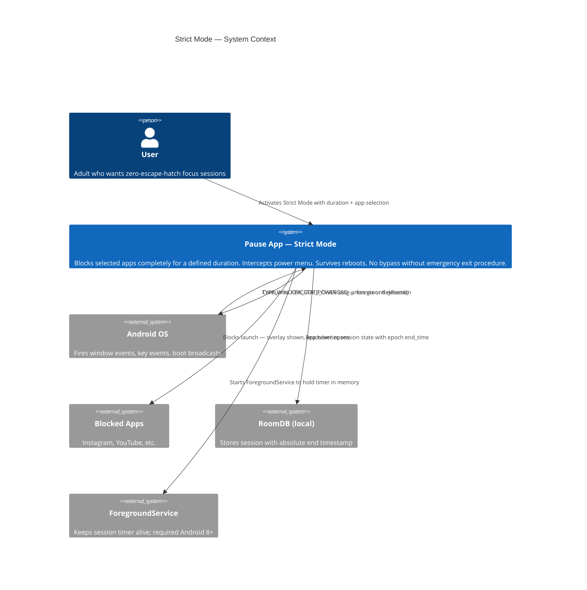
```mermaid
C4Context
    title Strict Mode — System Context

    Person(user, "User", "Adult who wants zero-escape-hatch focus sessions")

    System(pause, "Pause App — Strict Mode", "Blocks selected apps completely for a defined duration. Intercepts power menu. Survives reboots. No bypass without emergency exit procedure.")

    System_Ext(android_os, "Android OS", "Fires window events, key events, boot broadcasts")
    System_Ext(target_apps, "Blocked Apps", "Instagram, YouTube, etc.")
    System_Ext(room_db, "RoomDB (local)", "Stores session with absolute end timestamp")
    System_Ext(foreground_svc, "ForegroundService", "Keeps session timer alive; required Android 8+")

    Rel(user, pause, "Activates Strict Mode with duration + app selection")
    Rel(pause, android_os, "Consumes KEYCODE_POWER long-press via onKeyEvent()")
    Rel(android_os, pause, "BOOT_COMPLETED broadcast → BootReceiver")
    Rel(android_os, pause, "TYPE_WINDOW_STATE_CHANGED → foreground detection")
    Rel(pause, target_apps, "Blocks launch — overlay shown, app never opens")
    Rel(pause, room_db, "Reads/writes session state with epoch end_time")
    Rel(pause, foreground_svc, "Starts ForegroundService to hold timer in memory")
```

---

### 3.2 Component Architecture

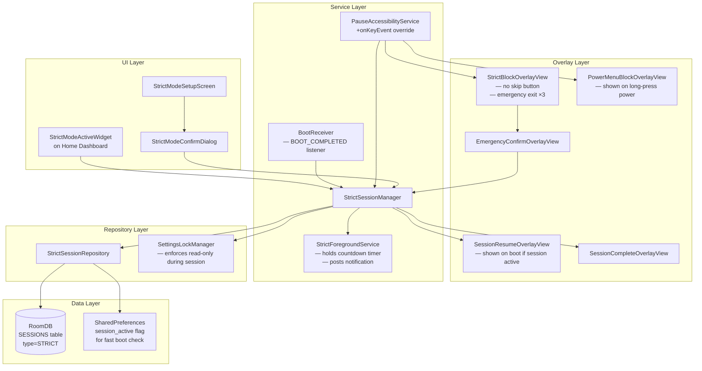
```mermaid
graph TB
    subgraph UI["UI Layer"]
        A[StrictModeSetupScreen]
        B[StrictModeConfirmDialog]
        C[StrictModeActiveWidget\non Home Dashboard]
    end

    subgraph OVERLAY["Overlay Layer"]
        D[StrictBlockOverlayView\n— no skip button\n— emergency exit ×3]
        E[PowerMenuBlockOverlayView\n— shown on long-press power]
        F[SessionResumeOverlayView\n— shown on boot if session active]
        G[SessionCompleteOverlayView]
        H[EmergencyConfirmOverlayView]
    end

    subgraph SERVICE["Service Layer"]
        I[PauseAccessibilityService\n+onKeyEvent override]
        J[StrictSessionManager]
        K[StrictForegroundService\n— holds countdown timer\n— posts notification]
        L[BootReceiver\n— BOOT_COMPLETED listener]
    end

    subgraph REPO["Repository Layer"]
        M[StrictSessionRepository]
        N[SettingsLockManager\n— enforces read-only during session]
    end

    subgraph DATA["Data Layer"]
        O[(RoomDB\nSESSIONS table\ntype=STRICT)]
        P[SharedPreferences\nsession_active flag\nfor fast boot check]
    end

    A --> B
    B --> J
    J --> K
    J --> M
    M --> O
    M --> P

    I --> D
    I --> E
    I --> J
    L --> J
    J --> F
    J --> G

    D --> H
    H --> J

    C --> J
    J --> N
```

---

### 3.3 Data Flow

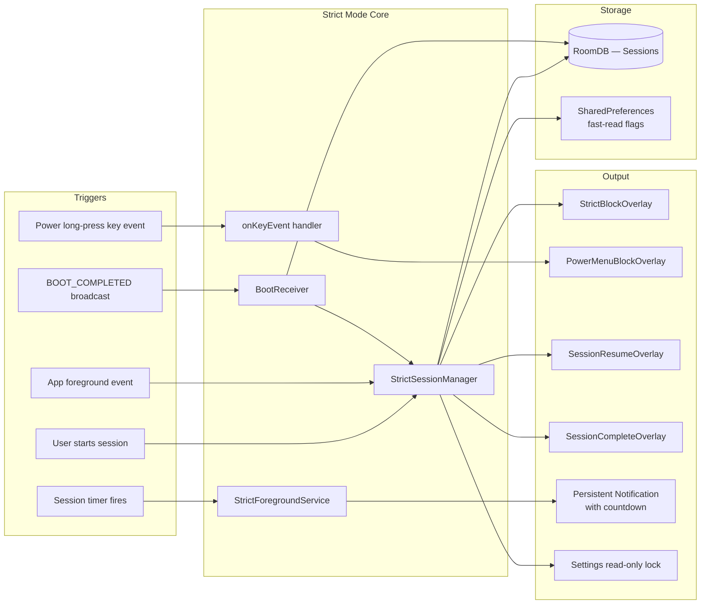
```mermaid
flowchart LR
    subgraph TRIGGERS["Triggers"]
        T1[User starts session]
        T2[App foreground event]
        T3[Power long-press key event]
        T4[BOOT_COMPLETED broadcast]
        T5[Session timer fires]
    end

    subgraph CORE["Strict Mode Core"]
        C1[StrictSessionManager]
        C2[BootReceiver]
        C3[StrictForegroundService]
        C4[onKeyEvent handler]
    end

    subgraph STORAGE["Storage"]
        S1[(RoomDB — Sessions)]
        S2[SharedPreferences\nfast-read flags]
    end

    subgraph OUTPUT["Output"]
        O1[StrictBlockOverlay]
        O2[PowerMenuBlockOverlay]
        O3[SessionResumeOverlay]
        O4[SessionCompleteOverlay]
        O5[Persistent Notification\nwith countdown]
        O6[Settings read-only lock]
    end

    T1 --> C1
    T2 --> C1
    T3 --> C4
    T4 --> C2
    T5 --> C3

    C1 --> S1
    C1 --> S2
    C2 --> S1
    C2 --> C1

    C1 --> O1
    C4 --> O2
    C1 --> O3
    C1 --> O4
    C3 --> O5
    C1 --> O6
```

---

## 4. Low-Level Design — Strict Mode

### 4.1 Database Schema Extensions

The core `SESSIONS` table from Phase 3 is extended with new fields. No new table is needed — Strict Mode is a session type.

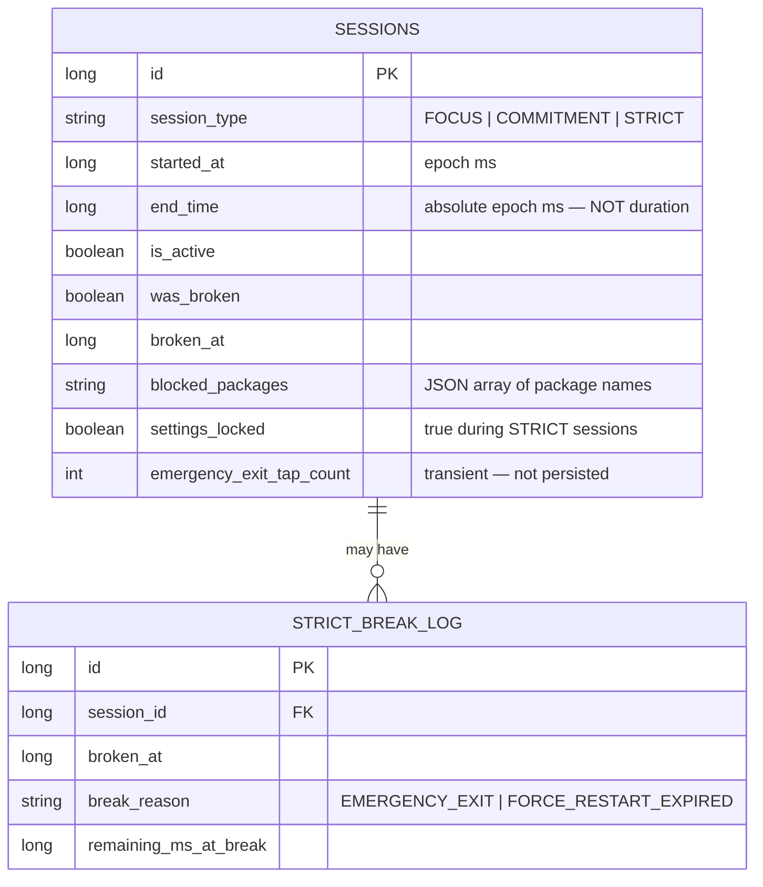
```mermaid
erDiagram
    SESSIONS {
        long id PK
        string session_type "FOCUS | COMMITMENT | STRICT"
        long started_at "epoch ms"
        long end_time "absolute epoch ms — NOT duration"
        boolean is_active
        boolean was_broken
        long broken_at
        string blocked_packages "JSON array of package names"
        boolean settings_locked "true during STRICT sessions"
        int emergency_exit_tap_count "transient — not persisted"
    }

    STRICT_BREAK_LOG {
        long id PK
        long session_id FK
        long broken_at
        string break_reason "EMERGENCY_EXIT | FORCE_RESTART_EXPIRED"
        long remaining_ms_at_break
    }

    SESSIONS ||--o{ STRICT_BREAK_LOG : "may have"
```

**Key design note — absolute `end_time` vs relative duration:**
All prior session types stored a `duration_ms`. Strict Mode stores `end_time` as an absolute epoch millisecond timestamp (`System.currentTimeMillis() + durationMs` at session start). This is critical for boot resume: after a force-restart, the app compares `end_time` against current time to calculate exactly how much session remains, regardless of how long the phone was off.

---

### 4.2 Class Design

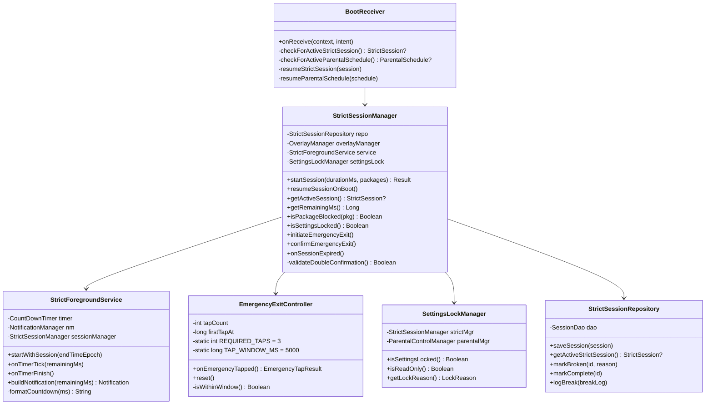
```mermaid
classDiagram
    class StrictSessionManager {
        -StrictSessionRepository repo
        -OverlayManager overlayManager
        -StrictForegroundService service
        -SettingsLockManager settingsLock
        +startSession(durationMs, packages) Result
        +resumeSessionOnBoot()
        +getActiveSession() StrictSession?
        +getRemainingMs() Long
        +isPackageBlocked(pkg) Boolean
        +isSettingsLocked() Boolean
        +initiateEmergencyExit()
        +confirmEmergencyExit()
        +onSessionExpired()
        -validateDoubleConfirmation() Boolean
    }

    class StrictForegroundService {
        -CountDownTimer timer
        -NotificationManager nm
        -StrictSessionManager sessionManager
        +startWithSession(endTimeEpoch)
        +onTimerTick(remainingMs)
        +onTimerFinish()
        +buildNotification(remainingMs) Notification
        -formatCountdown(ms) String
    }

    class BootReceiver {
        +onReceive(context, intent)
        -checkForActiveStrictSession() StrictSession?
        -checkForActiveParentalSchedule() ParentalSchedule?
        -resumeStrictSession(session)
        -resumeParentalSchedule(schedule)
    }

    class EmergencyExitController {
        -int tapCount
        -long firstTapAt
        -static int REQUIRED_TAPS = 3
        -static long TAP_WINDOW_MS = 5000
        +onEmergencyTapped() EmergencyTapResult
        +reset()
        -isWithinWindow() Boolean
    }

    class SettingsLockManager {
        -StrictSessionManager strictMgr
        -ParentalControlManager parentalMgr
        +isSettingsLocked() Boolean
        +isReadOnly() Boolean
        +getLockReason() LockReason
    }

    class StrictSessionRepository {
        -SessionDao dao
        +saveSession(session)
        +getActiveStrictSession() StrictSession?
        +markBroken(id, reason)
        +markComplete(id)
        +logBreak(breakLog)
    }

    StrictSessionManager --> StrictForegroundService
    StrictSessionManager --> EmergencyExitController
    StrictSessionManager --> SettingsLockManager
    StrictSessionManager --> StrictSessionRepository
    BootReceiver --> StrictSessionManager
```

---

### 4.3 Power Button Interception Design

```
Power Button Behavior Matrix — Strict Mode Active
─────────────────────────────────────────────────────────────────────
Physical Action          │ Android Event              │ Pause Response
─────────────────────────┼────────────────────────────┼──────────────
Short press              │ KEYCODE_POWER ACTION_DOWN  │ PASS THROUGH
(screen on → off)        │ (not long press)           │ Screen turns off
                         │                            │ Session continues
─────────────────────────┼────────────────────────────┼──────────────
Short press              │ Screen unlock sequence     │ PASS THROUGH
(screen off → on)        │ Not a key event in AS      │ Normal unlock
                         │                            │ AS continues monitoring
─────────────────────────┼────────────────────────────┼──────────────
Long press               │ KEYCODE_POWER ACTION_DOWN  │ INTERCEPTED
(power menu trigger)     │ + event.isLongPress = true │ Return true → consumed
                         │                            │ Show PowerMenuBlockOverlay
─────────────────────────┼────────────────────────────┼──────────────
Force restart combo      │ Firmware level             │ UNAVOIDABLE
(Vol↓+Vol↑+Power etc.)  │ Never reaches Android OS   │ BootReceiver handles
                         │                            │ session resume on reboot
─────────────────────────────────────────────────────────────────────
```

**Implementation:**

```kotlin
// Inside PauseAccessibilityService
override fun onKeyEvent(event: KeyEvent): Boolean {
    val strictSession = strictSessionManager.getActiveSession()
    if (strictSession != null &&
        event.keyCode == KeyEvent.KEYCODE_POWER &&
        event.action == KeyEvent.ACTION_DOWN &&
        event.isLongPress) {

        // Consume event — prevents system power menu
        overlayManager.showPowerMenuBlockOverlay(
            remainingMs = strictSessionManager.getRemainingMs()
        )
        return true // consumed
    }
    return super.onKeyEvent(event) // pass through all other events
}
```

> **Play Store declaration required:** "Pause intercepts long-press power button events exclusively when the user has actively started a Strict Mode or Parental Control session. This is used to enforce the user's own focus rules. No keypress data is stored or transmitted."

---

### 4.4 Boot-time Lockout Design

**Why absolute epoch timestamps matter:**

```
Session started:  end_time = 1,720,000,000,000 ms (stored in DB)
Phone turned off: at t = 1,719,960,000,000 ms  (40 min before end)
Phone back on:    at t = 1,719,980,000,000 ms  (20 min before end)

BootReceiver reads: end_time - System.currentTimeMillis()
                  = 1,720,000,000,000 - 1,719,980,000,000
                  = 20,000,000 ms = 20 minutes remaining ✅

If stored as relative duration instead:
  duration = 40 min remaining (stale — doesn't account for downtime) ❌
```

**BootReceiver decision tree:**

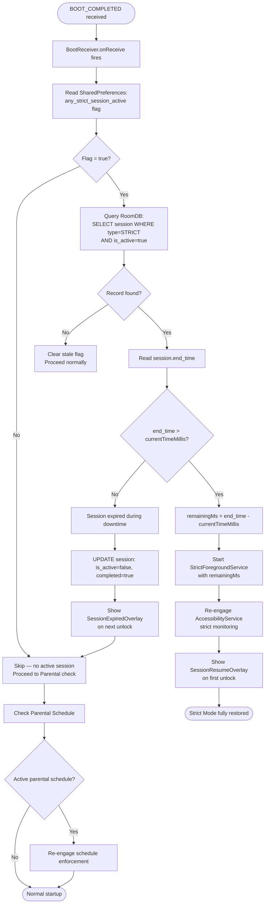
```mermaid
flowchart TD
    A([BOOT_COMPLETED received]) --> B[BootReceiver.onReceive fires]
    B --> C[Read SharedPreferences:\nany_strict_session_active flag]
    C --> D{Flag = true?}
    D -- No --> E[Skip — no active session\nProceed to Parental check]
    D -- Yes --> F[Query RoomDB:\nSELECT session WHERE type=STRICT\nAND is_active=true]
    F --> G{Record found?}
    G -- No --> H[Clear stale flag\nProceed normally]
    G -- Yes --> I[Read session.end_time]
    I --> J{end_time > currentTimeMillis?}
    J -- No --> K[Session expired during downtime]
    K --> L[UPDATE session: is_active=false, completed=true]
    L --> M[Show SessionExpiredOverlay\non next unlock]
    M --> E
    J -- Yes --> N[remainingMs = end_time - currentTimeMillis]
    N --> O[Start StrictForegroundService\nwith remainingMs]
    O --> P[Re-engage AccessibilityService\nstrict monitoring]
    P --> Q[Show SessionResumeOverlay\non first unlock]
    Q --> R([Strict Mode fully restored])

    E --> S[Check Parental Schedule]
    S --> T{Active parental schedule?}
    T -- No --> U([Normal startup])
    T -- Yes --> V[Re-engage schedule enforcement]
    V --> U
```

---

### 4.5 Emergency Exit Design

The emergency exit is the only user-initiated escape from Strict Mode. It is deliberately awkward to prevent accidental or impulsive use, while remaining accessible for genuine emergencies.

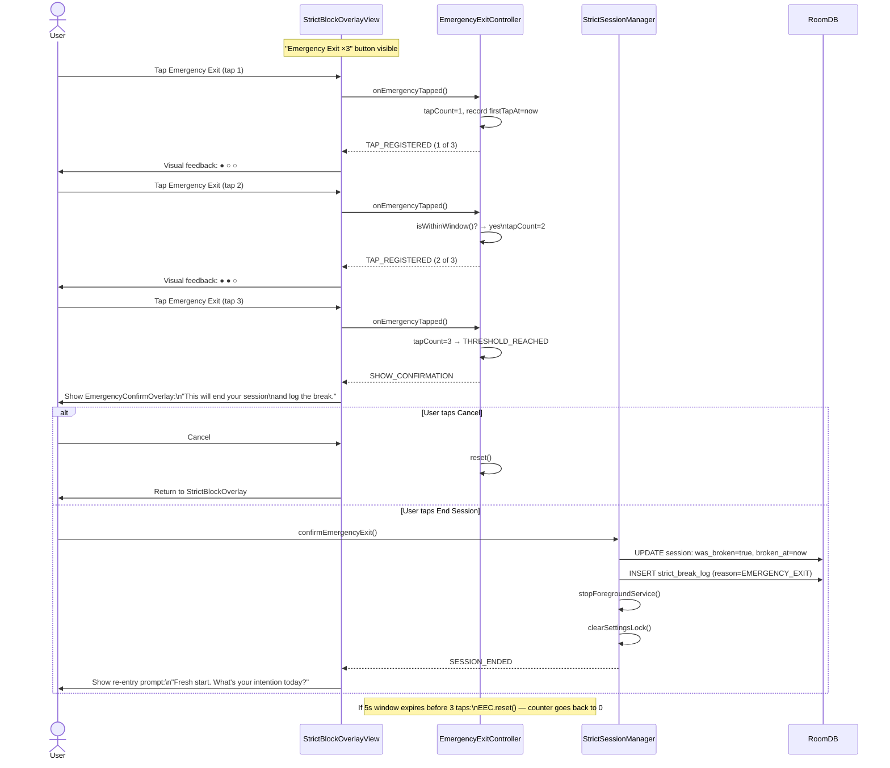
```mermaid
sequenceDiagram
    actor User
    participant Overlay as StrictBlockOverlayView
    participant EEC as EmergencyExitController
    participant SSM as StrictSessionManager
    participant DB as RoomDB

    Note over Overlay: "Emergency Exit ×3" button visible

    User->>Overlay: Tap Emergency Exit (tap 1)
    Overlay->>EEC: onEmergencyTapped()
    EEC->>EEC: tapCount=1, record firstTapAt=now
    EEC-->>Overlay: TAP_REGISTERED (1 of 3)
    Overlay->>User: Visual feedback: ● ○ ○

    User->>Overlay: Tap Emergency Exit (tap 2)
    Overlay->>EEC: onEmergencyTapped()
    EEC->>EEC: isWithinWindow()? → yes\ntapCount=2
    EEC-->>Overlay: TAP_REGISTERED (2 of 3)
    Overlay->>User: Visual feedback: ● ● ○

    User->>Overlay: Tap Emergency Exit (tap 3)
    Overlay->>EEC: onEmergencyTapped()
    EEC->>EEC: tapCount=3 → THRESHOLD_REACHED
    EEC-->>Overlay: SHOW_CONFIRMATION
    Overlay->>User: Show EmergencyConfirmOverlay:\n"This will end your session\nand log the break."

    alt User taps Cancel
        User->>Overlay: Cancel
        EEC->>EEC: reset()
        Overlay->>User: Return to StrictBlockOverlay
    else User taps End Session
        User->>SSM: confirmEmergencyExit()
        SSM->>DB: UPDATE session: was_broken=true, broken_at=now
        SSM->>DB: INSERT strict_break_log (reason=EMERGENCY_EXIT)
        SSM->>SSM: stopForegroundService()
        SSM->>SSM: clearSettingsLock()
        SSM-->>Overlay: SESSION_ENDED
        Overlay->>User: Show re-entry prompt:\n"Fresh start. What's your intention today?"
    end

    Note over EEC: If 5s window expires before 3 taps:\nEEC.reset() — counter goes back to 0
```

---

## 5. Strict Mode Diagrams

### 5.1 Use Case Diagram

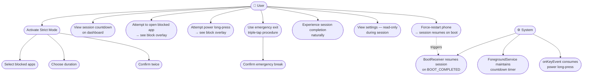
```mermaid
graph TB
    User(["👤 User"])

    UC_SM1([Activate Strict Mode])
    UC_SM2([Select blocked apps])
    UC_SM3([Choose duration])
    UC_SM4([Confirm twice])
    UC_SM5([View session countdown\non dashboard])
    UC_SM6([Attempt to open blocked app\n→ see block overlay])
    UC_SM7([Attempt power long-press\n→ see block overlay])
    UC_SM8([Use emergency exit\ntriple-tap procedure])
    UC_SM9([Confirm emergency break])
    UC_SM10([Experience session completion\nnaturally])
    UC_SM11([View settings — read-only\nduring session])
    UC_SM12([Force-restart phone\n→ session resumes on boot])

    System(["⚙️ System"])
    UC_SM13([BootReceiver resumes session\non BOOT_COMPLETED])
    UC_SM14([ForegroundService maintains\ncountdown timer])
    UC_SM15([onKeyEvent consumes\npower long-press])

    User --> UC_SM1
    UC_SM1 --> UC_SM2
    UC_SM1 --> UC_SM3
    UC_SM1 --> UC_SM4
    User --> UC_SM5
    User --> UC_SM6
    User --> UC_SM7
    User --> UC_SM8
    UC_SM8 --> UC_SM9
    User --> UC_SM10
    User --> UC_SM11
    User --> UC_SM12

    System --> UC_SM13
    System --> UC_SM14
    System --> UC_SM15

    UC_SM12 -.->|triggers| UC_SM13
```

---

### 5.2 Sequence Diagram — Full Session Lifecycle

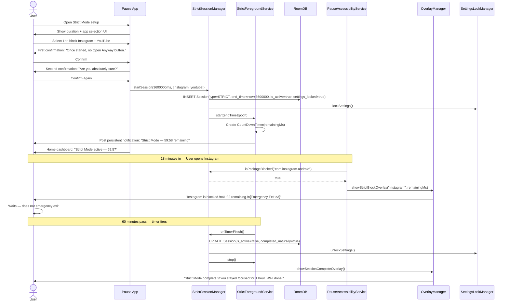
```mermaid
sequenceDiagram
    actor User
    participant App as Pause App
    participant SSM as StrictSessionManager
    participant SFS as StrictForegroundService
    participant DB as RoomDB
    participant AS as PauseAccessibilityService
    participant OM as OverlayManager
    participant SLM as SettingsLockManager

    User->>App: Open Strict Mode setup
    App->>User: Show duration + app selection UI
    User->>App: Select 1hr, block Instagram + YouTube
    App->>User: First confirmation: "Once started, no Open Anyway button."
    User->>App: Confirm
    App->>User: Second confirmation: "Are you absolutely sure?"
    User->>App: Confirm again
    App->>SSM: startSession(3600000ms, [instagram, youtube])
    SSM->>DB: INSERT Session(type=STRICT, end_time=now+3600000, is_active=true, settings_locked=true)
    SSM->>SLM: lockSettings()
    SSM->>SFS: start(endTimeEpoch)
    SFS->>SFS: Create CountDownTimer(remainingMs)
    SFS->>User: Post persistent notification: "Strict Mode — 59:58 remaining"
    App->>User: Home dashboard: "Strict Mode active — 59:57"

    Note over User,AS: 18 minutes in — User opens Instagram

    AS->>SSM: isPackageBlocked("com.instagram.android")
    SSM-->>AS: true
    AS->>OM: showStrictBlockOverlay("Instagram", remainingMs)
    OM->>User: "Instagram is blocked.\n41:32 remaining.\n[Emergency Exit ×3]"
    User->>User: Waits — does not emergency exit

    Note over SFS,User: 60 minutes pass — timer fires

    SFS->>SSM: onTimerFinish()
    SSM->>DB: UPDATE Session(is_active=false, completed_naturally=true)
    SSM->>SLM: unlockSettings()
    SSM->>SFS: stop()
    SSM->>OM: showSessionCompleteOverlay()
    OM->>User: "Strict Mode complete.\nYou stayed focused for 1 hour. Well done."
```

---

### 5.3 Sequence Diagram — Force Restart & Boot Resume

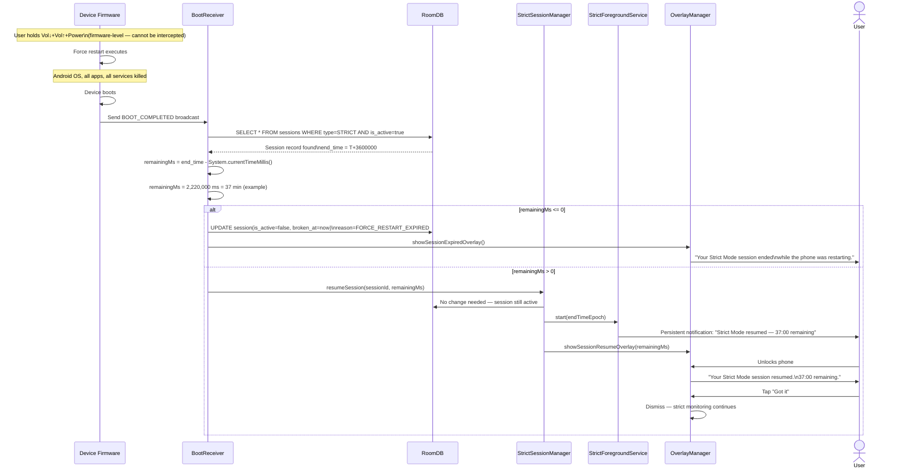
```mermaid
sequenceDiagram
    participant FW as Device Firmware
    participant BR as BootReceiver
    participant DB as RoomDB
    participant SSM as StrictSessionManager
    participant SFS as StrictForegroundService
    participant OM as OverlayManager
    actor User

    Note over FW: User holds Vol↓+Vol↑+Power\n(firmware-level — cannot be intercepted)

    FW->>FW: Force restart executes
    Note over FW: Android OS, all apps, all services killed
    FW->>FW: Device boots

    FW->>BR: Send BOOT_COMPLETED broadcast
    BR->>DB: SELECT * FROM sessions WHERE type=STRICT AND is_active=true
    DB-->>BR: Session record found\nend_time = T+3600000

    BR->>BR: remainingMs = end_time - System.currentTimeMillis()
    BR->>BR: remainingMs = 2,220,000 ms = 37 min (example)

    alt remainingMs <= 0
        BR->>DB: UPDATE session(is_active=false, broken_at=now)\nreason=FORCE_RESTART_EXPIRED
        BR->>OM: showSessionExpiredOverlay()
        OM->>User: "Your Strict Mode session ended\nwhile the phone was restarting."
    else remainingMs > 0
        BR->>SSM: resumeSession(sessionId, remainingMs)
        SSM->>DB: No change needed — session still active
        SSM->>SFS: start(endTimeEpoch)
        SFS->>User: Persistent notification: "Strict Mode resumed — 37:00 remaining"
        SSM->>OM: showSessionResumeOverlay(remainingMs)
        User->>OM: Unlocks phone
        OM->>User: "Your Strict Mode session resumed.\n37:00 remaining."
        User->>OM: Tap "Got it"
        OM->>OM: Dismiss — strict monitoring continues
    end
```

---

### 5.4 Flow Diagram — App Interception

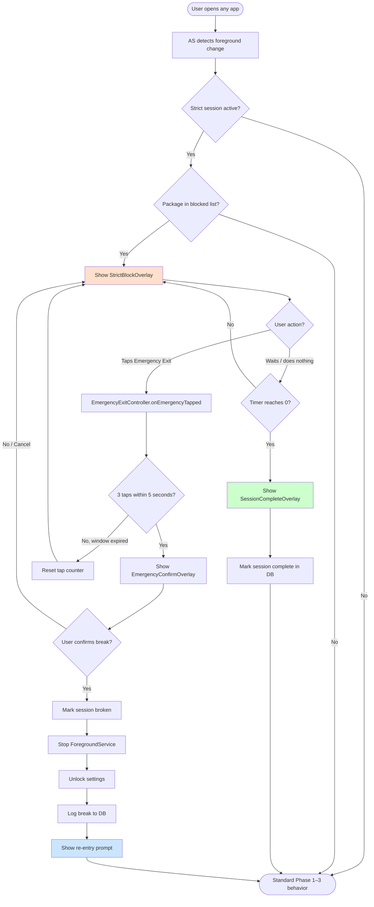
```mermaid
flowchart TD
    A([User opens any app]) --> B[AS detects foreground change]
    B --> C{Strict session active?}
    C -- No --> D([Standard Phase 1–3 behavior])
    C -- Yes --> E{Package in blocked list?}
    E -- No --> D
    E -- Yes --> F[Show StrictBlockOverlay]
    F --> G{User action?}
    G -- Waits / does nothing --> H{Timer reaches 0?}
    H -- Yes --> I[Show SessionCompleteOverlay]
    I --> J[Mark session complete in DB]
    J --> D
    H -- No --> F
    G -- Taps Emergency Exit --> K[EmergencyExitController.onEmergencyTapped]
    K --> L{3 taps within 5 seconds?}
    L -- No, window expired --> M[Reset tap counter]
    M --> F
    L -- Yes --> N[Show EmergencyConfirmOverlay]
    N --> O{User confirms break?}
    O -- No / Cancel --> F
    O -- Yes --> P[Mark session broken]
    P --> Q[Stop ForegroundService]
    Q --> R[Unlock settings]
    R --> S[Log break to DB]
    S --> T[Show re-entry prompt]
    T --> D

    style F fill:#ffe0cc
    style I fill:#ccffcc
    style T fill:#cce5ff
```

---

### 5.5 Flow Diagram — Emergency Exit Triple-Tap

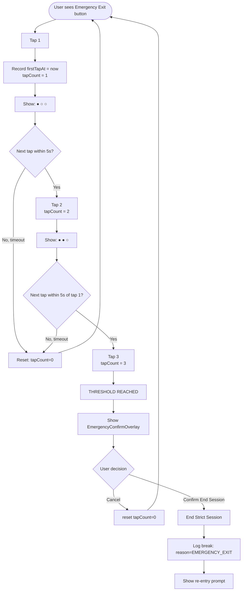
```mermaid
flowchart TD
    A([User sees Emergency Exit button]) --> B[Tap 1]
    B --> C[Record firstTapAt = now\ntapCount = 1]
    C --> D[Show: ● ○ ○]
    D --> E{Next tap within 5s?}
    E -- No, timeout --> F[Reset: tapCount=0]
    F --> A
    E -- Yes --> G[Tap 2\ntapCount = 2]
    G --> H[Show: ● ● ○]
    H --> I{Next tap within 5s of tap 1?}
    I -- No, timeout --> F
    I -- Yes --> J[Tap 3\ntapCount = 3]
    J --> K[THRESHOLD REACHED]
    K --> L[Show EmergencyConfirmOverlay]
    L --> M{User decision}
    M -- Cancel --> N[reset tapCount=0]
    N --> A
    M -- Confirm End Session --> O[End Strict Session]
    O --> P[Log break: reason=EMERGENCY_EXIT]
    P --> Q[Show re-entry prompt]
```

---

### 5.6 Flow Diagram — Boot Lockout

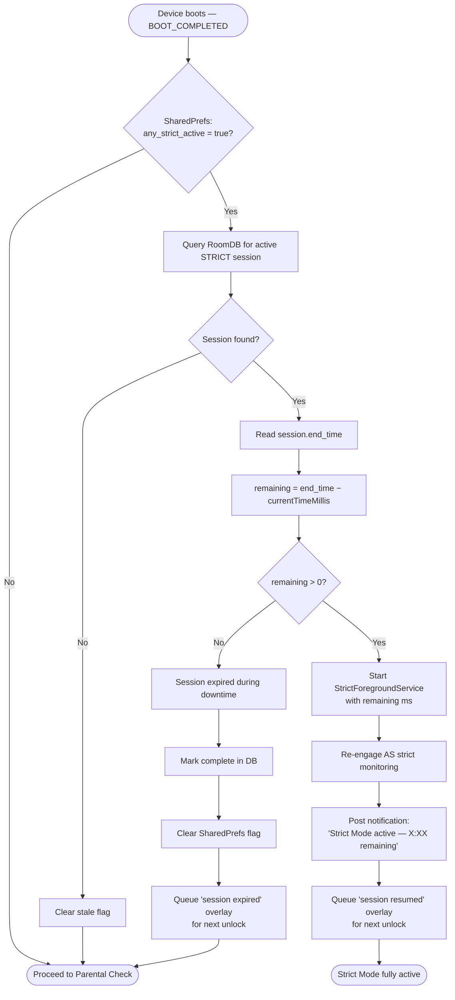
```mermaid
flowchart TD
    A([Device boots — BOOT_COMPLETED]) --> B{SharedPrefs:\nany_strict_active = true?}
    B -- No --> C([Proceed to Parental Check])
    B -- Yes --> D[Query RoomDB for active STRICT session]
    D --> E{Session found?}
    E -- No --> F[Clear stale flag]
    F --> C
    E -- Yes --> G[Read session.end_time]
    G --> H[remaining = end_time − currentTimeMillis]
    H --> I{remaining > 0?}
    I -- No --> J[Session expired during downtime]
    J --> K[Mark complete in DB]
    K --> L[Clear SharedPrefs flag]
    L --> M[Queue 'session expired' overlay\nfor next unlock]
    M --> C
    I -- Yes --> N[Start StrictForegroundService\nwith remaining ms]
    N --> O[Re-engage AS strict monitoring]
    O --> P[Post notification:\n'Strict Mode active — X:XX remaining']
    P --> Q[Queue 'session resumed' overlay\nfor next unlock]
    Q --> R([Strict Mode fully active])
```

---

### 5.7 State Diagram

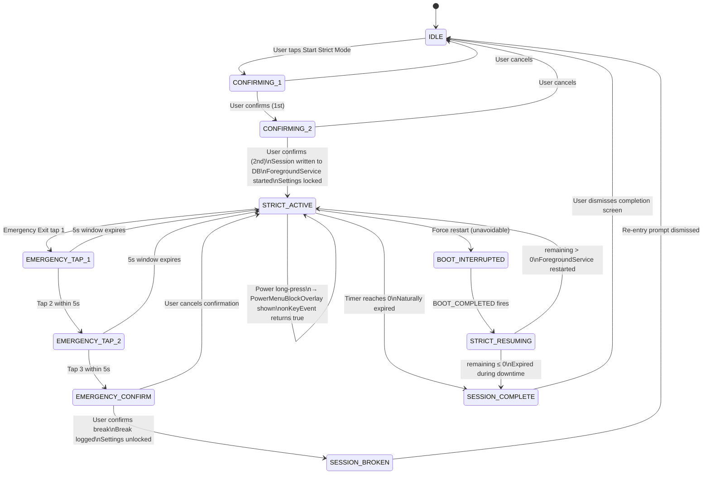
```mermaid
stateDiagram-v2
    [*] --> IDLE

    IDLE --> CONFIRMING_1 : User taps Start Strict Mode
    CONFIRMING_1 --> IDLE : User cancels
    CONFIRMING_1 --> CONFIRMING_2 : User confirms (1st)
    CONFIRMING_2 --> IDLE : User cancels
    CONFIRMING_2 --> STRICT_ACTIVE : User confirms (2nd)\nSession written to DB\nForegroundService started\nSettings locked

    STRICT_ACTIVE --> STRICT_ACTIVE : Blocked app opened\n→ StrictBlockOverlay shown
    STRICT_ACTIVE --> STRICT_ACTIVE : Power long-press\n→ PowerMenuBlockOverlay shown\nonKeyEvent returns true
    STRICT_ACTIVE --> EMERGENCY_TAP_1 : Emergency Exit tap 1

    EMERGENCY_TAP_1 --> STRICT_ACTIVE : 5s window expires
    EMERGENCY_TAP_1 --> EMERGENCY_TAP_2 : Tap 2 within 5s

    EMERGENCY_TAP_2 --> STRICT_ACTIVE : 5s window expires
    EMERGENCY_TAP_2 --> EMERGENCY_CONFIRM : Tap 3 within 5s

    EMERGENCY_CONFIRM --> STRICT_ACTIVE : User cancels confirmation
    EMERGENCY_CONFIRM --> SESSION_BROKEN : User confirms break\nBreak logged\nSettings unlocked

    STRICT_ACTIVE --> SESSION_COMPLETE : Timer reaches 0\nNaturally expired

    SESSION_COMPLETE --> IDLE : User dismisses completion screen
    SESSION_BROKEN --> IDLE : Re-entry prompt dismissed

    STRICT_ACTIVE --> BOOT_INTERRUPTED : Force restart (unavoidable)
    BOOT_INTERRUPTED --> STRICT_RESUMING : BOOT_COMPLETED fires
    STRICT_RESUMING --> STRICT_ACTIVE : remaining > 0\nForegroundService restarted
    STRICT_RESUMING --> SESSION_COMPLETE : remaining ≤ 0\nExpired during downtime
```

---

## 6. High-Level Design — Parental Control Mode

### 6.1 System Context

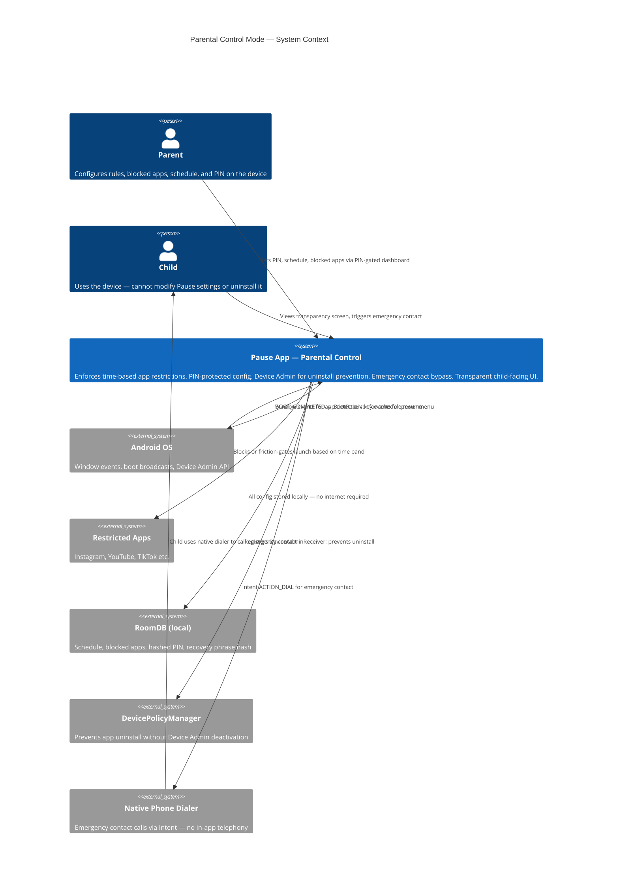
```mermaid
C4Context
    title Parental Control Mode — System Context

    Person(parent, "Parent", "Configures rules, blocked apps, schedule, and PIN on the device")
    Person(child, "Child", "Uses the device — cannot modify Pause settings or uninstall it")

    System(pause, "Pause App — Parental Control", "Enforces time-based app restrictions. PIN-protected config. Device Admin for uninstall prevention. Emergency contact bypass. Transparent child-facing UI.")

    System_Ext(android_os, "Android OS", "Window events, boot broadcasts, Device Admin API")
    System_Ext(target_apps, "Restricted Apps", "Instagram, YouTube, TikTok etc.")
    System_Ext(room_db, "RoomDB (local)", "Schedule, blocked apps, hashed PIN, recovery phrase hash")
    System_Ext(device_admin, "DevicePolicyManager", "Prevents app uninstall without Device Admin deactivation")
    System_Ext(dialer, "Native Phone Dialer", "Emergency contact calls via Intent — no in-app telephony")

    Rel(parent, pause, "Sets PIN, schedule, blocked apps via PIN-gated dashboard")
    Rel(child, pause, "Views transparency screen, triggers emergency contact")
    Rel(pause, android_os, "Window events for app detection; key events for power menu")
    Rel(android_os, pause, "BOOT_COMPLETED → BootReceiver for schedule resume")
    Rel(pause, device_admin, "Registers DeviceAdminReceiver; prevents uninstall")
    Rel(pause, target_apps, "Blocks or friction-gates launch based on time band")
    Rel(pause, room_db, "All config stored locally — no internet required")
    Rel(pause, dialer, "Intent.ACTION_DIAL for emergency contact")
    Rel(dialer, child, "Child uses native dialer to call emergency contact")
```

---

### 6.2 Component Architecture

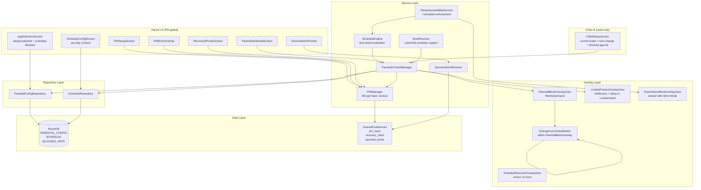
```mermaid
graph TB
    subgraph PARENT_UI["Parent UI (PIN-gated)"]
        A[ParentDashboardScreen]
        B[ScheduleConfigScreen\nper-day, 3-band]
        C[AppSelectionScreen\nalways-blocked + schedule-blocked]
        D[PINSetupScreen]
        E[PINEntryOverlay]
        F[RecoveryPhraseScreen]
        G[DeviceAdminPrompt]
    end

    subgraph CHILD_UI["Child UI (read-only)"]
        H[ChildStatusScreen\ncurrent band + next change + blocked app list]
    end

    subgraph OVERLAY["Overlay Layer"]
        I[ParentalBlockOverlayView\nRestricted band]
        J[EmergencyContactButton\nwithin ParentalBlockOverlay]
        K[LimitedFrictionOverlayView\nReflection + delay in Limited band]
        L[PowerMenuBlockOverlayView\nshared with Strict Mode]
        M[ScheduleResumeOverlayView\nshown on boot]
    end

    subgraph SERVICE["Service Layer"]
        N[PauseAccessibilityService\n+schedule enforcement]
        O[ParentalControlManager]
        P[ScheduleEngine\ntime-band evaluation]
        Q[PINManager\nBCrypt hash, lockout]
        R[DeviceAdminReceiver]
        S[BootReceiver\n+parental schedule support]
    end

    subgraph REPO["Repository Layer"]
        T[ParentalConfigRepository]
        U[ScheduleRepository]
    end

    subgraph DATA["Data Layer"]
        V[(RoomDB\nPARENTAL_CONFIG\nSCHEDULE\nBLOCKED_APPS)]
        W[SharedPreferences\npin_hash\nrecovery_hash\nparental_active]
    end

    A --> O
    B --> U
    C --> T
    D --> Q
    E --> Q
    F --> Q
    G --> R

    N --> P
    P --> O
    O --> T
    O --> U
    O --> Q

    O --> I
    I --> J
    J --> J
    O --> K
    N --> L
    S --> O

    T --> V
    U --> V
    Q --> W
    R --> W

    H --> O
```

---

### 6.3 Data Flow

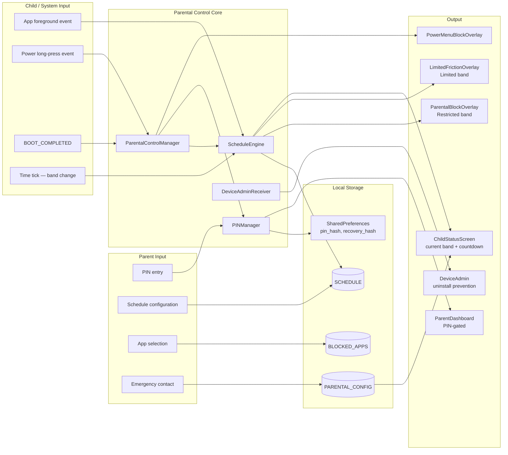
```mermaid
flowchart LR
    subgraph PARENT_INPUT["Parent Input"]
        PI1[PIN entry]
        PI2[Schedule configuration]
        PI3[App selection]
        PI4[Emergency contact]
    end

    subgraph CHILD_INPUT["Child / System Input"]
        CI1[App foreground event]
        CI2[Power long-press event]
        CI3[BOOT_COMPLETED]
        CI4[Time tick — band change]
    end

    subgraph CORE["Parental Control Core"]
        C1[ParentalControlManager]
        C2[ScheduleEngine]
        C3[PINManager]
        C4[DeviceAdminReceiver]
    end

    subgraph STORAGE["Local Storage"]
        S1[(PARENTAL_CONFIG)]
        S2[(SCHEDULE)]
        S3[(BLOCKED_APPS)]
        S4[SharedPreferences\npin_hash, recovery_hash]
    end

    subgraph OUTPUT["Output"]
        O1[ParentalBlockOverlay\nRestricted band]
        O2[LimitedFrictionOverlay\nLimited band]
        O3[ChildStatusScreen\ncurrent band + countdown]
        O4[PowerMenuBlockOverlay]
        O5[ParentDashboard\nPIN-gated]
        O6[DeviceAdmin\nuninstall prevention]
    end

    PI1 --> C3
    PI2 --> S2
    PI3 --> S3
    PI4 --> S1

    CI1 --> C2
    CI2 --> C1
    CI3 --> C1
    CI4 --> C2

    C2 --> S2
    C3 --> S4
    C1 --> C2
    C1 --> C3
    C4 --> O6

    C2 --> O1
    C2 --> O2
    C2 --> O3
    C1 --> O4
    C3 --> O5
    S1 --> O3
```

---

## 7. Low-Level Design — Parental Control Mode

### 7.1 Database Schema Extensions

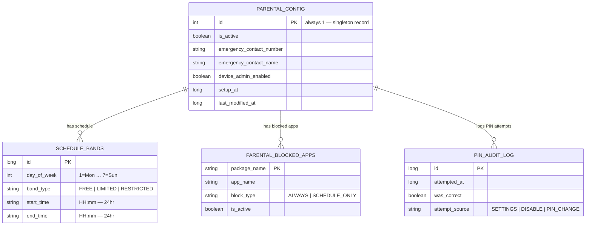
```mermaid
erDiagram
    PARENTAL_CONFIG {
        int id PK "always 1 — singleton record"
        boolean is_active
        string emergency_contact_number
        string emergency_contact_name
        boolean device_admin_enabled
        long setup_at
        long last_modified_at
    }

    SCHEDULE_BANDS {
        long id PK
        int day_of_week "1=Mon … 7=Sun"
        string band_type "FREE | LIMITED | RESTRICTED"
        string start_time "HH:mm — 24hr"
        string end_time "HH:mm — 24hr"
    }

    PARENTAL_BLOCKED_APPS {
        string package_name PK
        string app_name
        string block_type "ALWAYS | SCHEDULE_ONLY"
        boolean is_active
    }

    PIN_AUDIT_LOG {
        long id PK
        long attempted_at
        boolean was_correct
        string attempt_source "SETTINGS | DISABLE | PIN_CHANGE"
    }

    PARENTAL_CONFIG ||--o{ SCHEDULE_BANDS : "has schedule"
    PARENTAL_CONFIG ||--o{ PARENTAL_BLOCKED_APPS : "has blocked apps"
    PARENTAL_CONFIG ||--o{ PIN_AUDIT_LOG : "logs PIN attempts"
```

**SharedPreferences (fast-read security data):**

| Key | Type | Value |
|---|---|---|
| `parental_active` | Boolean | Master on/off flag for fast BootReceiver check |
| `pin_bcrypt_hash` | String | BCrypt hash of 6-digit PIN |
| `recovery_phrase_hash` | String | SHA-256 hash of recovery phrase |
| `pin_attempt_count` | Int | Consecutive wrong attempts (reset on correct) |
| `pin_lockout_until` | Long | Epoch ms — 0 if not locked out |

> PIN is never stored in plaintext, not even transiently in memory beyond the verification call.

---

### 7.2 Class Design

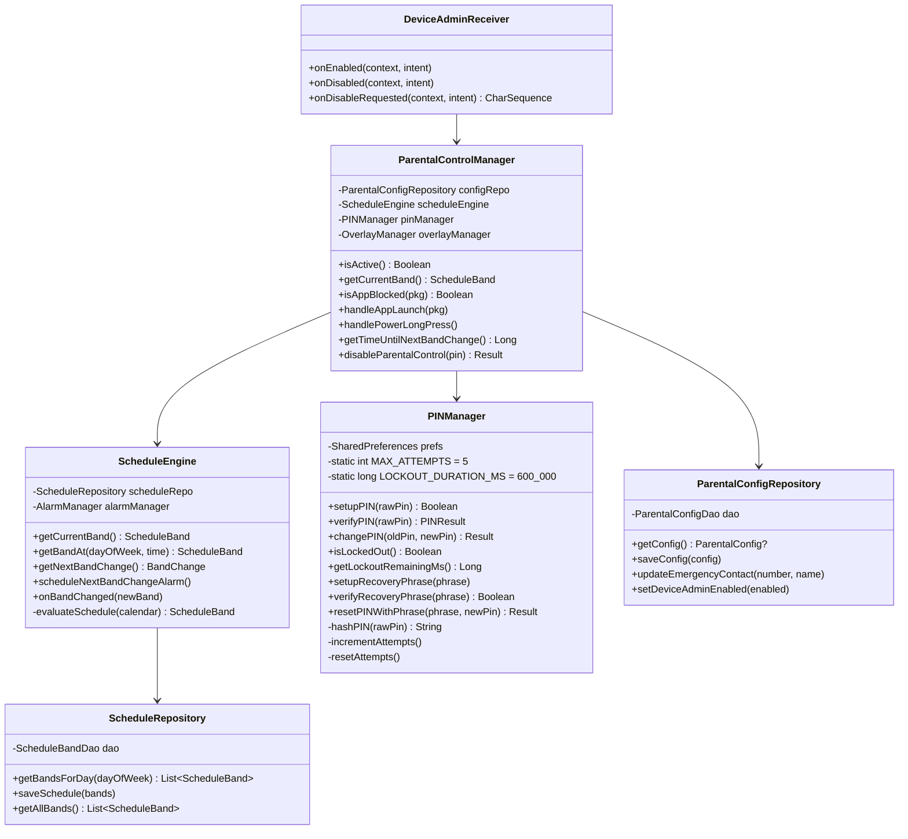
```mermaid
classDiagram
    class ParentalControlManager {
        -ParentalConfigRepository configRepo
        -ScheduleEngine scheduleEngine
        -PINManager pinManager
        -OverlayManager overlayManager
        +isActive() Boolean
        +getCurrentBand() ScheduleBand
        +isAppBlocked(pkg) Boolean
        +handleAppLaunch(pkg)
        +handlePowerLongPress()
        +getTimeUntilNextBandChange() Long
        +disableParentalControl(pin) Result
    }

    class ScheduleEngine {
        -ScheduleRepository scheduleRepo
        -AlarmManager alarmManager
        +getCurrentBand() ScheduleBand
        +getBandAt(dayOfWeek, time) ScheduleBand
        +getNextBandChange() BandChange
        +scheduleNextBandChangeAlarm()
        +onBandChanged(newBand)
        -evaluateSchedule(calendar) ScheduleBand
    }

    class PINManager {
        -SharedPreferences prefs
        -static int MAX_ATTEMPTS = 5
        -static long LOCKOUT_DURATION_MS = 600_000
        +setupPIN(rawPin) Boolean
        +verifyPIN(rawPin) PINResult
        +changePIN(oldPin, newPin) Result
        +isLockedOut() Boolean
        +getLockoutRemainingMs() Long
        +setupRecoveryPhrase(phrase)
        +verifyRecoveryPhrase(phrase) Boolean
        +resetPINWithPhrase(phrase, newPin) Result
        -hashPIN(rawPin) String
        -incrementAttempts()
        -resetAttempts()
    }

    class DeviceAdminReceiver {
        +onEnabled(context, intent)
        +onDisabled(context, intent)
        +onDisableRequested(context, intent) CharSequence
    }

    class ParentalConfigRepository {
        -ParentalConfigDao dao
        +getConfig() ParentalConfig?
        +saveConfig(config)
        +updateEmergencyContact(number, name)
        +setDeviceAdminEnabled(enabled)
    }

    class ScheduleRepository {
        -ScheduleBandDao dao
        +getBandsForDay(dayOfWeek) List~ScheduleBand~
        +saveSchedule(bands)
        +getAllBands() List~ScheduleBand~
    }

    ParentalControlManager --> ScheduleEngine
    ParentalControlManager --> PINManager
    ParentalControlManager --> ParentalConfigRepository
    ScheduleEngine --> ScheduleRepository
    DeviceAdminReceiver --> ParentalControlManager
```

---

### 7.3 PIN Security Design

```
PIN Security Architecture
─────────────────────────────────────────────────────────────────
Layer 1 — Storage
  - PIN hashed with BCrypt (cost factor 12) before storage
  - Hash stored in SharedPreferences (private mode)
  - Raw PIN never written to disk, not even temporarily

Layer 2 — Verification
  - BCrypt.checkpw(rawInput, storedHash)
  - Constant-time comparison — not vulnerable to timing attacks

Layer 3 — Brute Force Prevention
  - 5 wrong attempts → 10-minute lockout
  - Attempt count stored in SharedPreferences
  - Lockout_until stored as epoch ms
  - On each PIN screen open: check lockout_until > now

Layer 4 — Biometric Bypass Prevention
  - No biometric option offered on PIN entry screen
  - Prevents child using sleeping parent's fingerprint
  - PIN-only, always

Layer 5 — Recovery
  - Parent sets recovery phrase (5–10 words) at setup
  - Phrase hashed with SHA-256 and stored locally
  - Recovery screen only accessible from "Forgot PIN" link
  - On correct phrase: allow PIN reset, log event

Layer 6 — No Cloud
  - No server-side PIN storage or recovery
  - No email reset
  - All verification is entirely local
─────────────────────────────────────────────────────────────────
```

---

### 7.4 Schedule Engine Design

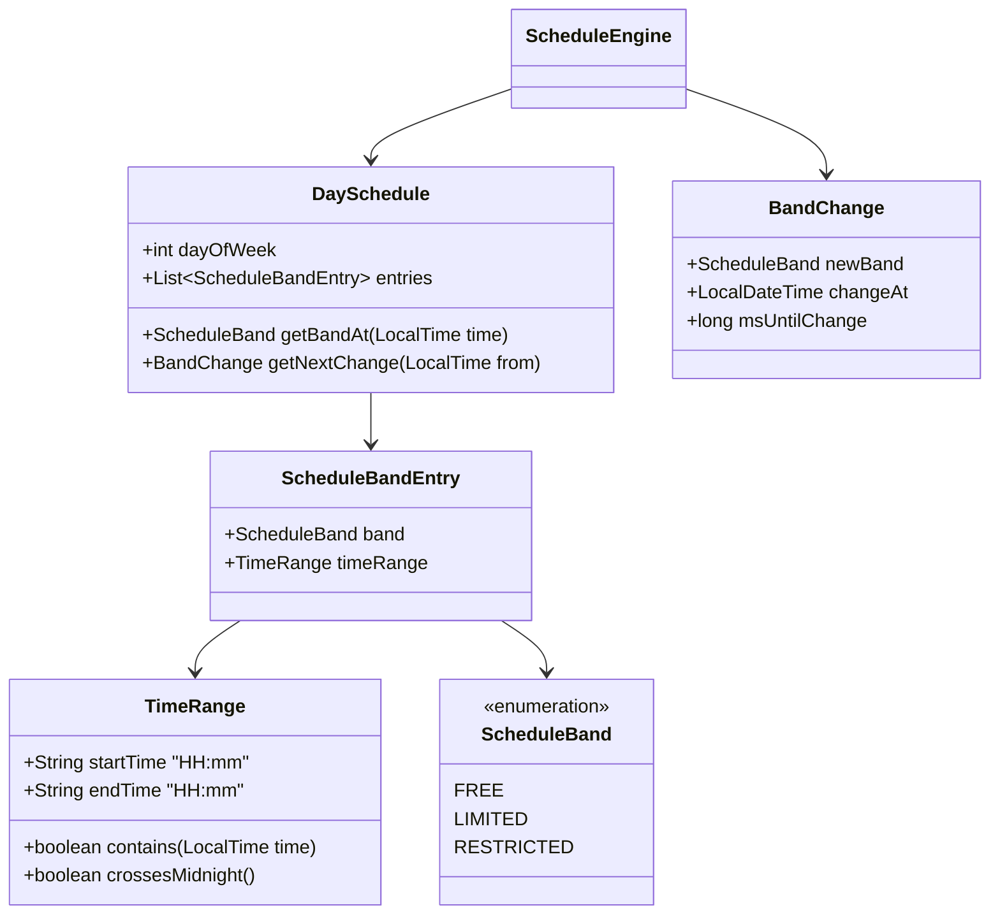
```mermaid
classDiagram
    class ScheduleBand {
        <<enumeration>>
        FREE
        LIMITED
        RESTRICTED
    }

    class TimeRange {
        +String startTime "HH:mm"
        +String endTime "HH:mm"
        +boolean contains(LocalTime time)
        +boolean crossesMidnight()
    }

    class DaySchedule {
        +int dayOfWeek
        +List~ScheduleBandEntry~ entries
        +ScheduleBand getBandAt(LocalTime time)
        +BandChange getNextChange(LocalTime from)
    }

    class ScheduleBandEntry {
        +ScheduleBand band
        +TimeRange timeRange
    }

    class BandChange {
        +ScheduleBand newBand
        +LocalDateTime changeAt
        +long msUntilChange
    }

    ScheduleEngine --> DaySchedule
    DaySchedule --> ScheduleBandEntry
    ScheduleBandEntry --> TimeRange
    ScheduleBandEntry --> ScheduleBand
    ScheduleEngine --> BandChange
```

**Schedule evaluation logic:**

```
Given current Calendar:
  1. Get dayOfWeek (1=Mon, 7=Sun)
  2. Load DaySchedule for that day from DB
  3. Iterate entries; find first TimeRange containing LocalTime.now()
  4. If no entry matches → default band = FREE
  5. Return matching ScheduleBand

Edge cases:
  - Bands crossing midnight (e.g., 10pm–7am):
    Store as two entries: 22:00–23:59 and 00:00–07:00
    Or: store end_time = "07:00+1" with a next_day flag
  - Gap between bands: default to FREE
  - Overlapping bands: first-match wins (entries ordered by start_time)
```

---

### 7.5 Device Admin Design

```mermaid
sequenceDiagram
    actor Parent
    participant App as Pause App
    participant PCM as ParentalControlManager
    participant DA as DeviceAdminReceiver
    participant DPM as DevicePolicyManager
    participant OS as Android OS

    Parent->>App: Complete Parental Control setup
    App->>PCM: activateDeviceAdmin()
    PCM->>OS: Create Intent(ACTION_ADD_DEVICE_ADMIN)\nwith DeviceAdminReceiver component
    OS->>Parent: System dialog: "Allow Pause to be a Device Admin?\nThis allows Pause to prevent uninstallation."
    Parent->>OS: Tap "Activate"
    OS->>DA: onEnabled(context, intent)
    DA->>PCM: notifyDeviceAdminEnabled()
    PCM->>DB: UPDATE parental_config SET device_admin_enabled=true

    Note over Parent,OS: Later — Child attempts to uninstall Pause

    OS->>DPM: Uninstall requested for Pause
    DPM->>OS: BLOCKED — Device Admin active
    OS->>Parent: "Pause cannot be uninstalled.\nYou must first deactivate it as a Device Admin."

    Note over Parent,App: Parent wants to disable Parental Control

    Parent->>App: Tap "Disable Parental Control"
    App->>App: Show PIN entry
    Parent->>App: Enter correct PIN
    App->>DPM: removeActiveAdmin(DeviceAdminReceiver)
    DPM->>DA: onDisabled(context, intent)
    DA->>PCM: notifyDeviceAdminDisabled()
    PCM->>DB: UPDATE parental_config SET is_active=false, device_admin_enabled=false
    App->>Parent: "Parental Control disabled."
```

---

### 7.6 Emergency Contact Design

```
Emergency Contact Bypass Rules
────────────────────────────────────────────────────────
Rule 1: If emergency_contact_number is configured,
        the "Call Emergency Contact" button is always
        shown on ParentalBlockOverlay, even during
        Restricted band.

Rule 2: Tapping the button launches:
        Intent(Intent.ACTION_DIAL,
               Uri.parse("tel:" + emergencyNumber))
        This opens native dialer — Pause does NOT make
        the call directly. Child taps Call in dialer.

Rule 3: Emergency numbers (112, 911, 999, 000 etc.)
        are always allowed. If the child opens the
        Phone app itself, Pause checks whether the
        app is explicitly in the always-blocked list.
        If not, Phone app is never blocked regardless
        of schedule.

Rule 4: Pause never blocks the Phone app unless a
        parent has explicitly added it to the
        always-blocked list (and even then, a warning
        is shown during setup: "Blocking the Phone app
        may prevent emergency calls.")
────────────────────────────────────────────────────────
```

---

## 8. Parental Control Mode Diagrams

### 8.1 Use Case Diagram

```mermaid
graph LR
    Parent(["👨‍👩‍👧 Parent"])
    Child(["🧒 Child"])
    OS(["⚙️ Android OS"])

    subgraph ParentUC["Parent Use Cases"]
        P1([Setup Parental Control])
        P2([Create 6-digit PIN])
        P3([Set recovery phrase])
        P4([Configure schedule\nFree / Limited / Restricted\nper day-of-week])
        P5([Select always-blocked apps])
        P6([Select schedule-blocked apps])
        P7([Set emergency contact])
        P8([Activate Device Admin])
        P9([Access Parent Dashboard])
        P10([Change PIN])
        P11([Recover PIN via phrase])
        P12([Disable Parental Control])
    end

    subgraph ChildUC["Child Use Cases"]
        C1([View child status screen\ncurrent band + next change])
        C2([Attempt to open restricted app\n→ see block overlay])
        C3([Experience friction\nin Limited hours])
        C4([Tap Emergency Contact button])
        C5([Wait for restriction to lift])
    end

    subgraph SystemUC["System Actions"]
        S1([BootReceiver resumes\nschedule on reboot])
        S2([AlarmManager fires\non band change])
        S3([DeviceAdmin blocks\nuninstall attempt])
    end

    Parent --> P1
    P1 --> P2
    P1 --> P3
    P1 --> P4
    P1 --> P5
    P1 --> P6
    P1 --> P7
    P1 --> P8
    Parent --> P9
    Parent --> P10
    Parent --> P11
    Parent --> P12

    Child --> C1
    Child --> C2
    Child --> C3
    Child --> C4
    Child --> C5

    OS --> S1
    OS --> S2
    OS --> S3

    P8 -.->|enables| S3
```

---

### 8.2 Sequence Diagram — Parent Setup

```mermaid
sequenceDiagram
    actor Parent
    participant App as Pause App
    participant PIN as PINManager
    participant PCR as ParentalConfigRepository
    participant SR as ScheduleRepository
    participant DA as DeviceAdminReceiver
    participant DB as RoomDB

    Parent->>App: Open Settings → Parental Control
    App->>Parent: Show setup intro screen

    Note over Parent,PIN: Step 1 — PIN creation

    App->>Parent: Show PIN creation screen
    Parent->>App: Enter 6-digit PIN
    App->>Parent: Confirm PIN
    Parent->>App: Enter same PIN again
    App->>PIN: setupPIN("123456")
    PIN->>PIN: BCrypt.hashpw("123456", salt)
    PIN->>PIN: Store hash in SharedPreferences

    Note over Parent,PIN: Step 2 — Recovery phrase

    App->>Parent: Show recovery phrase screen
    Parent->>App: Enter phrase: "my dog likes blue cheese"
    App->>PIN: setupRecoveryPhrase(phrase)
    PIN->>PIN: SHA256(phrase) → store hash

    Note over Parent,SR: Step 3 — Schedule setup

    App->>Parent: Show schedule config\n(per-day, 3-band)
    Parent->>App: Set Mon–Fri:\nFree 7am–4pm\nLimited 4pm–10pm\nRestricted 10pm–7am
    App->>SR: saveSchedule(bands)
    SR->>DB: INSERT schedule_bands (14 records)

    Note over Parent,PCR: Step 4 — App selection

    App->>Parent: Show installed apps list
    Parent->>App: Mark Instagram/YouTube as schedule-blocked\nTikTok as always-blocked
    App->>PCR: saveBlockedApps(apps)
    PCR->>DB: INSERT parental_blocked_apps (3 records)

    Note over Parent,PCR: Step 5 — Emergency contact

    App->>Parent: Show emergency contact setup (optional)
    Parent->>App: Enter: "Mum — +91 98765 43210"
    App->>PCR: updateEmergencyContact(number, name)
    PCR->>DB: UPDATE parental_config

    Note over Parent,DA: Step 6 — Device Admin

    App->>Parent: Explain Device Admin: prevents uninstall
    Parent->>App: Tap "Enable"
    App->>DA: Launch ACTION_ADD_DEVICE_ADMIN intent
    DA->>Parent: System dialog appears
    Parent->>DA: Tap "Activate"
    DA-->>PCR: onEnabled → setDeviceAdminEnabled(true)

    App->>Parent: "Parental Control is now active."
```

---

### 8.3 Sequence Diagram — Child Interception (Restricted Hours)

```mermaid
sequenceDiagram
    actor Child
    participant AS as AccessibilityService
    participant SE as ScheduleEngine
    participant PCM as ParentalControlManager
    participant OM as OverlayManager
    participant Dialer as Native Phone Dialer
    participant DB as RoomDB

    Child->>AS: Opens YouTube (10:15 PM)
    AS->>SE: getCurrentBand()
    SE->>SE: Check calendar: Tue, 22:15\nMatch RESTRICTED band (10pm–7am)
    SE-->>AS: RESTRICTED

    AS->>PCM: isAppBlocked("com.google.android.youtube")
    PCM->>DB: SELECT * FROM parental_blocked_apps\nWHERE package="com.google.android.youtube"
    DB-->>PCM: Found — block_type=SCHEDULE_ONLY
    PCM-->>AS: BLOCKED

    AS->>OM: showParentalBlockOverlay\n("YouTube", liftsAt="7:00 AM", emergencyContact="Mum")
    OM->>Child: "YouTube is restricted.\nLifts at 7:00 AM.\n[Call Mum]  [I understand]"

    alt Child taps "I understand"
        Child->>OM: Tap "I understand"
        OM->>OM: Dismiss overlay
        Note over Child: Returns to home screen
    else Child taps "Call Mum"
        Child->>OM: Tap "Call Mum"
        OM->>Dialer: Intent(ACTION_DIAL, "tel:+919876543210")
        Dialer->>Child: Native dialer opens with number\nChild taps Call
    end
```

---

### 8.4 Sequence Diagram — PIN Entry & Recovery

```mermaid
sequenceDiagram
    actor User as Parent/Child
    participant App as Pause App
    participant PIN as PINManager
    participant SP as SharedPreferences
    participant DB as RoomDB

    User->>App: Attempts to open Settings
    App->>PIN: isLockedOut()
    PIN->>SP: Read pin_lockout_until
    SP-->>PIN: 0 (not locked)
    PIN-->>App: false
    App->>User: Show PINEntryOverlay

    User->>App: Enter wrong PIN "654321"
    App->>PIN: verifyPIN("654321")
    PIN->>SP: Read pin_bcrypt_hash
    PIN->>PIN: BCrypt.checkpw("654321", hash) → false
    PIN->>SP: Increment pin_attempt_count → 3
    PIN-->>App: WRONG_PIN (2 attempts remaining)
    App->>User: "Wrong PIN. 2 attempts remaining."

    Note over User,PIN: 2 more wrong attempts

    User->>App: Enter wrong PIN again (5th attempt total)
    App->>PIN: verifyPIN(wrong)
    PIN->>SP: attempt_count → 5
    PIN->>SP: Set pin_lockout_until = now + 600_000ms
    PIN-->>App: LOCKED_OUT
    App->>User: "Too many attempts.\nTry again in 10 minutes."

    Note over User,App: 10 minutes pass — or parent taps Forgot PIN

    User->>App: Tap "Forgot PIN"
    App->>User: Show recovery phrase entry screen
    User->>App: Enter phrase: "my dog likes blue cheese"
    App->>PIN: verifyRecoveryPhrase(phrase)
    PIN->>SP: Read recovery_phrase_hash
    PIN->>PIN: SHA256(phrase) == stored_hash → true
    PIN-->>App: PHRASE_CORRECT
    App->>User: Show new PIN entry screen
    User->>App: Enter new PIN "789012"
    App->>PIN: changePIN(null, "789012")
    PIN->>PIN: BCrypt.hashpw("789012", newSalt)
    PIN->>SP: Update pin_bcrypt_hash\nReset pin_attempt_count=0\nClear pin_lockout_until
    App->>DB: INSERT pin_audit_log (PIN_RESET_VIA_PHRASE)
    App->>User: "PIN updated. You now have access."
    App->>User: Open Parent Dashboard
```

---

### 8.5 Flow Diagram — App Interception Decision

```mermaid
flowchart TD
    A([Child opens any app]) --> B{Parental Control active?}
    B -- No --> C([Standard Pause behavior\nor unrestricted])
    B -- Yes --> D[ScheduleEngine.getCurrentBand]
    D --> E{Current band?}

    E -- FREE --> C

    E -- LIMITED --> F{App in always-blocked list?}
    F -- Yes --> G[Show ParentalBlockOverlay\nwith lifts-at time]
    F -- No --> H{App in schedule-blocked list?}
    H -- No --> I[Apply standard friction\nreflection + delay]
    H -- Yes --> I
    I --> J{Child cancels?}
    J -- Yes --> K([App not opened])
    J -- No --> L([App opens after delay])

    E -- RESTRICTED --> M{App in always-blocked list?}
    M -- Yes --> G
    M -- No --> N{App in schedule-blocked list?}
    N -- Yes --> G
    N -- No --> C

    G --> O{Child action?}
    O -- I understand --> P([Overlay dismissed\nChild returns to home])
    O -- Call Emergency Contact --> Q[Intent ACTION_DIAL\nwith emergency number]
    Q --> R([Native dialer opens])

    style G fill:#ffcccc
    style I fill:#fff3cc
    style C fill:#ccffcc
    style R fill:#ccffcc
```

---

### 8.6 Flow Diagram — PIN Protection

```mermaid
flowchart TD
    A([Access to Pause Settings requested]) --> B{Parental Control active?}
    B -- No --> C([Open settings normally])
    B -- Yes --> D{PIN lockout active?\npin_lockout_until > now?}
    D -- Yes --> E[Show locked screen:\nTime remaining countdown]
    E --> F{Lockout expired?}
    F -- No --> E
    F -- Yes --> G[Clear lockout\nReset attempt count]
    G --> H[Show PIN entry screen]
    D -- No --> H

    H --> I[Parent enters PIN]
    I --> J[PINManager.verifyPIN]
    J --> K{BCrypt match?}
    K -- Yes --> L[Reset attempt count\nClear lockout]
    L --> M([Open Parent Dashboard])
    K -- No --> N[Increment attempt count]
    N --> O{attempt_count >= 5?}
    O -- Yes --> P[Set lockout_until = now + 10min\nStore in SharedPrefs]
    P --> Q[Show: Too many attempts\n10 minutes remaining]
    Q --> E
    O -- No --> R[Show: Wrong PIN\nX attempts remaining]
    R --> H

    H --> S{Parent taps Forgot PIN?}
    S -- Yes --> T[Show recovery phrase screen]
    T --> U[Parent enters phrase]
    U --> V[SHA256 hash + compare]
    V --> W{Phrase correct?}
    W -- No --> X[Show error\nTry again]
    X --> T
    W -- Yes --> Y[Show new PIN creation screen]
    Y --> Z[New PIN entered + confirmed]
    Z --> AA[BCrypt hash + store\nReset all lockout state]
    AA --> M
```

---

### 8.7 Flow Diagram — Boot Schedule Resume

```mermaid
flowchart TD
    A([Device boots]) --> B[BootReceiver.onReceive]
    B --> C{SharedPrefs:\nparental_active = true?}
    C -- No --> D([Check Strict Mode\nproceed normally])
    C -- Yes --> E[Load full schedule from RoomDB]
    E --> F[ScheduleEngine.getCurrentBand]
    F --> G{Band?}

    G -- FREE --> H[No intervention needed\nMonitor for next band change]
    H --> I[Schedule AlarmManager\nfor next band boundary]
    I --> D

    G -- LIMITED --> J[Re-engage AccessibilityService\nfor friction enforcement]
    J --> K[Schedule AlarmManager\nfor next band boundary]
    K --> D

    G -- RESTRICTED --> L[Re-engage AccessibilityService\nfor full block enforcement]
    L --> M[Show ScheduleResumeOverlay\non first unlock]
    M --> N[Schedule AlarmManager\nfor next band boundary]
    N --> D

    D --> O([Normal Pause startup complete])
```

---

### 8.8 State Diagram

```mermaid
stateDiagram-v2
    [*] --> PC_INACTIVE

    PC_INACTIVE --> PC_SETUP : Parent initiates setup
    PC_SETUP --> PC_INACTIVE : Parent cancels at any step
    PC_SETUP --> PC_ACTIVE : All steps complete:\nPIN ✅  Schedule ✅  Apps ✅\nDevice Admin (optional)

    state PC_ACTIVE {
        [*] --> EVALUATING_BAND

        EVALUATING_BAND --> FREE_BAND : getCurrentBand() = FREE
        EVALUATING_BAND --> LIMITED_BAND : getCurrentBand() = LIMITED
        EVALUATING_BAND --> RESTRICTED_BAND : getCurrentBand() = RESTRICTED

        FREE_BAND --> EVALUATING_BAND : AlarmManager fires\n(next band boundary)
        LIMITED_BAND --> EVALUATING_BAND : AlarmManager fires
        RESTRICTED_BAND --> EVALUATING_BAND : AlarmManager fires

        state LIMITED_BAND {
            [*] --> MONITORING
            MONITORING --> FRICTION_SHOWN : Blocked app opened
            FRICTION_SHOWN --> MONITORING : Child cancels or waits
        }

        state RESTRICTED_BAND {
            [*] --> BLOCKING
            BLOCKING --> BLOCK_OVERLAY : Blocked app opened
            BLOCK_OVERLAY --> BLOCKING : Child taps "I understand"
            BLOCK_OVERLAY --> EMERGENCY_CALL : Child taps emergency contact
            EMERGENCY_CALL --> BLOCKING : Dialer opened
        }
    }

    PC_ACTIVE --> PIN_ENTRY : Settings access attempt
    PIN_ENTRY --> PIN_LOCKED : 5 wrong attempts
    PIN_LOCKED --> PIN_ENTRY : 10-minute lockout expires
    PIN_ENTRY --> RECOVERY : "Forgot PIN" tapped
    RECOVERY --> PIN_ENTRY : Wrong phrase
    RECOVERY --> PIN_RESET : Correct phrase
    PIN_RESET --> PC_ACTIVE : New PIN set
    PIN_ENTRY --> PARENT_DASHBOARD : Correct PIN
    PARENT_DASHBOARD --> PC_ACTIVE : Parent exits
    PARENT_DASHBOARD --> PC_INACTIVE : Parent disables\nDevice Admin removed

    PC_ACTIVE --> PC_BOOT_RESUME : Device restarted
    PC_BOOT_RESUME --> PC_ACTIVE : BootReceiver re-evaluates\ncurrent band and enforces
```

---

## 9. Shared Infrastructure Changes

Both modes build on the existing Pause architecture from Phases 1–3. This section documents exactly what needs to be modified or extended in shared components.

### 9.1 AccessibilityService Extensions

```mermaid
classDiagram
    class PauseAccessibilityService {
        -String lastForegroundPackage
        -AppRepository appRepository
        -OverlayManager overlayManager
        -SessionManager sessionManager
        -StrictSessionManager strictSessionManager
        -ParentalControlManager parentalControlManager
        -UnlockTracker unlockTracker

        +onAccessibilityEvent(event)
        +onKeyEvent(event) Boolean
        +onServiceConnected()

        -handleForegroundChange(packageName)
        -evaluateStrict(packageName) StrictDecision
        -evaluateParental(packageName) ParentalDecision
        -evaluateStandard(packageName) StandardDecision
        -handlePowerLongPress() Boolean
    }

    class InterceptionPriority {
        <<enumeration>>
        STRICT_BLOCK
        PARENTAL_RESTRICTED_BLOCK
        PARENTAL_LIMITED_FRICTION
        STANDARD_FRICTION
        ALLOW
    }

    note for PauseAccessibilityService "Priority order for interception evaluation:\n1. Strict block (highest)\n2. Parental restricted block\n3. Parental limited friction\n4. Standard Phase 1-3 friction\n5. Allow (lowest)"
```

**Updated `onAccessibilityEvent` priority chain:**

```
On foreground package change:
  1. Is there an active STRICT session AND package is blocked?
     → YES: Show StrictBlockOverlay. Stop. Return.

  2. Is Parental Control active?
     a. Current band = RESTRICTED AND app is blocked?
        → YES: Show ParentalBlockOverlay. Stop. Return.
     b. Current band = LIMITED AND app is in parental list?
        → YES: Apply standard friction (reflection + delay). Return.

  3. Is there an active COMMITMENT session AND package is blocked?
     → YES: Show CommitmentBlockOverlay + 90s cooldown. Return.

  4. Is package in standard monitored apps?
     → YES: Apply Phase 1/2 friction based on settings. Return.

  5. Allow — do nothing.
```

---

### 9.2 BootReceiver Design

```mermaid
flowchart TD
    A([BOOT_COMPLETED]) --> B[BootReceiver.onReceive]
    B --> C[Check SharedPrefs:\nany_strict_active]
    C --> D{Strict active?}
    D -- Yes --> E[Resume Strict Mode\nsee Section 5.6]
    D -- No --> F[Check SharedPrefs:\nparental_active]
    F --> G{Parental active?}
    G -- Yes --> H[Resume Parental Schedule\nsee Section 8.7]
    G -- No --> I([Normal startup])
    E --> I
    H --> I
```

The `BootReceiver` handles both modes sequentially. It is a single receiver registered for `BOOT_COMPLETED`.

```xml
<!-- AndroidManifest.xml -->
<receiver android:name=".receiver.BootReceiver"
          android:exported="false">
    <intent-filter>
        <action android:name="android.intent.action.BOOT_COMPLETED"/>
        <action android:name="android.intent.action.LOCKED_BOOT_COMPLETED"/>
    </intent-filter>
</receiver>
```

> `LOCKED_BOOT_COMPLETED` is also registered so the receiver fires even on devices with Direct Boot (encrypted storage). RoomDB must use device-encrypted storage for session data to be readable before the user unlocks.

---

### 9.3 Overlay System Extensions

```mermaid
graph TB
    subgraph EXISTING["Existing Overlays (Ph1–3)"]
        E1[DelayOverlayView]
        E2[ReflectionOverlayView]
        E3[CommitmentBlockOverlayView]
        E4[LockInterventionOverlayView]
    end

    subgraph NEW_STRICT["New — Strict Mode"]
        S1[StrictBlockOverlayView\n— no skip\n— emergency exit ×3 button\n— tap counter visual]
        S2[PowerMenuBlockOverlayView\n— shown on KEYCODE_POWER long-press\n— 'I understand' dismiss]
        S3[SessionResumeOverlayView\n— shown on boot if session survived]
        S4[SessionCompleteOverlayView\n— shown when timer reaches 0]
        S5[EmergencyConfirmOverlayView\n— shown after 3 taps]
    end

    subgraph NEW_PARENTAL["New — Parental Control"]
        P1[ParentalBlockOverlayView\n— restricted band\n— lifts-at time\n— emergency contact button]
        P2[ScheduleResumeOverlayView\n— shown on boot\n— current band + next change]
        P3[PINEntryOverlayView\n— 6-digit grid\n— lockout handling\n— forgot PIN link]
    end

    BaseOverlayView --> E1
    BaseOverlayView --> E2
    BaseOverlayView --> E3
    BaseOverlayView --> E4
    BaseOverlayView --> S1
    BaseOverlayView --> S2
    BaseOverlayView --> S3
    BaseOverlayView --> S4
    BaseOverlayView --> S5
    BaseOverlayView --> P1
    BaseOverlayView --> P2
    BaseOverlayView --> P3
```

---

### 9.4 Updated Full Component Architecture (Both Modes)

```mermaid
graph TB
    subgraph UI["UI Layer"]
        U1[Home Dashboard v3+]
        U2[Onboarding]
        U3[App Selection]
        U4[Insights]
        U5[Settings]
        U6[StrictMode Setup]
        U7[ParentalControl Setup]
        U8[Parent Dashboard\nPIN-gated]
        U9[Child Status Screen]
    end

    subgraph OVERLAY["All Overlays"]
        OV1[Delay · Reflection]
        OV2[CommitmentBlock]
        OV3[StrictBlock · PowerMenuBlock]
        OV4[EmergencyConfirm · SessionResume]
        OV5[ParentalBlock · PINEntry]
        OV6[ScheduleResume]
    end

    subgraph SERVICES["Services"]
        SV1[PauseAccessibilityService\n+onKeyEvent]
        SV2[OverlayManager]
        SV3[SessionManager\nFocus + Commitment]
        SV4[StrictSessionManager]
        SV5[ParentalControlManager]
        SV6[ScheduleEngine]
        SV7[PINManager]
        SV8[BootReceiver]
        SV9[StrictForegroundService]
        SV10[DeviceAdminReceiver]
        SV11[SettingsLockManager]
    end

    subgraph REPO["Repositories"]
        R1[AppRepository]
        R2[LaunchRepository]
        R3[SessionRepository]
        R4[StrictSessionRepository]
        R5[ParentalConfigRepository]
        R6[ScheduleRepository]
        R7[InsightsRepository]
        R8[AccountabilityRepository]
    end

    subgraph DATA["Data"]
        D1[(RoomDB)]
        D2[SharedPreferences]
        D3[UsageStatsManager]
    end

    subgraph WORKERS["WorkManager"]
        W1[MidnightResetWorker]
        W2[AccountabilityDispatchWorker]
        W3[DailySummaryWorker]
    end

    UI --> SERVICES
    SERVICES --> OVERLAY
    SERVICES --> REPO
    REPO --> DATA
    WORKERS --> DATA
    SV8 --> SV4
    SV8 --> SV5
    SV1 --> SV4
    SV1 --> SV5
    SV1 --> SV3
```

---

## 10. Permissions & Feasibility

### New Permissions Required by These Modes

| Permission | Required By | Grant Method | Play Store Risk |
|---|---|---|---|
| `RECEIVE_BOOT_COMPLETED` | Strict Mode, Parental | Declared in manifest — auto-granted | Low |
| `LOCKED_BOOT_COMPLETED` | Strict Mode, Parental | Declared in manifest | Low |
| Device Admin (`DevicePolicyManager`) | Parental Control only | System prompt (parent-initiated, explicit) | Medium |

### Existing Permissions Used Differently

| Permission | Phase 1–3 Use | Extended Use in New Modes |
|---|---|---|
| Accessibility Service | `TYPE_WINDOW_STATE_CHANGED` only | + `onKeyEvent` for power long-press interception |
| `SYSTEM_ALERT_WINDOW` | Delay + reflection overlays | + StrictBlock + ParentalBlock + PowerMenu + PIN overlays |

### Feasibility Notes

**Power button interception (`onKeyEvent`)**
Returning `true` from `onKeyEvent` for `KEYCODE_POWER + isLongPress` is a supported pattern — used by kiosk apps and MDM tools. The AccessibilityService config must declare `canRequestFilterKeyEvents = true`:

```xml
<accessibility-service
    android:canRequestFilterKeyEvents="true"
    .../>
```

Without this flag, `onKeyEvent` is never called. This must be added to the existing accessibility service XML config.

**Device Admin and Play Store**
`DevicePolicyManager` for uninstall prevention is Play Store compliant when:
- The feature is opt-in (parent must explicitly activate it)
- The system dialog clearly explains what Device Admin enables
- The user can remove Device Admin at any time (requiring PIN in our case)
- The Play Store listing clearly states Device Admin is used for parental controls

**Force-restart — permanent limitation**
Hardware restart combinations are firmware-level. This is a known and accepted limitation for all Android apps, including enterprise MDM tools. It should be disclosed:
- In the Strict Mode setup screen: *"Force-restarting the phone will interrupt the session. Pause will resume it when the phone turns back on."*
- In the Parental Control setup screen with the same disclosure.

**RoomDB + Direct Boot**
Session data must be readable before the user unlocks the phone (so BootReceiver can re-engage Strict Mode even on the lock screen). Use `databaseBuilder` with `createFromAsset` or configure the database to use device-encrypted (DE) storage:

```kotlin
Room.databaseBuilder(context, PauseDatabase::class.java, "pause.db")
    .allowMainThreadQueries() // BootReceiver context
    .build()
// On Android 7+: use context.createDeviceProtectedStorageContext()
// to ensure DB is in DE storage
```

---

## 11. Risk Register

| Risk | Likelihood | Impact | Mitigation | Mode |
|---|---|---|---|---|
| Play Store flags `canRequestFilterKeyEvents` as suspicious | Medium | High | Justify in listing: only active during user-started strict sessions; no key logging | Both |
| Power menu interception causes user confusion ("my phone is broken") | Medium | Medium | Clear onboarding; overlay explains exactly what happened | Both |
| Force-restart bypasses lockout | High | Medium | Accepted limitation; BootReceiver resumes session; disclosed in UI | Both |
| BootReceiver fires too late (background execution limits) | Low | Medium | Register for `LOCKED_BOOT_COMPLETED`; use ForegroundService for continuity | Both |
| RoomDB not readable in Direct Boot context | Medium | High | Use `createDeviceProtectedStorageContext()`; test on API 24+ encrypted devices | Both |
| Emergency exit abused casually | Medium | Low | Triple-tap within 5s is awkward by design; break is logged; streak resets | Strict |
| Child social-engineers parent to reveal PIN | Low | Low | Not a technical problem; UX only | Parental |
| Parent forgets recovery phrase | Medium | High | Recovery phrase shown to parent during setup with strong prompt to write it down | Parental |
| Child brute-forces PIN | Low | High | 5 attempts → 10-minute lockout; exponential could be considered post-MVP | Parental |
| Device Admin rejected by parent → child can uninstall | Medium | Medium | Parental Control still works without it; warn parent clearly at setup | Parental |
| Schedule crosses midnight — band evaluation bug | Medium | High | Explicit midnight-crossing handling in ScheduleEngine; unit test all edge cases | Parental |
| Emergency contact not set → button appears but does nothing | Low | Medium | If no emergency contact is configured, button is hidden entirely | Parental |
| BCrypt too slow on low-end devices | Low | Low | Cost factor 12 takes ~100ms on modern chips; acceptable. Reduce to 10 if benchmarks fail | Parental |
| SettingsLockManager allows read-only bypass via ADB | Low | Medium | Out of scope — Pause is not an MDM. Document: ADB access = physical device access | Strict |

---

## 12. Development Timeline

**Assumption:** Single experienced Android developer building on top of completed Phase 1–3 codebase.

### Strict Mode — ~4–5 days

| Task | Estimate |
|---|---|
| Extend `SESSIONS` schema + `STRICT_BREAK_LOG` table | 0.25 day |
| `StrictSessionManager` + session start with double confirmation | 0.5 day |
| `StrictForegroundService` + countdown timer + notification | 0.75 day |
| `BootReceiver` — Strict Mode path (absolute timestamp resume) | 0.75 day |
| `onKeyEvent` power interception in `AccessibilityService` | 0.5 day |
| `canRequestFilterKeyEvents` config + AS XML update | 0.25 day |
| `StrictBlockOverlayView` (no skip, emergency ×3 button) | 0.5 day |
| `EmergencyExitController` + tap timing logic | 0.5 day |
| `EmergencyConfirmOverlayView` | 0.25 day |
| `PowerMenuBlockOverlayView` | 0.25 day |
| `SessionResumeOverlayView` + `SessionCompleteOverlayView` | 0.25 day |
| `SettingsLockManager` + read-only enforcement | 0.25 day |
| Strict Mode setup UI (duration + app select + 2× confirm) | 0.25 day |
| Home dashboard widget for active session | 0.25 day |
| Testing: boot scenarios, key events, API 26/29/31/33/35 | 0.75 day |
| **Total** | **~5.5 days** |

### Parental Control Mode — ~7–8 days

| Task | Estimate |
|---|---|
| DB schema: `PARENTAL_CONFIG`, `SCHEDULE_BANDS`, `PARENTAL_BLOCKED_APPS`, `PIN_AUDIT_LOG` | 0.5 day |
| `PINManager` (BCrypt setup, verify, lockout, recovery phrase) | 1 day |
| `ScheduleEngine` (band evaluation, midnight-crossing, AlarmManager) | 1.25 days |
| `DeviceAdminReceiver` + `DevicePolicyManager` integration | 0.75 day |
| `ParentalControlManager` + interception priority chain | 0.75 day |
| `BootReceiver` — Parental path (schedule resume) | 0.5 day |
| Parent setup flow (6-screen guided onboarding) | 0.75 day |
| Schedule configuration UI (per-day, 3-band, time pickers) | 0.75 day |
| App selection UI (always-blocked vs schedule-blocked) | 0.5 day |
| `PINEntryOverlayView` (6-digit grid, lockout display, forgot PIN) | 0.5 day |
| Recovery phrase screen | 0.25 day |
| Parent Dashboard screen (PIN-gated, edit all settings) | 0.5 day |
| Child Status Screen (read-only, current band, next change) | 0.5 day |
| `ParentalBlockOverlayView` (restricted — emergency contact button) | 0.5 day |
| `ScheduleResumeOverlayView` (shown on boot) | 0.25 day |
| Emergency contact Intent wiring + Phone app whitelist | 0.25 day |
| `SettingsLockManager` extension for Parental mode | 0.25 day |
| Testing: PIN flows, schedule transitions, Device Admin, boot, midnight crossing | 1 day |
| **Total** | **~9.5 days** |

---

### Combined Summary

| Deliverable | Estimate |
|---|---|
| Strict Mode | ~5.5 days |
| Parental Control Mode | ~9.5 days |
| **Total for both new modes** | **~15 days** |

> These estimates assume Phase 1–3 is fully built and stable. `AccessibilityService`, `OverlayManager`, `RoomDB`, `SessionManager`, and `WorkManager` infrastructure are all in place. If building from scratch, add the Phase 1–3 estimate of ~17 days for a combined total of ~32 days.

---

*Pause — Strict Mode & Parental Control Mode*
*Two modes, one principle: no content detection, ever.*
*All enforcement is at the app-launch boundary only.*

---

> **Document Version:** 1.0
> **Scope:** Strict Mode · Parental Control Mode
> **Depends on:** Pause Phase 1–3 core architecture
> **Platform:** Android (Kotlin, API 26+, Direct Boot aware)
> **New components:** StrictSessionManager · StrictForegroundService · BootReceiver · EmergencyExitController · ParentalControlManager · ScheduleEngine · PINManager · DeviceAdminReceiver · SettingsLockManager