# Pause — Web Filtering & Browser Control
### Phase 4: Domain Blocking · URL Blacklisting · Keyword Filtering · Parental Web Shield
#### HLD · LLD · Architecture · Use Cases · Sequence · Flow · State Diagrams

---

> **Document Scope:** This document covers Phase 4 of Pause — browser and web content
> control. It introduces a local VPN-based DNS filtering engine as the enforcement
> backbone, Accessibility Service URL reading for intelligent auto-blacklisting,
> a static offensive/adult keyword list, and a suite of Phase 4+ ideation features.
>
> **Depends on:** Pause Phase 1–3 core + Strict Mode + Parental Control Mode.
> Parental Control Mode is the primary surface for all web filtering features.
> Limited opt-in web filtering is also available in Strict Mode.
>
> **What Pause never does:** Read page content, scan images, intercept HTTPS payloads,
> or inspect anything beyond the domain/URL string visible in the browser's address bar.

---

## Table of Contents

1. [Technical Foundation — How Browser Control Works on Android](#1-technical-foundation)
   - 1.1 The Three Approaches — Tradeoffs
   - 1.2 Chosen Architecture: VPN-Local DNS + AS URL Reading
   - 1.3 What This Means for the Play Store
2. [High-Level Design](#2-high-level-design)
   - 2.1 System Context Diagram
   - 2.2 Component Architecture
   - 2.3 Data Flow Diagram
   - 2.4 Enforcement Layer Map
3. [Low-Level Design](#3-low-level-design)
   - 3.1 Database Schema
   - 3.2 Local VPN DNS Engine
   - 3.3 URL Reader (Accessibility Service Extension)
   - 3.4 Keyword Filter Engine
   - 3.5 Blacklist Manager
   - 3.6 Class Diagram
   - 3.7 Repository Layer
4. [Feature Specifications — Phase 4 Core](#4-feature-specifications--phase-4-core)
   - F4.1 Domain Blacklist
   - F4.2 Static Keyword Blocker
   - F4.3 Auto URL Capture & Blacklisting
   - F4.4 Whitelist Override
   - F4.5 Block Page (Local)
   - F4.6 Parent Dashboard — Web Tab
   - F4.7 Child Web Activity Summary
5. [Feature Ideation — Phase 4+ Extensions](#5-feature-ideation--phase-4-extensions)
   - F4+.1 Safe Search Enforcement
   - F4+.2 Time-Gated Web Access
   - F4+.3 Category-Based Blocking
   - F4+.4 New Domain Alert (Parent)
   - F4+.5 Browser Allowlist Mode (Whitelist-only)
   - F4+.6 YouTube Restricted Mode Enforcement
   - F4+.7 Search Query Visibility
   - F4+.8 Incognito Mode Detection & Block
   - F4+.9 Per-Browser Profiles
   - F4+.10 Web Session Budgets
6. [Use Case Diagrams](#6-use-case-diagrams)
   - 6.1 Parent Web Configuration Use Cases
   - 6.2 Child Browsing Use Cases
   - 6.3 System / VPN Use Cases
7. [Sequence Diagrams](#7-sequence-diagrams)
   - 7.1 VPN Setup Flow
   - 7.2 Domain Block — DNS Intercept
   - 7.3 Keyword Match — URL Block
   - 7.4 Auto URL Capture & Blacklist Add
   - 7.5 Parent Reviews & Approves URL
   - 7.6 Child Requests URL Unblock
8. [Flow Diagrams](#8-flow-diagrams)
   - 8.1 DNS Resolution Decision Flow
   - 8.2 URL Capture & Classification Flow
   - 8.3 Keyword Filter Evaluation Flow
   - 8.4 Block Page Interaction Flow
   - 8.5 Parent Web Review Flow
9. [State Diagrams](#9-state-diagrams)
   - 9.1 VPN Service States
   - 9.2 URL Classification States
   - 9.3 Domain Blacklist Entry States
10. [Static Keyword & Domain Seed List Design](#10-static-keyword--domain-seed-list-design)
    - 10.1 Keyword Categories
    - 10.2 Bundled Domain Categories
    - 10.3 False Positive Mitigation
11. [Privacy Architecture](#11-privacy-architecture)
12. [Permissions & Feasibility](#12-permissions--feasibility)
13. [Risk Register](#13-risk-register)
14. [Development Timeline](#14-development-timeline)

---

## 1. Technical Foundation

### 1.1 The Three Approaches — Tradeoffs

| Approach | How it works | Enforces across all browsers | Reads content | Play Store risk | Works offline |
|---|---|---|---|---|---|
| **A: Accessibility URL reading only** | AS reads URL bar node in supported browsers | ❌ Browser-by-browser | URL string only | Medium-High | ✅ |
| **B: Local VPN DNS filtering** | `VpnService` intercepts all DNS queries on-device | ✅ All apps + browsers | ❌ None | Low | ✅ (DNS cache) |
| **C: Hybrid (chosen)** | VPN handles enforcement; AS reads URL for auto-blacklist only | ✅ | URL string only | Low-Medium | ✅ |

**Why not Option A alone:**
Accessibility Service reading URL bars to make real-time blocking decisions is the exact pattern Google's policy warns against. It's also fragile — Chrome updates can change accessibility tree structure. And it requires a different implementation per browser.

**Why Option B is the enforcement backbone:**
A local VPN (`VpnService`) creates a TUN interface that captures all UDP port 53 (DNS) traffic. Blocked domains return `NXDOMAIN` or a local loopback IP pointing to Pause's block page. This works for every browser and every app uniformly — Chrome, Firefox, Samsung Internet, even in-app browsers — with zero content reading.

**Why add Option A on top (the hybrid):**
VPN alone can only block at the domain level (`reddit.com`), not the path level (`reddit.com/r/nsfw`). The Accessibility Service URL reader enables:
- Sub-path blocking (`youtube.com/channel/xyz`)
- Auto-capture of visited URLs for the parent's review
- Keyword matching against full URLs (e.g., catching `?q=offensive+term` in search URLs)

The AS URL reader is used **only to build and refine the block list** — enforcement always goes through the VPN. This distinction is important for Play Store policy.

---

### 1.2 Chosen Architecture: VPN-Local DNS + AS URL Reading

```
Browser (Chrome, Firefox, etc.)
    │
    │  DNS query: "pornhub.com" → UDP port 53
    ▼
PauseVpnService (TUN interface — local only, no remote server)
    │
    ├─ Domain in blacklist? → Return NXDOMAIN / 127.0.0.1
    │   └─ Browser shows Pause block page (served locally on 127.0.0.1)
    │
    └─ Domain clean? → Forward to real DNS resolver (8.8.8.8 or device default)
        └─ Normal resolution proceeds

Separately, running in parallel:
PauseAccessibilityService
    │
    │  Reads URL bar text node from supported browsers
    ▼
URLReader
    ├─ Keyword check → If match → add domain to pending blacklist
    │                              → notify parent
    └─ New domain visited → add to URL visit log for parent review
```

**No HTTPS inspection.** Pause never intercepts TLS traffic. It operates only at the DNS layer (before connection) and the URL string layer (what's visible in the address bar). The content of web pages is never read, stored, or transmitted.

---

### 1.3 What This Means for the Play Store

| Action | Policy Status |
|---|---|
| `VpnService` for local DNS filtering | ✅ Permitted — explicitly allowed for parental control and content filtering use cases |
| Reading URL bar accessibility node | ⚠️ Permitted with justification — must state clearly this is used only for URL capture, not content reading |
| Intercepting HTTPS payloads | ❌ Not done — not permitted |
| Reading page text content | ❌ Not done — not permitted |
| Remote VPN server | ❌ Not used — local only |

Play Store listing must state: *"Pause uses a local VPN to filter DNS queries on-device. No traffic is sent to any Pause server. No page content is read or stored."*

---

## 2. High-Level Design

### 2.1 System Context Diagram

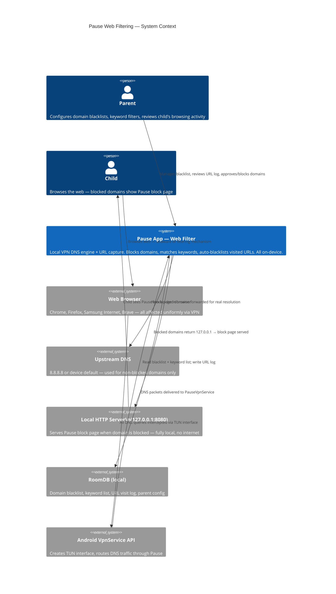

---

### 2.2 Component Architecture

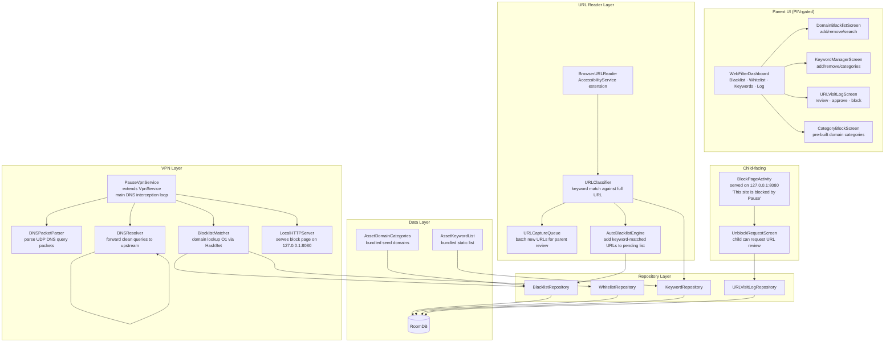

---

### 2.3 Data Flow Diagram

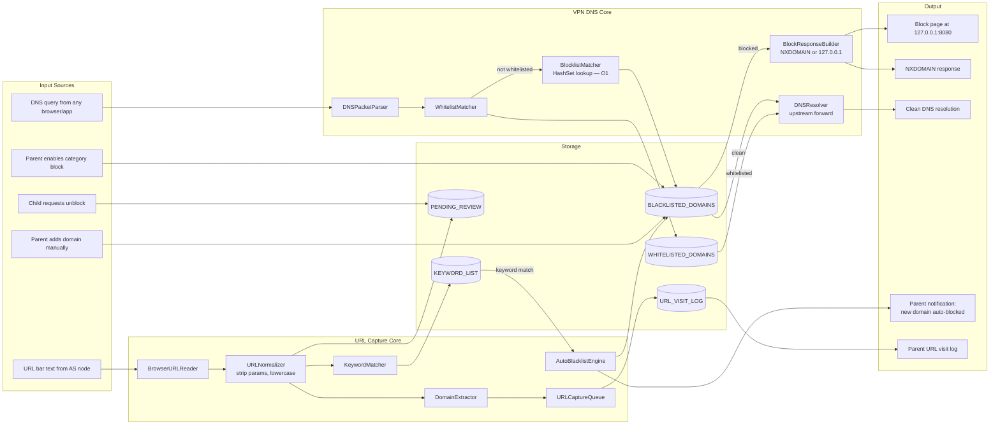

---

### 2.4 Enforcement Layer Map

```
┌─────────────────────────────────────────────────────────────────────┐
│                    PAUSE WEB ENFORCEMENT LAYERS                      │
├────────────────┬────────────────────────────────────────────────────┤
│ Layer          │ What it catches                                      │
├────────────────┼────────────────────────────────────────────────────┤
│ L1 — DNS Block │ Full domain: pornhub.com, reddit.com               │
│ (VPN)          │ Subdomains: *.pornhub.com                          │
│                │ Works in ALL browsers + ALL apps (uniform)         │
│                │ Trigger: DNS query before any connection made       │
├────────────────┼────────────────────────────────────────────────────┤
│ L2 — URL Block │ Full URL path: reddit.com/r/nsfw                   │
│ (AS URL read)  │ Query strings: google.com/search?q=offensive+term  │
│                │ Works in: Chrome, Firefox, Brave (node exposed)    │
│                │ Trigger: AS reads URL bar text after navigation     │
│                │ Action: Add domain to blacklist (VPN enforces)     │
├────────────────┼────────────────────────────────────────────────────┤
│ L3 — Keyword   │ Offensive terms in URL string or domain name       │
│ Filter         │ e.g., "xvideos", "escort", "xxx" in URL            │
│                │ Works via: URL reader (L2) input                   │
│                │ Action: Auto-block domain + alert parent           │
├────────────────┼────────────────────────────────────────────────────┤
│ L4 — Whitelist │ Explicitly allowed domains bypass L1+L3            │
│ Override       │ Configured by parent only                          │
│                │ Example: youtube.com whitelisted despite category  │
└────────────────┴────────────────────────────────────────────────────┘

NOTE: Pause never operates at L5 (page content / TLS payload).
      All enforcement is at DNS or URL-string level only.
```

---

## 3. Low-Level Design

### 3.1 Database Schema

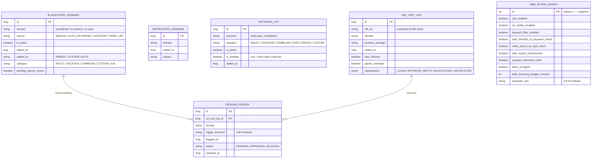

---

### 3.2 Local VPN DNS Engine

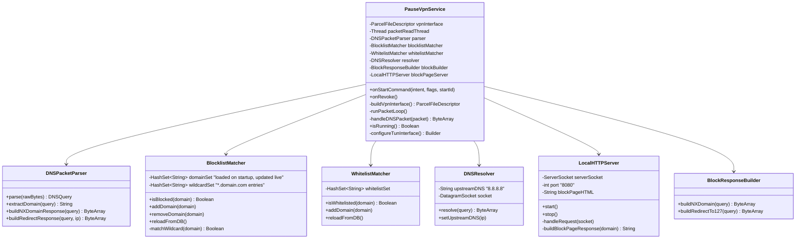

**VPN interface configuration:**

```kotlin
// Inside PauseVpnService.buildVpnInterface()
val builder = Builder()
    .setSession("Pause Web Filter")
    .addAddress("10.0.0.1", 32)          // Virtual device IP
    .addRoute("0.0.0.0", 0)              // Route all traffic
    .addDnsServer("10.0.0.1")            // Point DNS to ourselves
    .setMtu(1500)
    .setBlocking(true)

// Exclude Pause itself to prevent recursive filtering
builder.addDisallowedApplication(packageName)

vpnInterface = builder.establish()
```

**DNS packet loop:**

```kotlin
// Simplified packet loop
private fun runPacketLoop() {
    val input = FileInputStream(vpnInterface.fileDescriptor)
    val output = FileOutputStream(vpnInterface.fileDescriptor)

    while (isRunning) {
        val packet = ByteArray(32767)
        val length = input.read(packet)
        if (length <= 0) continue

        val query = parser.parse(packet.copyOf(length))
        if (query.isUDP && query.destinationPort == 53) {
            val domain = parser.extractDomain(query)
            val response = when {
                whitelistMatcher.isWhitelisted(domain) ->
                    resolver.resolve(query.rawBytes)
                blocklistMatcher.isBlocked(domain) ->
                    blockBuilder.buildRedirectTo127(query)
                else ->
                    resolver.resolve(query.rawBytes)
            }
            output.write(response)
        }
    }
}
```

---

### 3.3 URL Reader (Accessibility Service Extension)

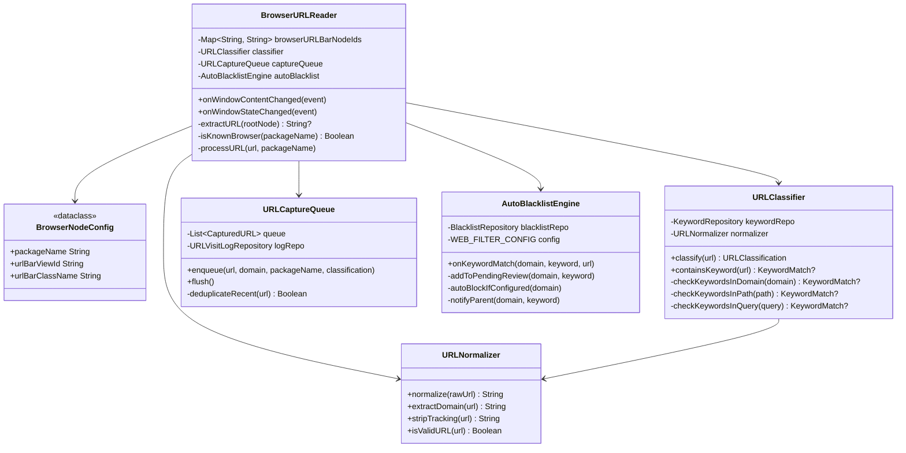

**Supported browsers and URL bar node IDs:**

```
Browser              Package                      URL node ViewId / heuristic
─────────────────────────────────────────────────────────────────────────────
Chrome               com.android.chrome            "com.android.chrome:id/url_bar"
Chrome Beta          com.chrome.beta               same pattern
Firefox              org.mozilla.firefox           "org.mozilla.firefox:id/mozac_browser_toolbar_url_view"
Firefox Focus        org.mozilla.focus             similar pattern
Brave                com.brave.browser             "com.brave.browser:id/url_bar"
Samsung Internet     com.sec.android.app.sbrowser  "com.sec.android.app.sbrowser:id/location_bar_edit_text"
Edge                 com.microsoft.emmx            "com.microsoft.emmx:id/address_bar_edit_text"
DuckDuckGo           com.duckduckgo.mobile.android "com.duckduckgo.mobile.android:id/omnibarTextInput"
Opera                com.opera.browser             className heuristic fallback
─────────────────────────────────────────────────────────────────────────────
Fallback:            Any window with class EditText + text matching URL pattern
```

> Browser updates can change view IDs. The fallback heuristic (className + URL regex pattern match) handles this gracefully. A maintenance task exists: verify node IDs against current browser versions quarterly.

---

### 3.4 Keyword Filter Engine

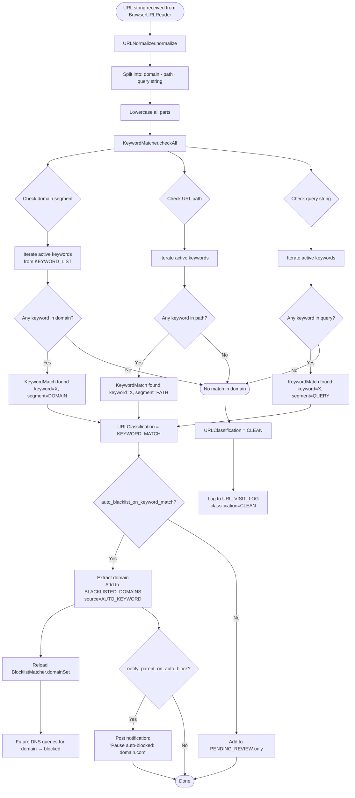

---

### 3.5 Blacklist Manager

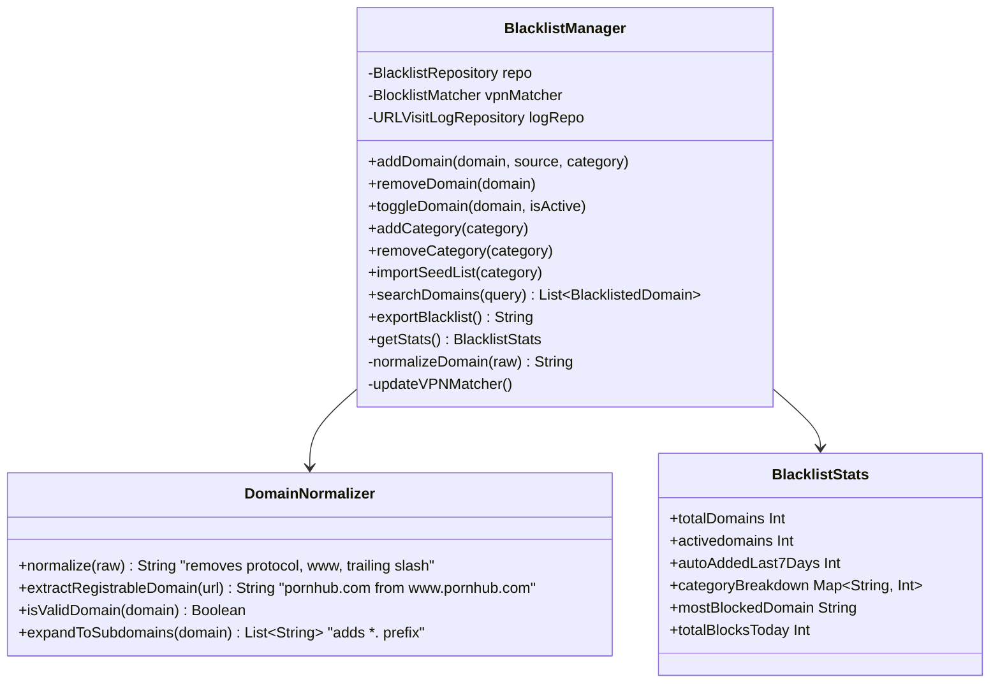

---

### 3.6 Full Class Diagram

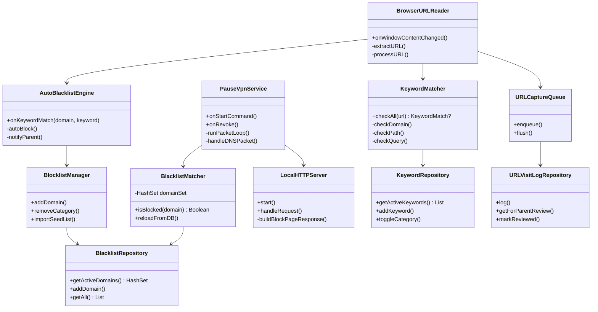

---

### 3.7 Repository Layer

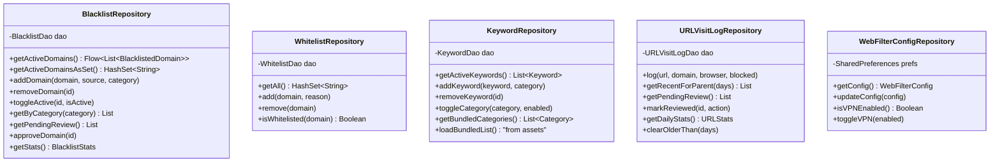

---

## 4. Feature Specifications — Phase 4 Core

### F4.1 — Domain Blacklist

The parent-managed list of blocked domains. Enforcement via VPN DNS layer.

**Parent UI:**

```
Web Filter — Blacklist                    [+ Add Domain]

🔴 Active categories
   ● Adult Content          1,247 domains  [Disable]
   ● Gambling                 312 domains  [Disable]

⬜ Inactive categories
   ○ Social Media              89 domains  [Enable]

Custom domains (manual)
   pornhub.com                       [Remove]
   reddit.com/r/nsfw → reddit.com    [Remove]

Auto-blocked (keyword match)          [Review all]
   xvideos.com — blocked 2h ago      [Keep] [Remove]
   escort-london.co.uk               [Keep] [Remove]
```

**Behavior:**
- Domain input auto-normalizes: user can paste full URL, Pause extracts the registrable domain
- Wildcard subdomains: blocking `reddit.com` also blocks `old.reddit.com`, `www.reddit.com`
- Category bundles loaded from bundled asset file (see Section 10)
- Live updates propagate to `BlocklistMatcher.domainSet` without restarting VPN

---

### F4.2 — Static Keyword Blocker

A bundled list of offensive terms checked against every URL string the AS reads.

**Parent UI:**

```
Keyword Filter

Categories (bundled — cannot edit individual terms)
  ✅ Adult / Explicit content
  ✅ Violence & gore
  ✅ Drug-related terms
  ⬜ Gambling terms         [Enable]
  ⬜ Hate speech terms      [Enable]

Custom keywords
  [+ Add custom keyword]
  "escort"    Custom   [Remove]
  "onlyfans"  Custom   [Remove]

When keyword detected in URL:
  ● Auto-block domain + notify me
  ○ Add to review queue only
```

**Behavior:**
- Bundled categories cannot have individual terms viewed or exported (privacy — prevents using Pause as a keyword reference)
- Custom keywords fully visible and editable
- Match is against URL string only — never page content
- Case-insensitive, Unicode-normalized

---

### F4.3 — Auto URL Capture & Blacklisting

The AS URL reader captures every URL the child navigates to and logs it. Keyword matches trigger automatic or pending blacklisting.

**Data captured per visit:**

```
URL Visit Log entry
  Domain:        xvideos.com
  Full URL:      xvideos.com/video/...  (truncated at 200 chars)
  Browser:       Chrome
  Time:          Today, 9:42 PM
  Classification: KEYWORD_MATCH (keyword: "xvideos")
  Status:        Auto-blocked ✅
```

**Privacy rules:**
- Full URL truncated at 200 characters (catches path/query, avoids capturing personal data in long query strings)
- Log retained for 30 days, then auto-deleted
- Parent can clear log at any time
- Log is local only — never synced

---

### F4.4 — Whitelist Override

Domains the parent explicitly allows, even if they appear in a blocked category.

**Use case example:** Parent blocks "Social Media" category globally but wants to allow YouTube for educational use.

```
Whitelist
  youtube.com    Added by parent    [Remove]
  khanacademy.org                   [Remove]

[+ Add to whitelist]
```

**Enforcement:** Whitelist is checked before blacklist in the VPN packet loop. Whitelisted domains always resolve normally.

---

### F4.5 — Block Page (Local)

When a blocked domain is accessed, the browser receives a redirect to `127.0.0.1:8080`, which serves a locally-generated HTML page.

**Block page design:**

```
┌──────────────────────────────────────┐
│  🔒  pause                           │
│                                      │
│  This site is blocked               │
│                                      │
│  pornhub.com is not available on    │
│  this device.                        │
│                                      │
│  If you think this is a mistake,    │
│  you can ask for it to be reviewed. │
│                                      │
│  [Request Review]                   │
└──────────────────────────────────────┘
```

**Requirements:**
- Served by `LocalHTTPServer` on `127.0.0.1:8080` — no internet required
- HTTP only (not HTTPS) — HTTPS block pages require certificate injection which Pause does not do
- For HTTPS blocked domains: browser shows its own "connection refused" / `ERR_NAME_NOT_RESOLVED` error. Pause does not intercept TLS. The block is still effective (DNS is blocked before connection is made) but the error page is the browser's native one.
- "Request Review" button opens a deep link into the Pause app's `UnblockRequestScreen`

---

### F4.6 — Parent Dashboard — Web Tab

A dedicated Web tab within the PIN-gated Parent Dashboard.

```
Web Filter                              [VPN: ON ●]

Today's Activity
  Domains visited:     47
  Domains blocked:     12
  Keyword matches:      3

Requires attention
  ⚠ xvideos.com — auto-blocked at 9:42pm  [Review]
  ⚠ escort-sites.co.uk — keyword match    [Review]

Quick actions
  [Blacklist]  [Keywords]  [URL Log]  [Whitelist]

Block categories
  Adult Content ✅   Violence ✅   Gambling ⬜
```

---

### F4.7 — Child Web Activity Summary

Included in the existing daily accountability summary (Section 10 of main PRD).

```
Pause — Daily Summary (Tuesday)

Web Activity
  Sites visited: 47
  Sites blocked: 12 (3 via keyword match, 9 via blacklist)
  
⚠️ Requires review:
  xvideos.com — blocked automatically
  (tap to review in Pause)
```

Sent via the existing `AccountabilityDispatchWorker` to the parent's SMS/email.

---

## 5. Feature Ideation — Phase 4+ Extensions

These are fully designed concept features for the roadmap. Each is independently shippable.

---

### F4+.1 — Safe Search Enforcement

Force Google, Bing, DuckDuckGo, and YouTube into Safe Search / Restricted Mode by redirecting their domains to their safe-search-enforced equivalents at the DNS level.

**How it works:**

```
DNS redirect table (VPN layer):
  www.google.com      →  forcesafesearch.google.com
  www.google.co.in    →  forcesafesearch.google.com
  www.bing.com        →  strict.bing.com
  duckduckgo.com      →  safe.duckduckgo.com
  www.youtube.com     →  restrictedytps.google.com (YouTube Restricted Mode)
```

These are publicly documented DNS endpoints maintained by Google, Microsoft, and DuckDuckGo specifically for parental and enterprise filtering. No page content is intercepted.

**Feasibility:** Fully feasible at the VPN DNS layer. These are canonical redirect targets documented in each provider's family safety documentation.

**Parent UI:**
```
Safe Search
  ✅ Google Safe Search (Force)
  ✅ Bing Safe Search (Strict)
  ✅ DuckDuckGo Safe Mode
  ✅ YouTube Restricted Mode
```

---

### F4+.2 — Time-Gated Web Access

Web access follows the same schedule bands as app access (Free / Limited / Restricted) but with web-specific configuration.

**Example:**
```
Web Access Schedule
  Free:        7am – 4pm  (full access)
  Limited:     4pm – 9pm  (blacklist enforced, no new blocking)
  Restricted:  9pm – 7am  (VPN blocks all non-whitelisted domains)
```

In Restricted web mode, the VPN's default behavior inverts: **all domains are blocked unless whitelisted**. The whitelist becomes the allowlist. This is the nuclear option — browsing is off except for explicitly permitted sites.

**Implementation:** The VPN packet loop checks the current schedule band on each DNS query. No restart required — it's a conditional in the handler.

---

### F4+.3 — Category-Based Blocking

A pre-built, categorized domain list bundled as a compressed asset file (~2MB). Categories:

| Category | Est. domains | Default state |
|---|---|---|
| Adult / Explicit | ~15,000 | ON (Parental) |
| Proxy & VPN bypass | ~500 | ON (Parental) |
| Violence / Gore | ~2,000 | ON (Parental) |
| Gambling | ~3,000 | OFF |
| Drugs & Narcotics | ~1,500 | OFF |
| Hate & Extremism | ~800 | OFF |
| Online Gaming | ~2,000 | OFF |
| Social Media | ~200 | OFF |
| Streaming | ~300 | OFF |

**Source strategy:** Use a public domain blocklist (e.g., `hagezi/dns-blocklists`, `StevenBlack/hosts`, or similar MIT-licensed lists) as the seed. Bundle a snapshot at build time. Provide a manual "refresh from asset" mechanism — not an automatic network fetch (keeps the no-internet-permission model intact).

---

### F4+.4 — New Domain Alert

When a domain is visited that:
- Has never been visited before on this device, AND
- Is not in the blacklist, AND  
- Is not in the whitelist

The parent receives a low-priority notification:

```
Pause — New site visited
Child visited: tiktok.com (first time)
[Block]  [Allow]  [View log]
```

This is opt-in (noisy by default — parents can tune it to "only unfamiliar + potentially suspicious" by enabling a TLD filter e.g., only alert on `.xxx`, `.adult`, foreign TLDs).

**Implementation:** `URLCaptureQueue` checks domain against a `KNOWN_DOMAINS` HashSet built from the visit log. If domain is new, posts a notification.

---

### F4+.5 — Browser Allowlist Mode (Whitelist-Only Browsing)

A toggle that inverts the VPN's default behavior: instead of "block listed domains, allow everything else," switch to "allow listed domains, block everything else."

**Parent UI:**
```
Browsing Mode
  ○ Standard (block specific sites)    ← default
  ● Allowlist only (block all except approved)

Allowed sites in Allowlist Mode:
  khanacademy.org
  bbc.co.uk/news/education
  nationalgeographic.com
  [+ Add site]
```

**Use case:** Very young children (6–10) where the parent wants to curate a safe web environment completely rather than play whack-a-mole with blocked sites.

**Implementation:** Single boolean in `WEB_FILTER_CONFIG`. In the VPN packet loop: if `allowlist_mode = true`, the logic inverts — whitelist becomes the pass-through, everything else returns NXDOMAIN.

---

### F4+.6 — YouTube Restricted Mode Enforcement

Beyond DNS redirect (F4+.1), enforce YouTube Restricted Mode at a deeper level by blocking YouTube API endpoints used to load restricted content.

**Additional DNS blocks in Restricted Mode:**
```
suggestqueries.google.com   → blocked (disables search suggestions for inappropriate terms)
yt3.ggpht.com               → NOT blocked (thumbnails — blocking causes visual breakage)
```

**URL reader contribution:** The AS URL reader monitors YouTube URLs specifically. If a URL matches `/watch?v=` for known restricted video IDs (from the parent's custom block list), the domain `youtube.com` for that session can be temporarily overridden. This is the only case where path-level blocking is used — and it's implemented by the URL reader layer adding to the block list, not by content inspection.

---

### F4+.7 — Search Query Visibility

When the child uses a search engine, the AS URL reader captures the search query from the URL (`?q=search+terms`) and logs it for parent review.

**Parent log view:**
```
Search Queries — Today

Google searches
  9:14 AM  "minecraft tutorial"          ✅ Clean
  9:48 AM  "how to make a bomb"          ⚠️ Flagged
  4:22 PM  "free movies online"          ⚠️ Review

[View all]
```

**Privacy design:**
- Search queries stored locally, 30-day retention
- Keyword flagging uses the same keyword list as URL filter
- Parent can disable query visibility independently of other web features
- Flagged queries trigger the same parent notification as auto-blocked domains

**Important UX note:** Parents should be informed this is a monitoring feature and used thoughtfully. Pause's transparency principle (child can see what is blocked) extends here — the child-facing status screen should indicate "Search queries are visible to your parent."

---

### F4+.8 — Incognito Mode Detection & Block

Detect when the child switches to incognito/private browsing and block it.

**How it works:**
The AS monitors for package name + window class combinations known to indicate incognito mode:

```
Chrome incognito:        Activity class contains "IncognitoTabSwitcher"
Firefox private:         Window title contains "Private Browsing"
Samsung Internet Secret: Specific activity class
```

When detected:
```
🔒  Private browsing is disabled.

Private/Incognito mode is turned off
on this device.

[I understand]
```

The AS then navigates away from the incognito tab — using `GLOBAL_ACTION_BACK` — and shows the block overlay.

**Feasibility:** Partially feasible. Chrome's incognito detection via AS is possible but fragile (browser updates change activity names). A more robust approach: block the incognito shortcut at the DNS level (incognito uses the same DNS so VPN filtering still applies — this doesn't actually bypass the filter). The overlay is an additional UX deterrent, not the primary enforcement mechanism.

---

### F4+.9 — Per-Browser Profiles

Assign different filter levels to different browsers.

**Example:**
```
Browser Profiles
  Chrome          → Standard filtering
  Firefox         → Strict (Allowlist-only)
  Samsung Browser → Blocked entirely
```

**Implementation:** The VPN filters uniformly at the DNS layer — per-browser DNS filtering isn't natively possible. However, the VPN can block browser apps at the network level by checking the UID of the DNS packet sender (Android VPN API provides `VpnService.protect()` and UID-aware routing). Blocking a browser's network access entirely is feasible. Applying different domain lists per browser requires per-UID routing in the VPN, which is more complex but achievable.

---

### F4+.10 — Web Session Budgets

Apply Pause's existing daily allowance mechanic to web browsing time.

**Parent UI:**
```
Daily Web Budget
  Total browsing: 90 min/day
  
  Remaining today: 34 min
  ████████████░░░░░░░░░░░░  34 min left

When budget exhausted:
  ● Block all browsing (VPN blocks all domains)
  ○ Show warning only
```

**Implementation:** `UsageStatsManager` tracks time in browser apps. When daily budget is exhausted, the VPN switches to "block all" mode (same as Allowlist Mode with an empty whitelist) until midnight.

---

## 6. Use Case Diagrams

### 6.1 Parent Web Configuration Use Cases

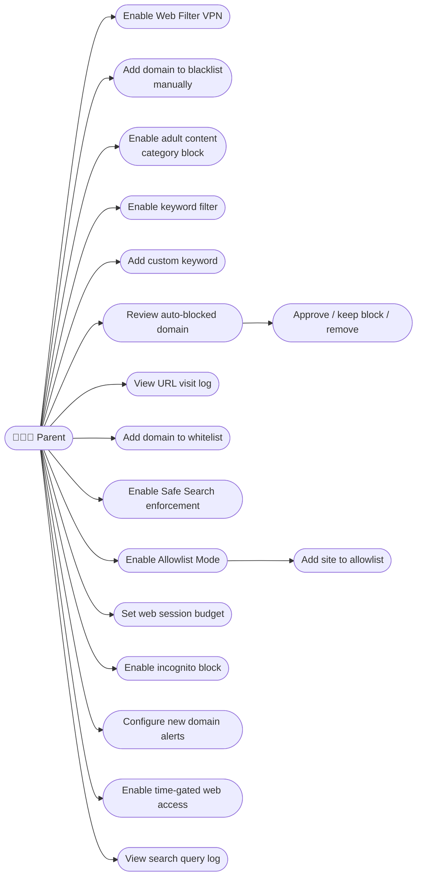

---

### 6.2 Child Browsing Use Cases

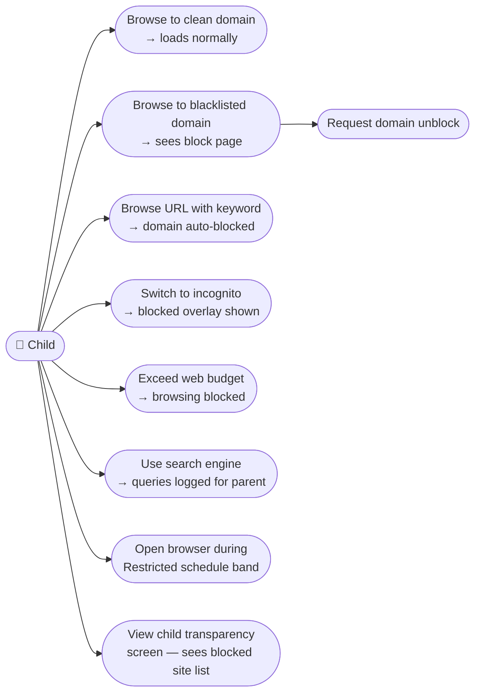

---

### 6.3 System / VPN Use Cases

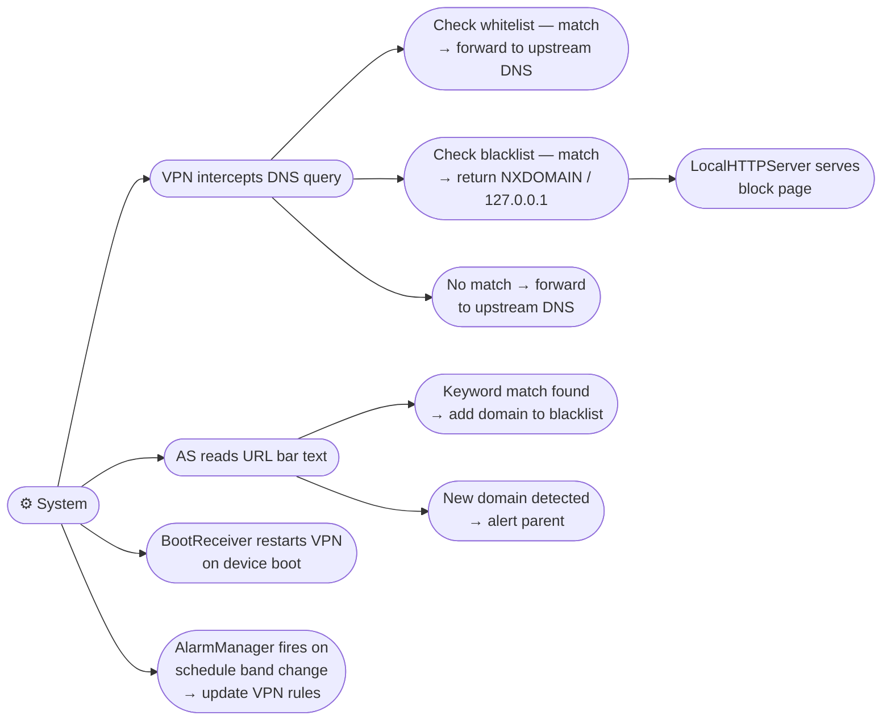

---

## 7. Sequence Diagrams

### 7.1 VPN Setup Flow

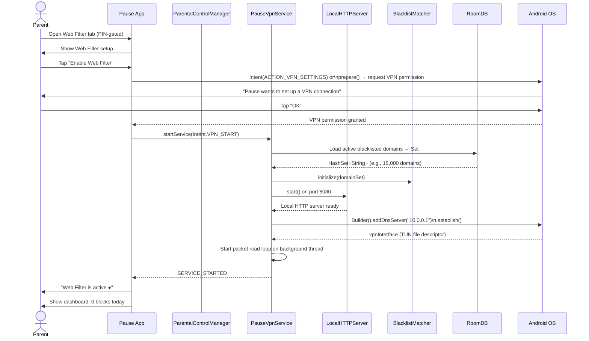

---

### 7.2 Domain Block — DNS Intercept

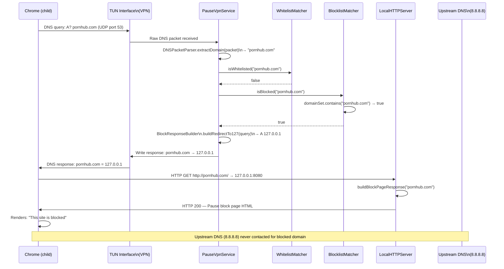

---

### 7.3 Keyword Match — URL Block

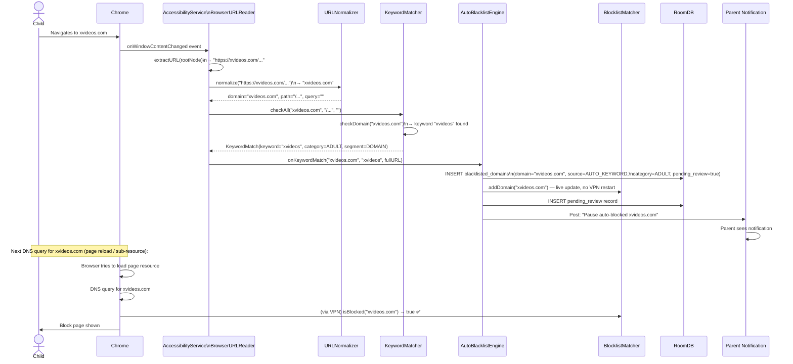

---

### 7.4 Auto URL Capture & Parent Review

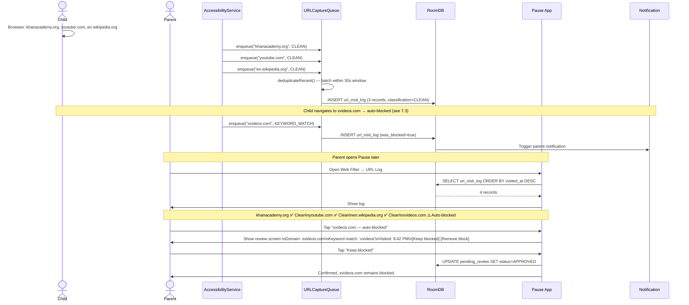

---

### 7.5 Child Requests URL Unblock

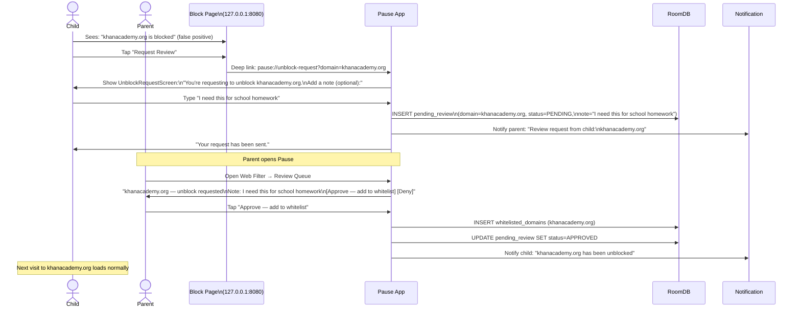

---

## 8. Flow Diagrams

### 8.1 DNS Resolution Decision Flow

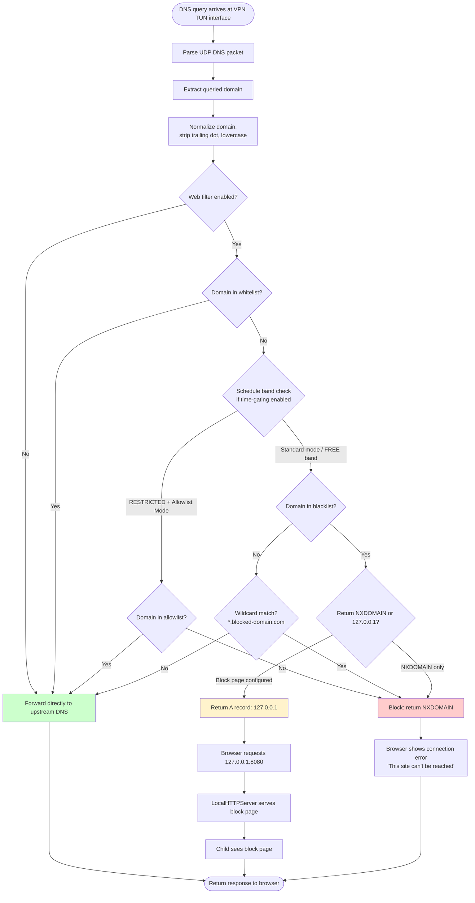

---

### 8.2 URL Capture & Classification Flow

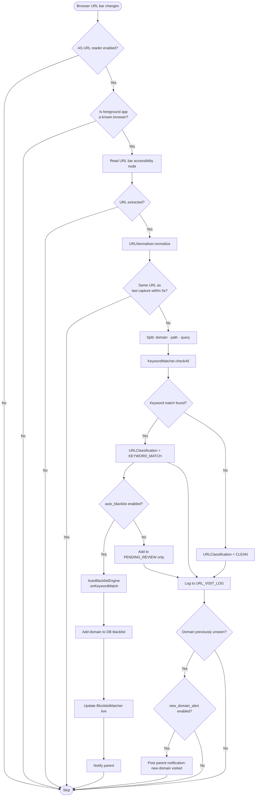

---

### 8.3 Keyword Filter Evaluation Flow

```mermaid
flowchart TD
    A([URL received for keyword check]) --> B[Lowercase entire URL]
    B --> C[Split into segments:\ndomain · path segments · query params]

    C --> D[Load active keywords\nfrom KeywordRepository\nin-memory cache]

    D --> E[For each keyword in list:]
    E --> F{Keyword in domain segment?}
    F -- Yes --> G[MATCH: segment=DOMAIN]
    F -- No --> H{Keyword in any\npath segment?}
    H -- Yes --> I[MATCH: segment=PATH]
    H -- No --> J{Keyword in any\nquery param value?}
    J -- Yes --> K[MATCH: segment=QUERY]
    J -- No --> L{More keywords\nto check?}
    L -- Yes --> E
    L -- No --> M[NO MATCH]

    G --> N[Return first KeywordMatch found\n— stop evaluating remaining keywords]
    I --> N
    K --> N
    M --> O[Return null — URL is clean]

    style G fill:#ffcccc
    style I fill:#ffcccc
    style K fill:#ffcccc
    style O fill:#ccffcc
```

---

### 8.4 Block Page Interaction Flow

```mermaid
flowchart TD
    A([Child's browser shows block page]) --> B{Child reads message}
    B --> C{Child action?}

    C -- Closes tab / navigates away --> D([No further action])

    C -- Taps Request Review --> E[Deep link opens Pause app]
    E --> F[UnblockRequestScreen shows]
    F --> G[Child optionally adds note]
    G --> H[Child submits request]
    H --> I[DB: INSERT pending_review]
    I --> J[Parent notified]
    J --> K{Parent reviews}
    K -- Approves --> L[Domain added to whitelist]
    L --> M[Child notified]
    M --> N[Domain loads normally on next visit]
    K -- Denies --> O[Pending review closed]
    O --> P[Domain remains blocked]

    C -- Tries different browser --> Q{VPN filtering\naffects all browsers?}
    Q -- Yes → all browsers blocked --> R[Block page shown in other browser too]
    Q --> D

    C -- Tries incognito mode --> S{incognito_block enabled?}
    S -- Yes --> T[AS detects incognito\nBlock overlay shown]
    S -- No --> U[VPN still filters DNS\nSite still blocked]
    T --> D
    U --> D
```

---

### 8.5 Parent Web Review Flow

```mermaid
flowchart TD
    A([Parent opens Web Filter dashboard]) --> B[Loads today's stats\nfrom DB]
    B --> C{Any items requiring attention?}
    C -- No --> D[Show clean dashboard]
    C -- Yes --> E[Show attention items:\nauto-blocked + pending reviews]

    E --> F{Parent selects item}
    F --> G[Show review screen:\ndomain + trigger + timestamp]
    G --> H{Parent decision}

    H -- Keep blocked --> I[UPDATE blacklist: active=true\nClear pending_review flag]
    H -- Unblock + whitelist --> J[INSERT whitelist record\nDELETE from blacklist]
    H -- Unblock without whitelist --> K[DELETE from blacklist\nNo whitelist entry\nCan be re-triggered]
    H -- Skip / review later --> L[Mark as seen but not resolved]

    I --> M[Notify child if request was pending]
    J --> M
    K --> M
    L --> C

    M --> N{More items?}
    N -- Yes --> F
    N -- No --> D

    style I fill:#ffcccc
    style J fill:#ccffcc
    style K fill:#fff3cc
```

---

## 9. State Diagrams

### 9.1 VPN Service States

```mermaid
stateDiagram-v2
    [*] --> VPN_STOPPED

    VPN_STOPPED --> VPN_PERMISSION_REQUEST : Parent enables Web Filter
    VPN_PERMISSION_REQUEST --> VPN_STOPPED : Parent denies VPN permission
    VPN_PERMISSION_REQUEST --> VPN_STARTING : Parent grants VPN permission

    VPN_STARTING --> VPN_LOADING_LISTS : Load blacklist + whitelist from DB
    VPN_LOADING_LISTS --> VPN_ACTIVE : Lists loaded\nTUN interface established\nLocal HTTP server started

    VPN_ACTIVE --> VPN_ACTIVE : DNS query processed\n(block or forward)
    VPN_ACTIVE --> VPN_UPDATING_LISTS : New domain added/removed\n(live update — no restart)
    VPN_UPDATING_LISTS --> VPN_ACTIVE : Lists updated

    VPN_ACTIVE --> VPN_STOPPED : Parent disables Web Filter
    VPN_ACTIVE --> VPN_STOPPED : System kills service\n(rare — foreground service protects)
    VPN_ACTIVE --> VPN_RESUMING : Device rebooted\nBootReceiver fires
    VPN_RESUMING --> VPN_LOADING_LISTS : Service restarted

    VPN_STOPPED --> VPN_RESUMING : BootReceiver: VPN was active\nbefore shutdown

    VPN_STOPPED --> [*]
```

---

### 9.2 URL Classification States

```mermaid
stateDiagram-v2
    [*] --> URL_CAPTURED

    URL_CAPTURED --> NORMALIZING : URLNormalizer processes
    NORMALIZING --> DEDUPLICATION_CHECK : Normalized

    DEDUPLICATION_CHECK --> DISCARDED : Same URL within 5s
    DEDUPLICATION_CHECK --> KEYWORD_CHECKING : New URL

    KEYWORD_CHECKING --> KEYWORD_MATCHED : Keyword found in URL
    KEYWORD_CHECKING --> CLEAN : No keyword found

    KEYWORD_MATCHED --> PENDING_AUTO_BLOCK : auto_blacklist = true
    KEYWORD_MATCHED --> PENDING_REVIEW : auto_blacklist = false

    PENDING_AUTO_BLOCK --> BLACKLISTED : Domain added to DB + VPN matcher
    BLACKLISTED --> PARENT_NOTIFIED : notify_parent = true
    BLACKLISTED --> LOGGED : notify_parent = false

    PENDING_REVIEW --> LOGGED
    CLEAN --> LOGGED

    LOGGED --> PARENT_REVIEWED : Parent opens log
    PARENT_REVIEWED --> WHITELISTED : Parent approves
    PARENT_REVIEWED --> BLACKLISTED : Parent blocks
    PARENT_REVIEWED --> ARCHIVED : Parent acknowledges

    DISCARDED --> [*]
    LOGGED --> ARCHIVED : 30-day retention expires
    ARCHIVED --> [*]
```

---

### 9.3 Domain Blacklist Entry States

```mermaid
stateDiagram-v2
    [*] --> NOT_IN_LIST

    NOT_IN_LIST --> PENDING_REVIEW : Auto-capture (keyword match)\nwith auto_blacklist=false
    NOT_IN_LIST --> ACTIVE_BLOCKED : Parent adds manually\nOR auto_blacklist=true
    NOT_IN_LIST --> ACTIVE_BLOCKED : Category bundle enabled

    PENDING_REVIEW --> ACTIVE_BLOCKED : Parent approves block
    PENDING_REVIEW --> NOT_IN_LIST : Parent rejects / no action

    ACTIVE_BLOCKED --> WHITELISTED : Parent adds to whitelist
    ACTIVE_BLOCKED --> NOT_IN_LIST : Parent removes
    ACTIVE_BLOCKED --> ACTIVE_BLOCKED : DNS query for domain → blocked ✅

    WHITELISTED --> ACTIVE_BLOCKED : Parent removes from whitelist
    WHITELISTED --> NOT_IN_LIST : Parent removes both
    WHITELISTED --> WHITELISTED : DNS query for domain → allowed ✅

    ACTIVE_BLOCKED --> [*] : Never — persists until parent removes
```

---

## 10. Static Keyword & Domain Seed List Design

### 10.1 Keyword Categories

The static keyword list is bundled as a compressed asset (`keywords.gz`) and loaded into the `KEYWORD_LIST` table on first launch. It is never transmitted to any server and never updated over-the-air (to avoid internet permission).

| Category | Approach | Estimated terms |
|---|---|---|
| Adult / Explicit | Domain name patterns + common explicit terms | ~300 terms |
| Violence / Gore | Terms associated with graphic violence, gore, self-harm instruction | ~150 terms |
| Drugs & Narcotics | Drug names, slang, purchase-related terms | ~200 terms |
| Gambling | Betting, casino, wagering terms | ~100 terms |
| Hate & Extremism | Slurs, extremist terminology (handled carefully — high false positive risk) | ~80 terms |
| Proxy & Bypass | VPN, proxy, tor, bypass-related terms in URLs | ~50 terms |

**False positive risk:** The hate/extremism category carries the highest false positive risk (legitimate news, academic, and dictionary sites use these terms). It is **disabled by default** and includes a warning when the parent enables it: *"This category may block news and educational content that discusses these topics."*

**What is NOT in the keyword list:**
- Common words that appear in legitimate URLs incidentally
- Medical terminology (too many false positives with health sites)
- Political terms (not Pause's role to judge)

### 10.2 Bundled Domain Categories

Pre-built domain lists bundled as compressed asset files. Source: MIT/public-domain DNS blocklists (e.g., `StevenBlack/hosts`, `hagezi/dns-blocklists`). Snapshot taken at build time.

| Category | Source strategy | Update mechanism |
|---|---|---|
| Adult Content | StevenBlack porn list | Bundle at build time, refresh with app update |
| Gambling | hagezi gambling list | Bundle at build time |
| Proxy/VPN bypass | StevenBlack + custom | Bundle at build time |
| Violence | Manual curation + community lists | Bundle at build time |
| Social Media | Manual list (~50 domains) | Manual maintenance |

**No automatic OTA updates** — keeps the no-internet-permission model intact. Parents who want a fresher list update the app.

### 10.3 False Positive Mitigation

```
Mitigation strategies:
─────────────────────────────────────────────────────────────
1. Whitelist takes priority over all blocking
   Parent can always add a false-positive to the whitelist

2. Child unblock request flow
   Child can request review from the block page

3. Category bundles are opt-in for all except Adult/Explicit
   (Adult is on by default in Parental Control Mode)

4. Keyword matching is domain + path level only
   "escort" in domain → flag
   "escort" in a news article URL path → flag (acceptable)
   But never blocks based on page text — reduces news-site false positives

5. Bundled keyword list excludes medical terms
   "penis", "vagina", "breast" excluded — too many health site false positives
   These sites are handled by the domain-level adult content list instead

6. Auto-block creates a pending review entry
   Parent sees every auto-block within 24 hours
   False positives are correctable the same day
─────────────────────────────────────────────────────────────
```

---

## 11. Privacy Architecture

```
Pause Web Filter — Privacy Commitments
─────────────────────────────────────────────────────────────────────
WHAT PAUSE READS:
  ✅ Domain names from DNS queries (e.g., "pornhub.com")
  ✅ URL strings visible in browser address bar (e.g., "reddit.com/r/nsfw")
  ✅ Search query strings from URL (e.g., "?q=how+to+bypass+filter")

WHAT PAUSE NEVER READS:
  ❌ Page content / HTML / JavaScript
  ❌ HTTPS payload (no TLS interception, no certificate injection)
  ❌ Passwords, form fields, login data
  ❌ Cookies or session tokens
  ❌ Images or media
  ❌ App content inside browsers

WHERE DATA LIVES:
  ✅ All data stored in RoomDB on-device only
  ✅ No Pause server — zero remote transmission
  ✅ URL visit log: 30-day auto-deletion
  ✅ Parent can clear log at any time
  ❌ No analytics SDK
  ❌ No cloud backup of domain lists or logs

TRANSPARENCY TO CHILD:
  ✅ Child can see which sites are blocked (child status screen)
  ✅ Child can see that search queries are visible (if enabled)
  ✅ Child can request unblock review
  ❌ Child cannot see the keyword list (prevents gaming the system)
  ❌ Child cannot see the full URL visit log (parent-only)

PLAY STORE DECLARATION:
  "Pause uses a local VPN to filter DNS queries entirely on-device.
   No browsing data is sent to Pause or any third-party server.
   The Accessibility Service reads URL bar text only to improve
   filtering accuracy. No page content is read or stored."
─────────────────────────────────────────────────────────────────────
```

---

## 12. Permissions & Feasibility

### New Permissions Required

| Permission | Purpose | Grant Method | Risk Level |
|---|---|---|---|
| `BIND_VPN_SERVICE` | Required to use VpnService | Declared in manifest (auto) | Low |
| VPN permission (user-facing) | `VpnService.prepare()` dialog | One-time system dialog | Low |
| `INTERNET` | LocalHTTPServer needs to bind socket\n(still fully local — no external connections) | Declared in manifest | Medium — first internet permission in Pause |

> **The `INTERNET` permission issue:** Pause's previous architecture required no internet permission — a key trust signal. `LocalHTTPServer` binding on `127.0.0.1:8080` technically requires `INTERNET` permission in Android. This is the first Pause feature that requires it.
>
> **Mitigation:** Declare clearly in the Play Store listing: *"The INTERNET permission is used only to run a local web server on the device (127.0.0.1). Pause makes no external network connections."* Users and Play Store reviewers can verify this with network monitoring tools. Consider making the block page optional — if parent disables it, `LocalHTTPServer` doesn't start and `INTERNET` permission could potentially be removed from the base APK (advanced optimization, post-MVP).

### Feasibility Notes

**VpnService and Play Store:**
`VpnService` for local filtering is explicitly permitted by Google Play for parental control and ad-blocking apps. Play Store requires a clear description of what the VPN does. Apps that tunnel traffic to a remote server face additional scrutiny — Pause avoids this entirely.

**The one VPN slot limitation:**
Android allows only one active VPN at a time. If a user (or child) has a real VPN running (for privacy or work), Pause's VPN cannot run simultaneously. Mitigation: detect if a VPN is already active and show a clear message: *"Web Filter requires the VPN slot. Pause will replace the active VPN while Web Filter is on."* This is the biggest real-world usability constraint of the VPN approach.

**HTTPS blocking behavior:**
For HTTPS sites (which is virtually all sites now), DNS blocking prevents the connection from being established at all — the browser shows `ERR_NAME_NOT_RESOLVED` before any TLS handshake. The `LocalHTTPServer` block page is only visible for the rare case where a site is HTTP-only (or when the browser follows an HTTP redirect before attempting HTTPS). This is acceptable — the block works, the experience is just the browser's error page rather than Pause's custom page for HTTPS sites.

**URL reader node fragility:**
Browser ViewIDs change with updates. The fallback (EditText + URL regex) handles most cases. A maintenance task should verify node IDs against current browser versions every 3 months.

**Performance:**
The DNS packet loop runs on a background thread. Each DNS resolution involves a HashMap lookup (O(1)) plus network I/O for clean domains. Benchmarks from similar apps (AdGuard Home, DNS66) show <5ms overhead per query — imperceptible to users. The `BlocklistMatcher` loads its `HashSet` from DB on startup (~500ms for 15,000 entries) and updates live on domain additions.

---

## 13. Risk Register

| Risk | Likelihood | Impact | Mitigation |
|---|---|---|---|
| VPN conflicts with child's other VPN apps | High | High | Detect active VPN at Web Filter enable time; show clear warning; user chooses |
| `INTERNET` permission erodes trust | Medium | Medium | Clear explanation in onboarding + Play Store listing; no external connections provable |
| HTTPS blocked domains show browser error page instead of Pause block page | High | Low | DNS block is still effective; browser error is acceptable; document in parent onboarding |
| Browser update changes URL bar ViewId | High | Low | Fallback heuristic handles most cases; quarterly maintenance task for ViewId list |
| Adult keyword list generates false positives on news/health sites | Medium | Medium | Whitelist flow; child unblock request; auto-blocks are pending review, not permanent |
| Category domain list becomes stale between app updates | Medium | Low | Auto-detected: parent can see "list last updated" date; update via app update |
| Child uses browser Pause doesn't support (URL reader only) | Low | Low | VPN DNS filtering still works for all browsers; URL reader is secondary layer |
| Child uses HTTPS proxy to bypass DNS | Low | Medium | Block known proxy domains (category: Proxy & VPN bypass); educational risk remains |
| LocalHTTPServer port 8080 conflict | Low | Low | Try fallback ports 8081, 8082 on bind failure |
| VPN service killed by battery optimizer | Medium | High | Run as ForegroundService; request battery optimization exemption in setup |
| Search query logging creates privacy concern | Medium | Medium | Opt-in only; child transparency screen discloses it; 30-day auto-delete |
| Incognito detection fragility | High | Low | Primary enforcement is VPN (works in incognito); overlay is UX deterrent, not security |

---

## 14. Development Timeline

**Assumption:** Single experienced Android developer. Phase 1–3 + Strict Mode + Parental Control Mode complete.

### Phase 4 Core — ~12–14 days

| Task | Estimate |
|---|---|
| VPN architecture setup: `PauseVpnService`, TUN interface, packet loop | 2 days |
| `DNSPacketParser` — parse/build DNS UDP packets | 1 day |
| `BlocklistMatcher` — HashSet + wildcard matching | 0.75 day |
| `WhitelistMatcher` — HashSet, priority over blacklist | 0.5 day |
| `DNSResolver` — upstream DNS forward | 0.5 day |
| `LocalHTTPServer` — block page serving on 127.0.0.1:8080 | 0.75 day |
| `BlockResponseBuilder` — NXDOMAIN + 127.0.0.1 responses | 0.5 day |
| DB schema: all 6 new tables + DAOs | 0.75 day |
| `BrowserURLReader` (AS extension) — 8 browsers + fallback | 1 day |
| `URLNormalizer` + `URLClassifier` | 0.5 day |
| `KeywordMatcher` — domain/path/query evaluation | 0.75 day |
| `AutoBlacklistEngine` + live VPN matcher update | 0.75 day |
| `URLCaptureQueue` + deduplication | 0.5 day |
| Bundled keyword asset list (compressed) + DB import | 0.5 day |
| Bundled domain category asset list + DB import | 0.75 day |
| `BlacklistManager` — add/remove/category/import | 0.75 day |
| VPN enable flow + system permission dialog | 0.5 day |
| Parent Web Filter dashboard UI | 1 day |
| Domain blacklist management UI | 0.75 day |
| Keyword manager UI | 0.5 day |
| URL visit log UI (parent review) | 0.75 day |
| Child unblock request screen + deep link | 0.5 day |
| Block page HTML (served locally) | 0.25 day |
| BootReceiver extension — restart VPN on boot | 0.25 day |
| Testing: VPN, DNS, keyword matching, browser compat | 1.5 days |
| **Total** | **~16 days** |

### Phase 4+ Extensions — Per Feature Estimates

| Feature | Estimate |
|---|---|
| F4+.1 Safe Search DNS redirects | 0.5 day |
| F4+.2 Time-Gated Web Access (schedule integration) | 1 day |
| F4+.3 Category blocking (already partially done in core) | 0.25 day |
| F4+.4 New Domain Alert | 0.5 day |
| F4+.5 Allowlist Mode (invert VPN logic) | 0.5 day |
| F4+.6 YouTube Restricted Mode (DNS + URL reader) | 0.75 day |
| F4+.7 Search Query Visibility + log UI | 1 day |
| F4+.8 Incognito Mode Detection | 0.75 day |
| F4+.9 Per-Browser Profiles (UID-aware VPN routing) | 2 days |
| F4+.10 Web Session Budgets (UsageStats integration) | 1 day |

---

### Overall Build Summary

| Deliverable | Estimate |
|---|---|
| Phase 1 — Awareness & Friction | ~5 days |
| Phase 2 — Control & Reflection | ~5–6 days |
| Phase 3 — Commitment & Accountability | ~6–7 days |
| Strict Mode | ~5.5 days |
| Parental Control Mode | ~9.5 days |
| Phase 4 — Web Filter Core | ~16 days |
| Phase 4+ Extensions (all) | ~7 days |
| **Total** | **~60–62 days** |

---

*Pause — Web Filter*
*DNS-layer enforcement. URL-level awareness. No content reading. Ever.*

---

> **Document Version:** 1.0
> **Scope:** Phase 4 Web Filtering — Domain Blocking · URL Blacklisting · Keyword Filtering
> **Depends on:** Pause Phase 1–3 · Strict Mode · Parental Control Mode
> **Platform:** Android (Kotlin, API 26+)
> **New components:** PauseVpnService · DNSPacketParser · BlocklistMatcher · LocalHTTPServer · BrowserURLReader · URLClassifier · KeywordMatcher · AutoBlacklistEngine · URLCaptureQueue · BlacklistManager
> **New permissions:** VpnService (user-dialog) · INTERNET (local only)